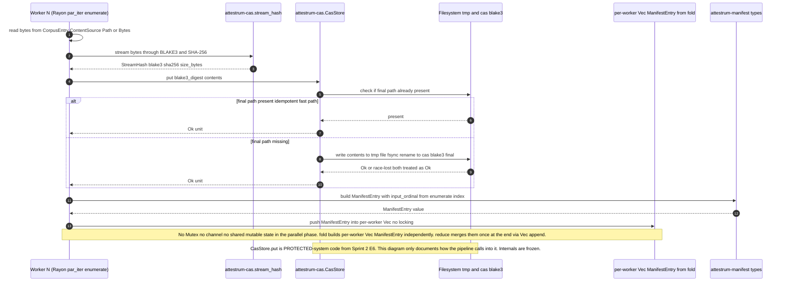

# Pipeline write path through CAS

Source of truth: `code` (Sprint 3 E4 implementation). Sprint 2 E6's `cas-write-atomicity.md` documents the single-put atomicity story (one thread, one digest, one `rename`); this diagram zooms out to the per-worker concurrency story when many threads are calling `CasStore::put` in parallel through the `attestrum_pipeline::build_corpus` entry point.

**Per-worker contract**: each Rayon `par_iter().enumerate()` worker independently reads one `CorpusEntry`, runs `attestrum-cas.stream_hash` to produce a `StreamHash blake3+sha256+size_bytes`, calls `CasStore.put` (race-safe and idempotent per E6), constructs a `ManifestEntry` with `input_ordinal` stamped from the enumerate index, and pushes that row into its own per-worker `Vec<ManifestEntry>` accumulator. There is NO inter-worker synchronisation during the parallel phase. The epilogue (single-threaded) sorts by `input_ordinal` to restore canonical input order, runs `assign_occurrence_indices` + `sort_entries`, computes `merkle_root` over the sorted leaves, and writes the manifest.

**No `Mutex<Vec>` accumulator**. The E3 cross-check (founder-conducted via ChatGPT, 2026-05-24, responses preserved at `~/Downloads/attestrum-e3/`) flagged a shared-mutex accumulator as the most-cited anti-pattern: it serialises every worker push and becomes the throughput bottleneck under contention with fast-hashing small docs. Rayon's `fold + reduce` builds a per-worker `Vec<ManifestEntry>` with zero cross-worker locking, then merges them in O(N) once at the end via `Vec::append`. The CAS write path itself is PROTECTED from Sprint 2 E6 and unaffected — `CasStore.put` already provides the only synchronisation primitive E4 needs (race-safe atomic rename).

**Test obligations** (per CLAUDE.md §7.1 sequenceDiagram → contract test, satisfied at Sprint 3 E4):

- `worker_calls_stream_hash_then_put_then_pushes_manifest_entry` — single-worker happy path covers every documented message in order and confirms the row lands at `cas.path_for(digest)`'s canonical `<root>/cas/blake3/<ab>/<cd>/<hex>.bin` path.
- `concurrent_workers_writing_same_digest_all_succeed` — 8 workers handed the same digest all land it in CAS exactly once (E6's race guarantee) and produce 8 distinct manifest rows (multiset).
- `worker_io_error_does_not_crash_other_workers` — one worker's read fails on a missing file; `build_corpus` returns `Err(BuildError::Io)` without panic or hang and the sealed `manifest.parquet` is absent.
- `accumulator_push_order_is_not_observable_externally` — same corpus built inside `rayon::ThreadPoolBuilder::new().num_threads(1)` and `num_threads(8)` produces byte-identical `manifest.parquet`. Locks the determinism claim across work-stealing schedules.

All four tests live at `crates/attestrum-pipeline/tests/cas_write_path.rs`. The pipeline-side public API consumed here is `attestrum_pipeline::build_corpus(ctx, cas, entries, output_dir) -> Result<BuildOutput, BuildError>` over the input type `CorpusEntry { content: ContentSource, ... }`.

**Out of scope for E4**:

- Distributed-worker write path (workers on multiple machines writing to a shared CAS) — Sprint 4 if the S3 backend lands; v1 is single-machine.
- Backpressure from manifest-accumulator memory pressure on very large corpora — v1 ships with the simple per-worker `Vec` accumulator; the 1 GB Common-Pile-mini acceptance (Sprint 5 + deferred) is the upper bound we exercise.
- Streaming CAS put (avoiding the in-memory `Vec<u8>` buffer per worker) — would require a different `CasStore::put` signature; deferred until profiling on the 1 GB acceptance corpus shows it matters.
