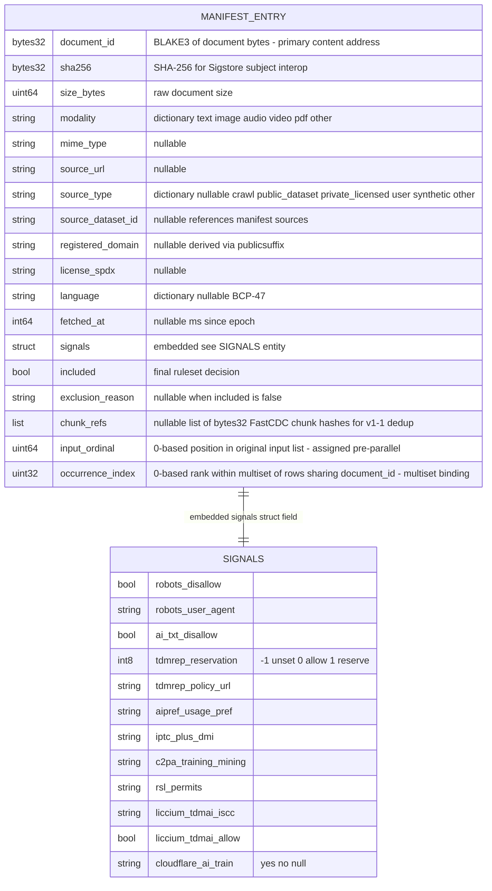

# attestrum-manifest Parquet row schema

Source of truth: `code` as of Sprint 3 E3 (`crates/attestrum-manifest/src/io.rs` ships the deterministic Parquet writer + reader with the PROTECTED schema + writer config; `crates/attestrum-manifest/src/lib.rs` defines the in-memory types from E2 + E2.5). The schema is the 16 columns of BUILD-PLAN §4.2 plus TWO Sprint 3 binding columns:

- **`input_ordinal`** (uint64, NOT NULL) — the row's 0-based position in the original input list. Set by `assign_input_ordinals` BEFORE the parallel hashing phase. Workers carry it through unchanged.
- **`occurrence_index`** (uint32, NOT NULL) — the row's 0-based rank within the multiset of rows sharing the same `document_id`. Set by `assign_occurrence_indices`. Founder-approved Sprint 2 amendment 2 (2026-05-23), recorded in `docs/diagrams/sprint-2/merkle-construction.md`.

The `input_ordinal` column was added in Sprint 3 E2.5 per the E3 pre-implementation cross-check (2026-05-24): two independent reviewers converged on adding it so the multiset binding is **independently auditable** without trusting Attestrum's internal HashMap-counter logic.

**Multiset binding contract**: when two corpus documents share a BLAKE3 digest, both rows are emitted with the same `document_id` but different `(input_ordinal, occurrence_index)` pairs. The Merkle tree's leaves are emitted in `(document_id, occurrence_index)` sort order.

**Audit invariant**: post-sort, within each consecutive group sharing the same `document_id`, the entries are sorted by `occurrence_index = 0, 1, 2, ...` AND by `input_ordinal` (monotone). An external verifier can independently:

  1. Sort the manifest by `(document_id, input_ordinal)`,
  2. Walk each consecutive `document_id` group assigning a 0-based rank,
  3. Assert the assigned rank equals the manifest's `occurrence_index` column.

If that holds, the multiset Merkle binding is correct — no need to trust Attestrum's internal counter logic.

**Deterministic Parquet writer config** (per E3 cross-check, more conservative than the original lean): PARQUET_1_0 writer version, ZSTD compression at level 3, dictionary encoding DISABLED globally, statistics DISABLED globally, raw `Int8`/`UInt8` encoding for `modality` and `source_type` enums (mapping pinned in KeyValue metadata), raw `Int64` for `fetched_at_ms` (avoids Arrow TIMESTAMP timezone-metadata leak), `created_by` pinned (NOT the parquet-rs default), bloom filters off, sorted by `(document_id, occurrence_index)`. `attestrum.manifest.schema_version = 2` lives in file-level KeyValue metadata, not as a per-row column.

**Test obligations** (per CLAUDE.md §7.1 erDiagram → schema-roundtrip test, due at Sprint 3 E3):

- `parquet_write_then_read_returns_equal_entries` — write a 100-entry sample, read it back, assert per-field equality including the nested signals struct.
- `parquet_byte_identical_re_write` — write, read, write again to a second path, assert the two Parquet files are byte-identical (the in-process determinism guarantee that the cross-platform CI matrix amplifies).
- `multiset_three_copies_get_occurrence_indices_012` — three input entries with identical `document_id` end up in the Parquet file with `occurrence_index` 0, 1, 2 (input order preserved within the group, then globally sorted by `(document_id, occurrence_index)`).
- `sort_order_is_document_id_then_occurrence_index` — entries written in any input order land on disk sorted lexicographically by `document_id`, then by `occurrence_index` as the tie-break.
- `audit_invariant_holds_post_sort` — for each consecutive `document_id` group post-`sort_entries`, `occurrence_index` rank equals the rank when the group is sorted by `input_ordinal`.
- `nullable_fields_roundtrip_as_none_when_absent` — `mime_type`, `source_url`, `source_type`, `source_dataset_id`, `registered_domain`, `license_spdx`, `language`, `fetched_at`, `exclusion_reason`, `chunk_refs` each roundtrip as `Option::None` when unset.
- `schema_version_keyvalue_metadata_pinned_to_2` — file-level KeyValue contains `attestrum.manifest.schema_version = "2"`.

**E2 + E2.5 deliverable** (pure types, no Parquet I/O yet, LANDED): `pub struct ManifestEntry` mirroring the columns above; `pub struct ManifestSignals` mirroring the SIGNALS sub-struct; `pub fn assign_input_ordinals(&mut [ManifestEntry])` walks entries in slice order and sets `input_ordinal = i as u64`; `pub fn assign_occurrence_indices(&mut [ManifestEntry])` walks entries in input order and assigns per-`document_id` 0-based ordinals; `pub fn sort_entries(&mut [ManifestEntry])` sorts in place by `(document_id, occurrence_index)`. Serde JSON roundtrip tests + audit-invariant test all green. This diagram stays `source_of_truth: diagram` until E3's Parquet roundtrip lands the on-disk schema.

**Out of scope for Sprint 3** (deferred):

- `cas/sha256/<ab>/<cd>/<hex>.bin` secondary CAS mirror — Sprint 4 once `attestrum-attest` needs SHA-256-addressed lookup for the Sigstore subject.
- `cas/meta/<prefix>.json` per-object sidecar metadata — Sprint 4+.
- RocksDB hot-write path (BUILD-PLAN §4.6) — Parquet-only v1; revisit only if profiling shows write-buffer pressure.
- `--enable-chunking` opt-in FastCDC (BUILD-PLAN §4.5) — v1.1 / post-MVP. The `chunk_refs` column exists in the schema as a nullable forward-compatibility slot; rows always emit `None` in Sprint 3.
