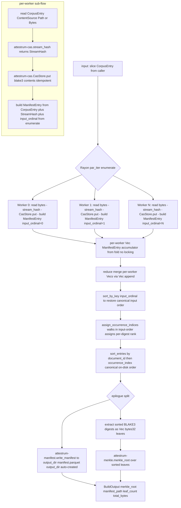

# attestrum-pipeline Rayon build pipeline

Source of truth: `code` (Sprint 3 E4 implementation). This is the end-to-end build pipeline that wires Sprint 1 signal types + Sprint 2 streaming hash + Sprint 2 CAS + Sprint 3 manifest + Sprint 2 Merkle into a single deterministic sealed corpus output.

**Pipeline shape**: a single `par_iter().fold(...).reduce(...)` parallel phase (per-document hash + store + row build) sandwiched by a deterministic sequential prelude (input load) and a deterministic sequential epilogue (sort + Merkle + Parquet write). Pure Rayon was chosen for v1 because the IO is small-file local-disk reads in the synthetic-corpus test path and the network fetch layer is deferred to Sprint 4.

**Determinism contract**: same `[CorpusEntry]` input → same `manifest.parquet` bytes + same Merkle root, byte-identical across all four CI matrix targets (E8 extends the matrix to compare manifest bytes pairwise). The Rayon work-stealing order is non-deterministic, but the final output is deterministic because:

1. Each worker stamps its row's `input_ordinal` from the `par_iter().enumerate()` index AT row construction, so the value survives any reduce order.
2. After the reduce, `sort_by_key(input_ordinal)` restores canonical input order. `assign_occurrence_indices` then walks in input-order to assign per-digest rank, and `sort_entries` re-sorts to canonical `(document_id, occurrence_index)` on-disk order.
3. Merkle leaves are extracted from the sorted manifest, so `merkle_root` is a pure function of the corpus as a multiset.
4. The Parquet writer is pinned to PROTECTED config from Sprint 3 E3 (PARQUET_1_0, ZSTD-3, dict OFF, stats OFF, raw Int8 enums, raw Int64 timestamps, pinned `created_by`, sorted KeyValue metadata).

**No `Mutex<Vec>` accumulator** (E3 cross-check verdict — see `~/Downloads/attestrum-e3/`): every worker would serialise on the lock, becoming the throughput bottleneck. Rayon's `fold` builds per-worker `Vec<ManifestEntry>` with zero shared mutable state; `reduce` merges those vectors with `Vec::append`, which is `memcpy`-fast and runs O(total rows) once.

**Test obligations** (per CLAUDE.md §7.1 flowchart → integration-edges test, satisfied at Sprint 3 E4 in `crates/attestrum-pipeline/tests/build_corpus.rs`):

- `empty_corpus_produces_empty_root` — `build_corpus(ctx, cas, &[], out)` returns a `BuildOutput` whose `merkle_root` is `BLAKE3 of empty input` (`af1349b9...`) and writes an empty `manifest.parquet`. Sprint 2 E7 locked the empty-root contract on the `attestrum-merkle` side; this test confirms the pipeline preserves it.
- `single_document_round_trip` — one-entry corpus seals to `merkle_root == leaf_hash(blake3_digest)` and the manifest readback round-trips every field.
- `n_1000_synthetic_documents_seal_deterministically_twice` — same 1000 xorshift64-derived entries built twice (fresh output dirs) produce byte-identical `manifest.parquet` and identical Merkle root. Local mirror of the cross-platform CI determinism check that E8 extends.
- `duplicate_doc_multiset_three_copies_get_indices_012` — three corpus entries with identical content land in the manifest with `occurrence_index` 0/1/2; three adjacent identical BLAKE3 leaves; merkle_root differs from the single-copy root (multiset binding preserved).
- `io_error_in_one_worker_does_not_corrupt_output` — one worker's source reader fails; `build_corpus` returns `Err(BuildError::Io)`; the partial `manifest.parquet` is NOT written (no corrupt artifact left on disk).
- `output_directory_is_created_if_missing` — fresh `output_dir` that doesn't yet exist is auto-created when `build_corpus` runs.

**Public surface** (locked in E4, all in `crates/attestrum-pipeline/src/lib.rs`):

- `enum ContentSource { Path(PathBuf), Bytes(Vec<u8>) }` — where bytes come from for one corpus entry.
- `struct CorpusEntry` — one input row carrying source URI + bytes + caller-supplied signal/provenance metadata. The pipeline stamps `input_ordinal` itself.
- `struct BuildOutput { merkle_root, manifest_path, leaf_count, total_bytes }` — summary of one build invocation.
- `enum BuildError { Io, OutputDir, Manifest }` — `Io` variant carries the offending `source_uri` so the operator can localise failure to a specific entry.
- `fn build_corpus(ctx, cas, entries, output_dir) -> Result<BuildOutput, BuildError>` — the entry point this diagram describes.

**Out of scope for E4** (deferred):

- Distributed pipeline (workers across multiple machines) — Sprint 4 with the S3 backend.
- Async-IO fetch stage — Sprint 4 with `attestrum-fetch` (HTTP/HTTPS, registry lookups).
- Adaptive Rayon pool sizing based on profiled-hash-cost — v1 ships default `num_cpus` workers; revisit only if profiling shows under-utilisation.
- Streaming CAS put (avoid the in-memory `Vec<u8>` per worker) — requires a new `CasStore::put_streaming` API; defer until profiling on the 1 GB acceptance corpus shows it matters.
