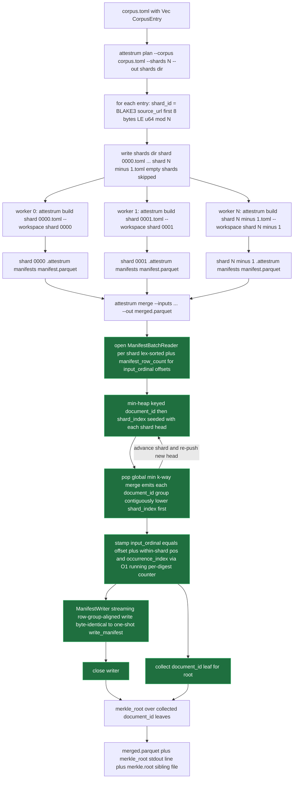

# attestrum plan and attestrum merge — deterministic sharding

Source of truth: `code` (Sprint 3 E7 implementation). Minimal sharding for v1 (founder-approved at Sprint 3 scope confirmation): correctness, not large-scale stress. The load-bearing contract is **Merkle-root equality**: building the unsharded corpus and building-then-merging the sharded variant produce the same final Merkle root. The merged `manifest.parquet` BYTES additionally equal the unsharded variant only when no cross-shard duplicate digests exist AND the shard-concat order happens to align with original input order — see the round-trip test obligation below for the exact assertion.

**Deterministic shard assignment**: `shard_id = (first 8 bytes of BLAKE3(source_url.as_bytes()), interpreted as little-endian u64) mod N`. The hash-mod-N scheme is uniform across `N` shards under normal URL distributions, depends only on the `source_url` string (not file content, not entry order), and re-running `attestrum plan` with the same `--corpus` and `--shards` produces byte-identical shard files. Duplicates of the same `source_url` always co-locate to the same shard so the multiset count is preserved within a shard. Empty shards are skipped (no `shard-NNNN.toml` emitted) — keeps the on-disk layout tidy and the merge step doesn't need to handle empty inputs.

**Merge contract** (streaming, since 2026-06-12 — memory bounded independent of the row count): `attestrum merge --inputs shard-*.parquet --out merged.parquet` runs a single streaming pass. It opens one batched reader per shard (`ManifestBatchReader`) in lex-sorted input-path order, reads each shard's footer row count (`manifest_row_count`) to fix per-shard `input_ordinal` offsets, then **k-way merges** the shards with a min-heap keyed `(document_id, shard_index)`. Popping the global minimum emits every row sharing a `document_id` contiguously, lower `shard_index` first — which is exactly the canonical `(document_id, occurrence_index)` on-disk order. As each row is emitted, merge stamps `input_ordinal = shard_offset + within-shard position` (the concat-order position an unsharded build assigns; the E2.5 audit invariant continues to hold), assigns `occurrence_index` via an **O(1) running per-digest counter** (no global HashMap — equal digests are already contiguous in the merged stream), appends the row to a streaming writer (`ManifestWriter`, which flushes row-group-aligned so its output is byte-identical to a one-shot `write_manifest`), and collects the `document_id` leaf. After closing the writer, merge computes the root (`attestrum_merkle::merkle_root` over the collected leaves — the identical computation `build_corpus` performs), prints a `merkle_root:` stdout line, and writes a `merkle.root` sibling beside `--out` (64 lowercase hex chars + newline) so sharded CI pipelines consume the canonical root without parsing `attestrum inspect`. The result is **byte-identical** to the previous load-everything / concatenate / global-`assign_*` / `sort_entries` / `write_manifest` implementation for any sorted shard inputs — proven by `streaming_merge_byte_identical_to_reference`. **Precondition**: each shard is internally sorted so equal `document_id`s are contiguous (every seal path runs `sort_entries` before writing); a shard violating this is rejected with `MergeError::UnsortedShard` rather than silently diverging.

**Why merged bytes ≠ unsharded bytes (in the general shards > 1 case)**: the unsharded build's `input_ordinal` column reflects the original input order (the position in the source corpus.toml); the merged build's `input_ordinal` reflects shard-concat order, which is `(shard_id ascending, within-shard canonical sort)`. These only coincide when entries happen to be listed in shard_id-ascending order in the original corpus.toml — a synthetic property. The Merkle root computes only over sorted digests, so it's invariant under any permutation that preserves the multiset; byte-identity of the full Parquet is a stricter property that requires `input_ordinal` agreement.

🟩 new this revision

**Changed this revision:** the merge subflow is now a single **streaming k-way pass** (open batched readers → min-heap → k-way merge → stamp ordinals → streaming write) replacing the prior read-all → concatenate → global `assign_*`/`sort_entries` → `write_manifest` sequence. Output is byte-identical; peak memory is now bounded by one row group plus the leaf-digest vector instead of all rows, which is what makes the ~100M-row rungs feasible in free CI.

**Public surface** (in `crates/attestrum-cli/src/commands/`):

- `pub mod plan` with `pub struct Args { corpus, shards, out }`, `pub enum PlanError { InvalidShardCount, CorpusMissing, CorpusRead, CorpusParse, EntryMissingSourceUrl, OutputDir, EmitShard, Serialize(#[from] toml::ser::Error) }`, `pub fn run(args) -> u8`, `pub fn shard_id(source_url: &str, shards: u32) -> u32`.
- `pub mod merge` with `pub struct Args { inputs, out }`, `pub enum MergeError { NoInputs, InputRead, UnsortedShard, OutputDir, Write(#[from] attestrum_core::AttestrumError), RootFile }`, `pub fn run(args) -> u8`. (Consumes the streaming `ManifestBatchReader` / `ManifestWriter` / `manifest_row_count` API from `attestrum-manifest`.)

**Test obligations** (per CLAUDE.md §7.1 flowchart → integration-edges test, satisfied at Sprint 3 E7 in `crates/attestrum-cli/tests/sharding.rs`):

- `plan_shards_1_is_noop_single_shard_file` — `--shards 1` writes a single `shard-0000.toml` whose `[[entry]]` count equals the input.
- `plan_shards_equal_entry_count_one_per_shard_when_unique_urls` — `--shards N` where N == entry count, distinct source_urls: emits 1..N shard files (empty shards skipped per hash distribution), the union of all shards' entries equals the input, and every emitted shard has ≥ 1 entry.
- `plan_duplicate_source_urls_colocate_in_same_shard` — 5 entries with identical `source_url` always land in the same single shard file (preserves multiset binding pre-build).
- `plan_re_run_produces_identical_shard_files` — running `attestrum plan` twice with the same args (against two different output dirs) produces byte-identical shard files in each.
- `merge_round_trip_matches_unsharded_build` — build corpus directly → root A; plan + build-each-shard + merge → root B; assert `root A == root B` AND assert the sorted leaf-set (sorted Vec<[u8; 32]> of document_ids) is identical between the two manifests. Additionally asserts merge's own root output: the `merkle_root:` stdout line equals root A, and the `merkle.root` sibling file is byte-identical to the unsharded build's. Note: byte-equality of `manifest.parquet` is NOT asserted because merged manifests' `input_ordinal` reflects merge-concat order rather than original input order; the deterministic-sharding contract is root equality + leaf-set equality, not full byte-identity.
- `merge_with_overlapping_digests_across_shards_globally_reassigns_occurrence_indices` — two single-entry shards each containing byte-identical content but distinct source_urls produce a merged manifest with two rows sharing `document_id` and carrying `occurrence_index` 0 and 1 globally (not 0 and 0 from their per-shard assignment).
- `streaming_merge_byte_identical_to_reference` (+ explicit single-shard / cross-shard-duplicate / empty-shard fixtures, in `crates/attestrum-cli/tests/merge_byte_identity.rs`) — the streaming merge's output `manifest.parquet` is BYTE-IDENTICAL to an in-process reference merge (the previous load-everything algorithm) across randomized shardings, and the merged `merkle.root` cross-checks against `attestrum_merkle::merkle_root` over the reference leaves. This is the determinism proof that the streaming rewrite preserves the exact bytes the canonical triple pins.
- `merge_merkle_root_sibling_write_failure_exits_nonzero` — a directory squatting on the `merkle.root` sibling path makes merge exit 1 with the `RootFile` error context (exercises the only new error path).

**Out of scope for E7** (deferred to later sprints):

- Distributed coordinator (running shard builds on different machines and merging via S3) — Sprint 4 with the S3 backend.
- Large-scale stress test (>100k entries × >100 shards) — Sprint 5 with the 1 GB Common-Pile-mini benchmark; v1 acceptance is correctness on small synthetic corpora.
- Inter-shard CAS sharing (shard builds today write to per-shard `.attestrum/cas/`; a future variant could share a global `.attestrum/cas/` and dedup-via-CAS) — v1.1.
- Restoring full byte-identity between merged and unsharded — would require canonicalizing `build_corpus`'s `input_ordinal` assignment by source_url instead of by input order (a PROTECTED-system-change with SCHEMA_VERSION bump). Defer until a real user use case demands it; root equality is sufficient for the Merkle-based attestations Attestrum emits.
