# Three predicate types — class diagram

Source of truth: `code` — flipped from `diagram` at Sprint 4 commit E2 (`<this-commit-SHA>`, see CHANGELOG/SESSION-LOG for the per-commit details). `crates/attestrum-attest/src/predicate.rs` + `statement.rs` + `lib.rs` are now authoritative. The two Bundle-related classes shown (`SigstoreBundleV03` + `DsseEnvelope` + `VerificationMaterial`) and the `canonicalize_for_compare` helper land at later commits (E2.5 for canonicalize + JSON-Schema derivation; E3 or later for the sigstore-crate-backed Bundle types) — their boxes in the diagram below are forward-references to those later commits and the corresponding `models:` paths (`bundle.rs`, `canonicalize.rs`) are deliberately omitted from frontmatter until those files exist. Drift between this diagram and the published predicate JSON-Schema files at the three v0.1 URIs is a CI break (the JSON-Schema files are derived from these Rust types via `schemars`, at E2.5).

**A fourth predicate, a separate generation.** The `model-binding/v0.1` predicate (`ModelBindingPredicate`, corpus-to-model binding) is a **separate v0.1 generation** from this frozen v0.3 corpus/proof family and has its own class diagram at `docs/diagrams/binding/model-binding-and-chain-walk.md`. Its const `MODEL_BINDING_PREDICATE_TYPE` is standalone and is **deliberately NOT a member of `ALL_PREDICATE_TYPES`** (which stays the locked `[3]` v0.3 snapshot, D2-A). It is named here only to record that adding it to `lib.rs` does not mutate the three-type contract this diagram models.

**Three predicates, three publication states, one common wrapper.** All three are wrapped in the same `InTotoStatement` (in-toto v1 spec — `_type` + `subject[]` + `predicateType` + `predicate`) and the same `SigstoreBundleV03` (Sigstore Bundle v0.3 wire format, `application/vnd.dev.sigstore.bundle.v0.3+json` media type). The DIFFERENCE between the three is purely the `predicate` payload shape and the `predicateType` URI string.

- **`TrainingCorpusPredicate`** — fully populated in Sprint 4. Built by `attestrum sign` from a sealed manifest.
- **`InclusionProofPredicate`** — type defined + URI locked in Sprint 4 (frozen shape, no `pub fn build()` constructor yet); payload populated in Sprint 5 by `attestrum prove` when a fingerprint match is found.
- **`NonInclusionProofPredicate`** — type defined + URI locked in Sprint 4; payload populated in Sprint 5 by `attestrum prove` when no match is found, using the sorted-Merkle adjacent-leaves technique.

**URI placeholders at E1** (literal `attestrum.com/attestation/.../v0.1` strings ship in a later commit per `CLAUDE.md §4`): `PLACEHOLDER_TRAINING_CORPUS_URI_v0.1`, `PLACEHOLDER_INCLUSION_PROOF_URI_v0.1`, `PLACEHOLDER_NON_INCLUSION_PROOF_URI_v0.1`. The literal strings are already defined in `PATH-A-BRIEF.md §3.1 / §3.2 / §3.3` and don't change at the cross-check — the cross-check confirms the JSON-Schema *shape* of each predicate's payload, not the URI string.

**Revised at E1.5 cross-check** (`docs/cross-checks/e1.5/resolution.md`): the original E1 draft of this diagram was directionally correct but missed several BLOCKER-severity verifier-required fields in the two proof predicates (`treeSize`, `leafHash`, `hashAlgorithm`, ordering-key separation, boundary-case handling) plus had an unbounded `signalCoverage`, an unanchored `attestrumVersion` regex, and lacked a deterministic-replay ruleset identity (`rulesetId` / `rulesetVersion`). The class shapes below incorporate the cross-check's findings; the `OVERALL` section in the resolution doc + §6.1/§6.2/§6.3 carry the per-change rationale. Severities preserved: [BLOCKER]-tier changes are now reflected as required fields; [STRONG]-tier changes as recommended type shapes; [NICE]-tier changes mostly deferred to v0.2 unless trivial. The diagram still stays `source_of_truth: diagram` since no Rust code has landed yet; flip to `source_of_truth: code` happens at the E2 commit that lands matching `pub` items.

```mermaid
classDiagram
  class SigstoreBundleV03 {
    +String mediaType
    +DsseEnvelope dsseEnvelope
    +VerificationMaterial verificationMaterial
    +to_json_canonical() String
    +from_json_reader(r) Result Bundle Error
  }

  class DsseEnvelope {
    +String payloadType
    +String payload_b64_exactly_one_signature
    +Vec Signature signatures
  }

  class VerificationMaterial {
    +Option CertificateRef certificate
    +Option X509CertificateChain x509_certificate_chain
    +Vec TlogEntry tlog_entries
    +Vec Rfc3161Timestamp timestamp_verification_data
  }

  class InTotoStatement {
    +String type_uri
    +Vec Subject subject
    +String predicate_type
    +Value predicate
    +new(predicate_type, subject, predicate) Self
    +canonical_json() String
  }

  class Subject {
    +String name
    +DigestMap digest
  }

  class DigestMap {
    +String blake3_hex
    +String sha256_hex
  }

  class TrainingCorpusPredicate {
    +String attestrum_version_semver_end_anchored
    +String builder_version
    +String built_at_rfc3339
    +DeterminismFields determinism
    +ManifestRef manifest
    +String merkle_root_hex
    +String merkle_algorithm_default_blake3_rfc6962
    +RulesetMode ruleset_mode
    +String ruleset_id
    +String ruleset_version
    +SignalCoverage signal_coverage_each_field_bounded_0_to_1
    +LicensingPosture licensing_posture
    +Vec LicenseInventoryEntry license_inventory
    +Option String takedown_contact
    +Option String dataset_homepage
    +Option PublicationIntent publication_intent
    +Option String total_compute
    +Option String training_cost
    +Option String model_name
    +PREDICATE_TYPE_URI String const placeholder
  }

  class DeterminismFields {
    +String target_triple
    +String seed
    +String manifest_schema_version
  }

  class ManifestRef {
    +String uri
    +DigestMap digest_set
    +u64 row_count
    +u64 byte_count
  }

  class SignalCoverage {
    +Option u32 robots_txt_ppm_0_to_1000000
    +Option u32 ai_txt_ppm_0_to_1000000
    +Option u32 tdm_rep_ppm_0_to_1000000
    +Option u32 aipref_ppm_0_to_1000000
    +Option u32 iptc_plus_ppm_0_to_1000000
    +Option u32 c2pa_ppm_0_to_1000000
    +Option u32 rsl_ppm_0_to_1000000
    +Option u32 liccium_ppm_0_to_1000000
    +Option u32 cloudflare_ppm_0_to_1000000
  }

  class LicenseInventoryEntry {
    +String spdx_id
    +u64 byte_count
    +Option u64 row_count
    +Option String notes
  }

  class RulesetMode {
    <<enum>>
    +Strict
    +AuditOnly
    +Permissive
  }

  class LicensingPosture {
    <<enum>>
    +AllOpenLicensed
    +MixedLicensed
    +AllLicensed
    +Undisclosed
  }

  class PublicationIntent {
    <<enum>>
    +HuggingFaceHub
    +Zenodo
    +GitHubRelease
    +EuAiOffice
    +Private
  }

  class InclusionProofPredicate {
    +String proof_type_const_inclusion
    +CorpusRef corpus
    +Value query_fingerprint
    +MatchEvidence match_evidence
    +u64 tree_size
    +u64 leaf_count
    +String leaf_hash_hex
    +String hash_algorithm
    +Vec String audit_path_hex
    +u64 leaf_index
    +Subject matched_subject_required
    +Option String proof_generated_at
    +Option String proof_generator_identity
    +PREDICATE_TYPE_URI String const placeholder
    +Sprint 5 PAYLOAD POPULATION
  }

  class NonInclusionProofPredicate {
    +String proof_type_const_non_inclusion
    +CorpusRef corpus
    +Value query_fingerprint
    +u64 tree_size
    +String hash_algorithm
    +String query_key_hex
    +BoundaryCase boundary_case
    +Option Neighbor left_neighbor
    +Option Neighbor right_neighbor
    +SortedAssertion sorted_assertion
    +Option String proof_generated_at
    +Option String proof_generator_identity
    +PREDICATE_TYPE_URI String const placeholder
    +Sprint 5 PAYLOAD POPULATION
  }

  class CorpusRef {
    +String manifest_uri
    +String merkle_root_hex
    +DigestMap attestation_digest_algorithm_qualified
  }

  class MatchEvidence {
    <<sealed-enum-keyed-by-match-mode>>
    +ExactBlake3
    +ExactSha256
    +Iscc IsccEvidence
    +Perceptual PerceptualEvidence
    +MinHash MinHashEvidence
  }

  class IsccEvidence {
    +u32 composite_distance
  }

  class PerceptualEvidence {
    +u32 hamming_distance
    +u32 threshold
  }

  class MinHashEvidence {
    +u32 jaccard_ppm_0_to_1000000
    +u32 ngram_size
  }

  class BoundaryCase {
    <<enum>>
    +Interior
    +BeforeFirst
    +AfterLast
  }

  class Neighbor {
    +String leaf_hash_hex
    +String ordering_key_hex
    +u64 leaf_index
    +Vec String inclusion_proof_audit_path_hex
  }

  class SortedAssertion {
    +String ordering_const_blake3_bytewise_ascending
    +String adjacency_invariant_const_left_plus_1_eq_right
    +String duplicate_leaf_policy_documented
  }

  SigstoreBundleV03 *-- DsseEnvelope : envelope
  SigstoreBundleV03 *-- VerificationMaterial : verification
  DsseEnvelope ..> InTotoStatement : payload base64 decodes to
  InTotoStatement *-- "*" Subject : subject
  Subject *-- DigestMap : digest

  InTotoStatement ..> TrainingCorpusPredicate : predicate when type is training corpus URI
  InTotoStatement ..> InclusionProofPredicate : predicate when type is inclusion proof URI
  InTotoStatement ..> NonInclusionProofPredicate : predicate when type is non-inclusion proof URI

  TrainingCorpusPredicate *-- DeterminismFields
  TrainingCorpusPredicate *-- ManifestRef
  TrainingCorpusPredicate *-- SignalCoverage
  TrainingCorpusPredicate *-- "*" LicenseInventoryEntry
  TrainingCorpusPredicate -- RulesetMode
  TrainingCorpusPredicate -- LicensingPosture
  TrainingCorpusPredicate -- PublicationIntent
  ManifestRef *-- DigestMap : digest_set

  InclusionProofPredicate *-- CorpusRef
  InclusionProofPredicate *-- MatchEvidence
  InclusionProofPredicate *-- Subject : matched_subject required
  MatchEvidence ..> IsccEvidence
  MatchEvidence ..> PerceptualEvidence
  MatchEvidence ..> MinHashEvidence

  NonInclusionProofPredicate *-- CorpusRef
  NonInclusionProofPredicate -- BoundaryCase
  NonInclusionProofPredicate o-- "0..2" Neighbor : conditional on boundary_case
  NonInclusionProofPredicate *-- SortedAssertion
  CorpusRef *-- DigestMap : attestation_digest
```

## E1.5 cross-check revisions (per-predicate change summary)

Each revision below corresponds to a specific [BLOCKER]- or [STRONG]-severity finding in `docs/cross-checks/e1.5/resolution.md` §6.1 / §6.2 / §6.3. NICE-tier items mostly deferred unless trivial; see resolution §6.1-§6.3 for the full per-tier breakdown.

**A.1 `TrainingCorpusPredicate` changes** (vs E1 draft):
- **NEW** `ruleset_id: String` + `ruleset_version: String` — both required, for deterministic re-evaluation of the signal-evaluation that drove the `ruleset_mode` decision. Without these, a verifier knows the corpus was built in `strict` mode but cannot reproduce which ruleset version drove the per-document signal evaluations.
- **NEW** `merkle_algorithm: String` — defaults to `blake3-rfc6962`, expressed explicitly so the verifier knows which hash function + RFC 6962 domain-separation prefixes to apply when recomputing the root.
- **CHANGED** `attestrum_version` regex from `^v[0-9]+\.[0-9]+\.[0-9]+` (unanchored, matches `v1.2.3garbage`) to `^v\d+\.\d+\.\d+(-[\w.]+)?(\+[\w.]+)?$` (end-anchored, SemVer-compliant with optional pre-release + build metadata). Reflected in the field-shape comment in the class.
- **CHANGED** `manifest.{digest_algo, digest_hex}` split → `manifest.digest_set: DigestMap` (algorithm-qualified, mirrors the in-toto Subject digest pattern of carrying both BLAKE3 + SHA-256). `DigestAlgo` enum dropped (no longer needed).
- **CHANGED** `takedown_contact` / `dataset_homepage` / `publication_intent` from required to `Option<...>`. A corpus published privately (`publication_intent: Private`) may legitimately have none of these.
- **CHANGED** `signal_coverage` field-shape comment reflects per-field schema constraint of `0..=1` bounds (E1.5 contract). **E3.6 v0.3 update**: the Rust types changed from `Option<f32>` to `Option<u32>` representing parts-per-million in `0..=1_000_000`. The semantic range is unchanged (0.0..=1.0 coverage, six decimal places of precision), but the wire format is integer-only because float JSON serialization is platform-nondeterministic (rounding, denormal flush-to-zero, NaN canonicalization). Verifiers read `<field_value> / 1_000_000` to recover the human-readable ratio for display. The schemars-derived JSON Schema now declares `"type": ["integer", "null"]` with `"minimum": 0, "maximum": 1000000` — the actual schema-enforced range constraint that the v0.1 schema was missing.

**A.2 `InclusionProofPredicate` changes** (vs E1 draft):
- **NEW** `tree_size: u64` + `leaf_count: u64` — required for the verifier to know which tree the proof is against and bound the audit path length (`len(audit_path) == ceil(log2(tree_size))`).
- **NEW** `leaf_hash_hex: String` — the actual leaf-position digest the audit path proves. Without this, the audit path proves something is in a tree at a position but doesn't connect to a specific subject.
- **NEW** `hash_algorithm: String` — proof hash function (e.g., `blake3-rfc6962`). Required for the verifier to apply correct domain-separation prefixes when recomputing the root.
- **CHANGED** `matched_subject: Option<Subject>` → `matched_subject: Subject` (required, not optional). The whole point of an inclusion proof is to identify what was matched.
- **CHANGED** `confidence: f32` → `match_evidence: MatchEvidence` (sealed enum keyed by `match_mode`, with per-mode evidence structures: `IsccEvidence`, `PerceptualEvidence`, `MinHashEvidence`). Exact modes carry no evidence struct (the match itself is the proof).
- **CHANGED** `CorpusRef.attestation_digest_hex: String` → `CorpusRef.attestation_digest: DigestMap` (algorithm-qualified, mirrors A.1's `manifest.digest_set`).
- **NEW** optional `proof_generated_at` + `proof_generator_identity` fields — useful for caching, staleness, and audit. Optional so they don't constrain v0.1 verifiers that don't need them.
- The old `MatchMode` enum is implicit in `MatchEvidence`'s variant discriminator (`ExactBlake3` / `ExactSha256` / `Iscc` / `Perceptual` / `MinHash`); standalone `MatchMode` enum class dropped.

**A.3 `NonInclusionProofPredicate` changes** (vs E1 draft):
- **NEW** `tree_size: u64` + `hash_algorithm: String` — same rationale as A.2.
- **NEW** `query_key_hex: String` — the query expressed as a key in the ordering space, distinct from the query's content hash.
- **NEW** `boundary_case: BoundaryCase` enum (`Interior` / `BeforeFirst` / `AfterLast`) — replaces the universal "both neighbors required" constraint. The old E1 schema made first-leaf and last-leaf non-inclusion proofs structurally impossible; the new schema makes `left_neighbor` required when `boundary_case` is `Interior` or `AfterLast`, `right_neighbor` required when `Interior` or `BeforeFirst`.
- **CHANGED** `Neighbor` carries explicit `ordering_key_hex` (the sort key, distinct from `leaf_hash_hex` which is the content hash). Both are needed: the sort is over keys, but the proof needs the content hash to actually verify against the leaf.
- **CHANGED** `Neighbor.audit_path` → `Neighbor.inclusion_proof_audit_path_hex` — explicit that each neighbor carries its own inclusion proof (not just a sibling-hash list). A verifier must independently confirm both neighbors are in the tree before checking adjacency.
- **CHANGED** `SortedAssertion` from a const-string assertion (`comparator: "leftNeighbor < query < rightNeighbor AND adjacent(leftNeighbor, rightNeighbor)"`) to a structured object: `{ ordering, adjacency_invariant_const, duplicate_leaf_policy_documented }`. The adjacency invariant (`left_index + 1 == right_index`) is now structurally encoded, not buried in a human-readable string.
- **NEW** explicit `duplicate_leaf_policy_documented` field on `SortedAssertion` — corpora may legitimately contain duplicate documents (same hash, different `input_ordinal` in the manifest); the v0.1 schema declares how sorted-Merkle non-inclusion proofs handle ties.
- **CHANGED** `CorpusRef.attestation_digest` to `DigestMap` (same as A.2).
- **NEW** optional `proof_generated_at` + `proof_generator_identity` (same as A.2).

**Strip-set integration** (Sigstore Bundle v0.3 byte-determinism, locked in `docs/diagrams/sprint-4/verify-flow.md` per E1.5 resolution §6.4): the 16-path strip-set's correctness depends on the predicate types remaining byte-deterministic in their `dsseEnvelope.payload` (the base64-encoded in-toto Statement JSON). The added fields above (especially the `Option<>`-wrapped ones) preserve determinism as long as the Rust types serialize with sorted keys, omit `Option::None` consistently (`serde(skip_serializing_if = "Option::is_none")`), and the `schemars`-derived JSON Schema validates the canonical-JSON output. The `attestrum_attest::canonicalize::canonicalize_for_compare(bundle) -> Vec<u8>` helper ships alongside the predicate types at E2 and applies the strip-set per the verify-flow.md table.

---

**Test obligation** (per `PATH-A-BRIEF.md Part 7.1`: `classDiagram` → API surface snapshot): `crates/attestrum-attest/tests/api_surface.rs` reads `crates/attestrum-attest/src/lib.rs` (plus any `src/**/mod.rs` re-exports), regex-extracts every `pub fn` / `pub struct` / `pub enum` / `pub trait` / `pub type` / `pub const` line, sorts canonically, and diffs against `crates/attestrum-attest/tests/api-surface.golden.txt`. Regen via `ATTESTRUM_REGEN_API_SURFACE=1` (mirrors the `ATTESTRUM_REGEN_GOLDEN=1` convention in `PATH-A-BRIEF.md Part 2.1` and the standard `INSTA_UPDATE=1` pattern). **No `cargo-public-api` dep added** per the Sprint 4 kickoff flag-2 decision: ~30 LOC of test code is cheaper than a new transitive dep tree.

**Schema-derivation invariant**: the published JSON-Schema files at the three `v0.3.schema.json` URLs are derived from these Rust types via `schemars::schema_for!(TrainingCorpusPredicate)` etc. (`schemars` is pre-approved Apache-2.0/MIT). The derivation runs as a build step that emits the schema files to a `docs/schemas/` directory checked into the repo; CI fails if the committed schema files don't match what `schemars` would produce from the current Rust types. This means: change the Rust type, regenerate the schema, commit both — or the build breaks. PROTECTED-system-change footer required for any commit that re-derives a v0.3 schema (and any non-additive change requires a v0.3 URI bump + migration doc per `CLAUDE.md §4`).

**v0.3 attestrum-rebrand** (current schema version): the URIs `https://attestrum.com/attestation/{training-corpus,inclusion-proof,non-inclusion-proof}/v0.3` are the initial public predicate set under the Attestrum project name. They carry forward the field-level shape established in the Annex-era v0.2 schemas (10 `u32` parts-per-million fields in `SignalCoverage` and `MinHashEvidence.jaccard`, replacing earlier `f32` shapes that exposed platform-nondeterministic float JSON serialization). The URI host change `annex.build` → `attestrum.com` accompanies the version bump because the Annex-era URI host was owned by a third-party GoDaddy parking-page squatter; Attestrum owns `attestrum.com` outright. Migration doc: `docs/migration/v0.2-to-v0.3-attestrum-rebrand.md`. The Annex-era v0.1 and v0.2 schemas were never consumed by a real verifier (no `annex prove` ever shipped publicly), so the v0.3 launch is a clean predicate-namespace start with zero existing-bundle impact.

**Out of scope for E1**:

- Literal `attestrum.com/attestation/.../v0.1` URI strings (placeholders only, per `CLAUDE.md §4`).
- The `schemars` derivation build step itself — lands with the predicate Rust types at E2 or E3.
- The committed `docs/schemas/*.schema.json` files — ship at the same commit as the derivation step (and that's the PROTECTED-system commit that locks the URIs).
- `InclusionProofPredicate::build()` + `NonInclusionProofPredicate::build()` constructor implementations — Sprint 5, when `attestrum prove` lands. Sprint 4 only ships the type definitions + URI consts + schema derivations + empty-payload smoke tests.
- The `query_fingerprint: Value` field's actual `FingerprintBundle` shape (Sprint 5 per `PATH-A-BRIEF.md §3.4 + Part 2.1`) — Sprint 4 keeps it as untyped `serde_json::Value` so the Rust types don't take a Sprint 5 dep prematurely.
