# `attestrum sign` flow — DSSE-wrapped Sigstore Bundle v0.3 sign half

Source of truth: `code` per the frontmatter, flipped from `diagram` at commit `73c609d` after Session 4 confirmed `.github/workflows/cosign-interop.yml` is green against the implemented module. This file was originally authored as the Session 2 contract for the X→Y hybrid cosign-interop fix; cross-check artifacts that drove the contract are retained as local-only notes outside the public tree. The Mermaid block below describes the DSSE-wrapped sign flow that `crates/attestrum-attest/src/dsse_sign.rs` + the fork-side `SigningSession::sign_dsse` API jointly implement; the historical "What landed at Sprint 4 E3.5" section near the foot of this document describes the **shipped-but-wrong** flow this contract replaced.

**Session 1+2 contract delta (2026-05-25)** — diagnosis verified V1-V7: sigstore-rs 0.14.0's `SigningSession::sign(input)` is a blob-signing primitive. It SHA-256-hashes `input`, signs the hash with the ephemeral ECDSA-P256 key, submits a `Hashedrekord` Rekor v1 entry, and returns a `SigningArtifact` whose `to_bundle()` hard-codes `Bundle v0.2` mediaType + `Content::MessageSignature` (see `bundle/sign.rs:351-382` in sigstore-rs at fork rev `ade5422`). Attestrum's `attest_sign` passed the canonical in-toto Statement JSON bytes as `input`, so the on-disk bundle's signature was over `SHA-256(canonical Statement JSON)`. `attest_verify` then asked sigstore-rs to verify against `SHA-256(manifest.parquet)`. Different byte streams → ring rejects → `PublicKeyVerificationError`. The new flow below signs **DSSE PAE bytes over RAW payload bytes** and emits **Bundle v0.3** with `dsseEnvelope` content + a **`dsse@0.0.1` Rekor v1 entry**, corresponding to what `cosign verify-blob-attestation --new-bundle-format` actually accepts.

**Removed vs the prior wrong-shape diagram**:

- `SigningSession::sign(input)` call (blob-signing primitive) → `SigningSession::sign_dsse(payload_type, payload)` (new fork API on the `attestrum/email-optional-for-workload-identity-tokens` branch, landed at fork commit `e551bf9`; Attestrum consumes via `[patch.crates-io]`).
- `Hashedrekord` Rekor v1 entry (kind = `hashedrekord`, version = `0.0.1`) → `dsse` Rekor v1 entry (kind = `dsse`, version = `0.0.1`, type schema = `github.com/sigstore/rekor/pkg/types/dsse/v0.0.1`). Kind discriminator changes; Rekor version stays at v1 (the `rekor.sigstore.dev` public-good endpoint already supports the `dsse` kind; the V2 verification report's `DSSERequestV002@0.0.2` reference was the Rekor v2 tile-server shape, which sigstore-rs 0.14.0 doesn't speak — Session 2 plan-mode chose v1 for scope discipline + zero new HTTP-client surface).
- `Content::MessageSignature` bundle content → `Content::DsseEnvelope` content with `payloadType = "application/vnd.in-toto+json"`.
- Bundle v0.2 mediaType (`application/vnd.dev.sigstore.bundle+json;version=0.2`) → Bundle v0.3 mediaType (`application/vnd.dev.sigstore.bundle.v0.3+json` — note dotted form, NOT `;version=0.3` — sigstore-rs's `Version::Bundle0_3.to_string()` returns the dotted spelling; both forms appear in the wild but the dotted is canonical per sigstore-protobuf-specs).
- `input_digest` field (SHA-256 of the input bytes) → removed; DSSE signs PAE bytes directly, not the input's digest.

**Fork touchpoint** — Session 2A landed a single new method on `impl SigningSession` (plus a `blocking::SigningSession` wrapper) at fork commit `e551bf9`:

```rust
pub async fn sign_dsse(&self, payload_type: &str, payload: &[u8]) -> SigstoreResult<Bundle>
```

…on the `Attestrum/sigstore-rs` fork's `attestrum/email-optional-for-workload-identity-tokens` branch. The method calls `SigningSession::materials()` internally — the fork's empty-emailAddress workload-identity patch at sigstore-rs `bundle/sign.rs:97-110` stays load-bearing under this code path (V5 verified). Attestrum's `crates/attestrum-attest/src/dsse_sign.rs` (Session 2B-ii) consumes the fork-method via the workspace `[patch.crates-io]` block (current rev pinned in workspace `Cargo.toml`). Session 6 (out-of-band, async, multi-week) upstreams the fork-method as a sigstore-rs PR — Session 5 from the original plan was reframed as Session 2A + the PR step that's now Session 6.

**DSSE PAE byte-length semantics** (per verification report §10 + DSSE protocol spec):

```
PAE = "DSSEv1 " + len(payload_type) + " " + payload_type + " " + len(payload) + " " + payload
```

where `len(x)` is the **UTF-8 byte length** of `x` (= `x.len()` for `&str`/`&[u8]` in Rust), NOT the character count, and `payload` is the **raw payload bytes** — NOT base64-encoded. The base64 encoding only appears in the on-disk DSSE envelope's `payload` field (Bundle v0.3 ProtoJSON convention encodes `bytes` fields as base64); PAE wraps the in-memory raw bytes. (The Session 1 diagram drafted PAE over base64-wrapped payload — a contract bug surfaced during Session 2B-ii implementation; corrected here. Spec test vectors at `https://github.com/secure-systems-lab/dsse/blob/master/protocol.md` pin the raw-bytes shape; `crates/attestrum-attest/src/dsse_sign.rs::compute_pae` is byte-identical to sigstore-rs's `pub(crate) bundle::verify::models::compute_pae` and tested against four spec vectors.)

**Contract-test obligation closed at `crates/attestrum-cli/tests/sign_flow_contract.rs`** (Sprint 4 E3.5). The contract test enumerates `sign_documented_transitions()` (22 edges) plus four proptest properties (documented-edges-reachable, undocumented-holds, paths-terminate-in-known-exit, exit-codes-in-allowed-set) plus two end-to-end smokes (`--offline` → exit 3 + no bundle written; missing manifest → exit 2 before offline / OIDC dispatch). The state machine still describes subcommand-level transitions accurately; only the internal sign-mechanism changes under the X→Y hybrid.

**Subcommand contract** (unchanged): `attestrum sign <manifest>` takes a sealed `manifest.parquet` (PROTECTED schema per Sprint 3 E3), optionally a `--workspace <dir>` (default: `.attestrum/` in CWD), optional `--source-date-epoch <secs>` for builder-version-fields determinism, and OIDC configuration (env vars `SIGSTORE_ID_TOKEN` / `SIGSTORE_OIDC_ISSUER` / `SIGSTORE_OIDC_CLIENT_ID`, or `--oidc-flow {interactive,workload,token-file}` flag with corresponding sub-flags). Writes the bundle to `<workspace>/bundles/manifest.sigstore.json`. Always networks (Fulcio + Rekor + optional OIDC IdP); `--offline` exits 3.

**Exit codes** (per PATH-A-BRIEF §5.2): `0` ok; `1` runtime error (manifest read, JSON serialize, file I/O on bundle write); `2` clap parse / arg-validation error; `3` `--offline` violation; `4` signing identity error (OIDC token fetch failed, Fulcio rejected CSR, certificate validity window not in future at issuance time); `5` network error (Fulcio 5xx, Rekor 5xx, TUF refresh failed); `8` predicate JSON-Schema validation failure (the assembled `TrainingCorpusPredicate` does not satisfy the v0.1 schema — guard against drift between Rust types and the published schema).

```mermaid
sequenceDiagram
  autonumber
  participant U as User CLI<br/>attestrum sign manifest.parquet
  participant Cmd as attestrum_cli::commands::sign::run
  participant Att as attestrum_attest::sign::sign<br/>(wrapper, callsite-aliased as attest_sign, delegates to dsse_sign)
  participant Dse as attestrum_attest::dsse_sign<br/>(NEW — Session 2)
  participant Mn as attestrum_manifest::read_manifest
  participant Pred as attestrum_attest::predicate::TrainingCorpusPredicate
  participant Stmt as attestrum_attest::statement::InTotoStatement
  participant Schema as schemars JSON-Schema validate
  participant Oidc as sigstore::oauth::IdentityToken
  participant Ctx as sigstore::bundle::sign::SigningContext
  participant Sess as SigningSession::sign_dsse<br/>(fork API — introduced Session 2A at e551bf9 — current rev pinned in workspace Cargo.toml)
  participant Fulcio as Fulcio v2 signingCert<br/>(called during ctx.blocking_signer at session construction — cert reused by sign_dsse via self.certs)
  participant Rekor as Rekor v1 dsse@0.0.1<br/>(kind=dsse, version=0.0.1, proposedContent envelope+verifiers)
  participant Bun as Sigstore Bundle v0.3<br/>(mediaType per prose above)
  participant Fs as workspace/bundles/manifest.sigstore.json

  U->>Cmd: parse args (manifest, workspace, oidc_flow, source_date_epoch)
  Cmd->>Cmd: validate args, resolve workspace, locate manifest
  Cmd->>Att: attest_sign(SignContext { manifest_path, workspace, oidc, sde })
  Att->>Mn: read_manifest(manifest_path)
  Mn-->>Att: Vec ManifestEntry + schema_version + writer_profile
  Att->>Att: compute merkle_root from sorted document_id digests
  Att->>Pred: build TrainingCorpusPredicate from manifest + ctx
  Pred-->>Att: TrainingCorpusPredicate
  Att->>Stmt: InTotoStatement::new(predicateType=TRAINING_CORPUS_PREDICATE_TYPE, subject=[{name, digest:{blake3, sha256(manifest)}}], predicate)
  Stmt-->>Att: InTotoStatement
  Att->>Schema: validate(predicate against published JSON-Schema v0.3)
  Schema-->>Att: ok or Exit 8
  Att->>Att: payload_bytes = deterministic_json_vec(Statement)

  Note over Att,Oidc: --offline check happens here, before any network
  Att->>Oidc: IdentityToken::try_from(oidc_id_token JWT)
  Oidc-->>Att: typed IdentityToken
  Att->>Ctx: SigningContext::production()
  Ctx-->>Att: SigningContext (TUF-fetched Fulcio + Rekor + TSA trust roots)
  Att->>Dse: dsse_sign(ctx, id_token, payload_type="application/vnd.in-toto+json", payload=payload_bytes)
  Dse->>Sess: ctx.blocking_signer(id_token) — opens SigningSession via [patch.crates-io]

  Note over Sess,Fulcio: SigningSession::new calls Self::materials internally — fork's empty-emailAddress<br/>workload-identity patch at bundle/sign.rs:96-110 stays load-bearing (V5)
  Sess->>Fulcio: request_cert_v2(x509 CSR with ephemeral pubkey + empty emailAddress, id_token)
  Fulcio-->>Sess: x509 leaf cert bound to OIDC subject + issuer
  Sess-->>Dse: SigningSession with (private_key, certs) populated
  Dse->>Sess: session.sign_dsse(payload_type, payload_bytes)
  Sess->>Sess: pae = compute_pae(payload_type, payload_bytes) — raw payload bytes, NOT base64
  Sess->>Sess: signature_bytes = ecdsa_p256_sign(ephemeral_key, sha256(pae))
  Sess->>Sess: envelope = io.intoto.Envelope { payload: payload_bytes, payloadType, signatures:[{sig: signature_bytes, keyid:""}] }
  Sess->>Rekor: submit ProposedEntry::Dsse { apiVersion: "0.0.1", spec: { proposedContent: { envelope: serde_json(envelope), verifiers: [base64(cert_PEM_LF)] } } }
  Rekor-->>Sess: tlog entry { logIndex, integratedTime, kindVersion:{kind:"dsse", version:"0.0.1"}, canonicalizedBody:{spec:{envelopeHash, payloadHash, signatures}}, inclusionProof, signedEntryTimestamp }
  Sess->>Bun: assemble { mediaType=application/vnd.dev.sigstore.bundle.v0.3+json, verificationMaterial:{ Certificate(leaf X509Certificate), tlogEntries[0], timestampVerificationData: None }, content: DsseEnvelope { payloadType, payload, signatures:[{sig}] } }
  Bun-->>Sess: Bundle v0.3
  Sess-->>Dse: Bundle (v0.3 + DsseEnvelope, NOT v0.2 + MessageSignature)
  Dse-->>Att: Bundle v0.3

  Att->>Att: bundle_json = deterministic_json_vec(bundle) — sorted-keys ProtoJSON
  Att->>Fs: write_atomic(workspace/bundles/manifest.sigstore.json, bundle_json)
  Fs-->>Att: ok
  Att->>Att: re-parse bundle JSON + extract_identity() (cert SAN + OIDC issuer)
  Att-->>Cmd: SignedAttestation { bundle_path, identity, oidc_issuer, merkle_root, predicate_type }
  Cmd-->>U: print identity + oidc_issuer + merkle_root + bundle_path + Exit 0
```



**What landed at Sprint 4 E3.5 (historical — predates the Session 1 contract flip on 2026-05-25)**:

- `attestrum sign <manifest>` clap subcommand at `crates/attestrum-cli/src/commands/sign.rs` — full message-flow as drawn, with the `PLACEHOLDER_TRAINING_CORPUS_URI` resolved to the real PROTECTED v0.3 URI string `https://attestrum.com/attestation/training-corpus/v0.3` (the v0.3 set is the initial public predicate version under the Attestrum project name; carries forward the u32 PPM field shapes from the Annex-era v0.2 schemas — see `docs/migration/v0.2-to-v0.3-attestrum-rebrand.md`).
- `SignState` + `SignEvent` pure state machine at `crates/attestrum-cli/src/lifecycle.rs` — 12 non-terminal states, 22 documented transitions, 7 exit codes (0, 1, 2, 3, 4, 5, 8 per PATH-A-BRIEF §5.2).
- Per-`sequenceDiagram` contract test at `crates/attestrum-cli/tests/sign_flow_contract.rs` (closes the §7.1 obligation).
- `sigstore` crate choice resolved at E3 (`1568721`): RustCrypto `sigstore 0.14` with `bundle/fulcio/rekor/sigstore-trust-root/rustls-tls` features, blocking signer API path. **The E3.5 implementation called `SigningSession::sign(input)` — the wrong primitive.** Session 2 replaces that call with a new `dsse_sign` module that invokes the Session-5 fork-side `SigningSession::sign_dsse(payload_type, payload)` API.
- `--source-date-epoch <SECS>` (or `SOURCE_DATE_EPOCH` env var) is REQUIRED — feeds `built_at` and `determinism.seed`. No `SystemTime::now()` reads on any predicate-build codepath per CLAUDE.md §7 (audit PR 2 `7cefc90` removed the parallel sin from the CAS layer).
- OIDC token sourcing: `--oidc-token-file <PATH>` or env var `SIGSTORE_ID_TOKEN`. Interactive OIDC + workload-identity flows share the env-var path on CI (GitHub Actions OIDC `id-token: write` writes the JWT to the env where attestrum picks it up).

**E3.5 tactical defaults** (not contract-level, surfaceable at E4 / Sprint 5):

- `ruleset_mode = Strict`, `ruleset_id = "attestrum-default"`, `ruleset_version = "v0.1.0"` are hardcoded until a real ruleset config file ships.
- `licensing_posture = Undisclosed` always; SPDX-whitelist heuristic deferred so the v0.3 bundle never embeds an under-vetted "open" claim.
- Predicate JSON-Schema validation (the `Schema` participant in the diagram) is by-construction via schemars derive on the Rust types; the `Exit 8` arrow is reserved in the lifecycle but no E3.5 codepath emits it from the sign flow (inspect's Exit 8 still applies to manifest schema-version drift).
- `SignedAttestation::identity` returned the placeholder `"sigstore-bundle-v0.3"` at E3.5; E4 enriched it via the shared cert identity-extractor at `crates/attestrum-attest/src/identity.rs`.

**Landed at Session 2 + deferred follow-ups (the X→Y hybrid, Option B re-ordering)**:

- **Session 2A** (fork commit `e551bf9` on `Attestrum/sigstore-rs` branch `attestrum/email-optional-for-workload-identity-tokens`, **landed 2026-05-25**): added `ProposedEntry::Dsse` variant + `pub async fn SigningSession::sign_dsse(payload_type, payload) -> SigstoreResult<Bundle>` + `blocking::SigningSession::sign_dsse` sibling. Reuses existing `materials()`, existing `create_log_entry` against existing `RekorConfiguration::default` (Rekor v1 endpoint), assembles Bundle v0.3 + `Content::DsseEnvelope` directly. 137 fork-side lib tests pass.
- **Session 2B-i** (Attestrum commit `ab02c6d`, **landed 2026-05-25**): bumped workspace `[patch.crates-io]` sigstore rev `ade5422` → `e551bf9`.
- **Session 2B-ii** (Attestrum commit `ff7f41c`, **landed 2026-05-25**): new `crates/attestrum-attest/src/dsse_sign.rs` module wrapping the fork API + `compute_pae` Attestrum-side re-implementation + four DSSE-spec PAE unit tests + new `AttestrumAttestError::DsseSign(String)` variant + matching cli match arm.
- **Session 2B-iii** (Attestrum commit landing this diagram update + the `sign.rs` wire-up): replaced the `session.sign(req.statement_payload)` call at `crates/attestrum-attest/src/sign.rs:95-107` with `dsse_sign::sign_dsse(&ctx, id_token, "application/vnd.in-toto+json", req.statement_payload)`. Source-of-truth stays `diagram` until Session 4's CI flip.
- **Session 3** (pending): confirm `crates/attestrum-attest/src/verify.rs` stays as-is. sigstore-rs's verify side has supported DSSE bundles since 0.14.0 (`bundle/verify/models.rs` + `bundle/verify/verifier.rs` handle both `MessageSignature` and `DsseEnvelope` content variants); no verify-side rework required. Session 3 produces a verification report rather than code.
- **Session 4** (pending): update `crates/attestrum-attest/tests/cosign_interop.rs` assertions if needed, push to CI, confirm `cosign verify-blob-attestation --new-bundle-format` exits 0 against the new Bundle v0.3. On confirmation, flip `source_of_truth` from `diagram` back to `code` in this file's frontmatter.
- **Session 6 — out-of-band, async** (pending): upstream the fork's `sign_dsse` method as a sigstore-rs PR. Multi-week; does not block any Sprint 5 milestone. Session 5 (originally "extract Attestrum-side dsse_sign to fork") was collapsed into Session 2A under Option B — the fork already has the method, so Session 6 is the PR.
