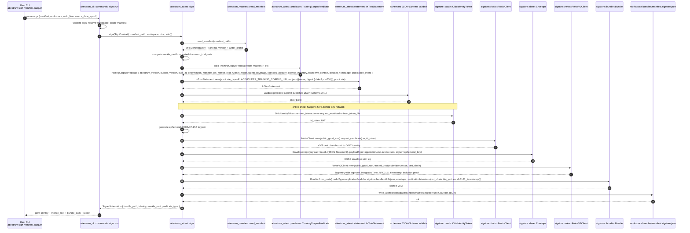

# `attestrum sign` flow — Sigstore Bundle v0.3 sign half

Source of truth: `code` as of Sprint 4 E3.5 (this commit). The `crates/attestrum-attest/src/sign.rs` low-level wrapper landed at E3 (`1568721`); the `crates/attestrum-cli/src/commands/sign.rs` user-facing subcommand + the `crates/attestrum-cli/src/lifecycle.rs::SignState` pure state machine + the contract test at `crates/attestrum-cli/tests/sign_flow_contract.rs` (closes the per-`sequenceDiagram` obligation per `PATH-A-BRIEF.md §7.1` / `CLAUDE.md §7.1`) land in this same commit. Refines `docs/diagrams/overview/sigstore-sign-verify.md`'s sign half with explicit Rust crate calls per `BUILD-PLAN.md §9 Sprint 4` and `PATH-A-BRIEF.md Part 6 Sprint 4`.

**Contract-test obligation closed at `crates/attestrum-cli/tests/sign_flow_contract.rs`** (Sprint 4 E3.5). The contract test enumerates `sign_documented_transitions()` (22 edges) plus four proptest properties (documented-edges-reachable, undocumented-holds, paths-terminate-in-known-exit, exit-codes-in-allowed-set) plus two end-to-end smokes (`--offline` → exit 3 + no bundle written; missing manifest → exit 2 before offline / OIDC dispatch).

**Subcommand contract**: `attestrum sign <manifest>` takes a sealed `manifest.parquet` (PROTECTED schema per Sprint 3 E3), optionally a `--workspace <dir>` (default: `.attestrum/` in CWD), optional `--source-date-epoch <secs>` for builder-version-fields determinism, and OIDC configuration (env vars `SIGSTORE_ID_TOKEN` / `SIGSTORE_OIDC_ISSUER` / `SIGSTORE_OIDC_CLIENT_ID`, or `--oidc-flow {interactive,workload,token-file}` flag with corresponding sub-flags). Writes the bundle to `<workspace>/bundles/manifest.sigstore.json`. Always networks (Fulcio + Rekor + optional OIDC IdP); `--offline` exits 3.

**Exit codes** (per PATH-A-BRIEF §5.2): `0` ok; `1` runtime error (manifest read, JSON serialize, file I/O on bundle write); `2` clap parse / arg-validation error; `3` `--offline` violation; `4` signing identity error (OIDC token fetch failed, Fulcio rejected CSR, certificate validity window not in future at issuance time); `5` network error (Fulcio 5xx, Rekor 5xx, TUF refresh failed); `8` predicate JSON-Schema validation failure (the assembled `TrainingCorpusPredicate` does not satisfy the v0.1 schema — guard against drift between Rust types and the published schema).

**Crate-choice flag**: messages below show `sigstore::*` (RustCrypto org, pre-approved per `CLAUDE.md §8` + `BUILD-PLAN.md §6.2`). If `cargo doc -p sigstore` at the first dep-add commit reveals the Bundle v0.3 signing API is still incomplete (per `BUILD-PLAN.md §9 Sprint 4` risk note), `sigstore-rust` (prefix-dev) lands as a second dep behind a `--features signing-prefix-dev` flag; the diagram's call shapes are compatible with either crate without structural change.

**What landed at Sprint 4 E3.5 (this commit)**:

- `attestrum sign <manifest>` clap subcommand at `crates/attestrum-cli/src/commands/sign.rs` — full message-flow as drawn, with the `PLACEHOLDER_TRAINING_CORPUS_URI` resolved to the real PROTECTED v0.3 URI string `https://attestrum.com/attestation/training-corpus/v0.3` (the v0.3 set is the initial public predicate version under the Attestrum project name; carries forward the u32 PPM field shapes from the Annex-era v0.2 schemas — see `docs/migration/v0.2-to-v0.3-attestrum-rebrand.md`).
- `SignState` + `SignEvent` pure state machine at `crates/attestrum-cli/src/lifecycle.rs` — 12 non-terminal states, 22 documented transitions, 7 exit codes (0, 1, 2, 3, 4, 5, 8 per PATH-A-BRIEF §5.2).
- Per-`sequenceDiagram` contract test at `crates/attestrum-cli/tests/sign_flow_contract.rs` (closes the §7.1 obligation).
- `sigstore` crate choice resolved at E3 (`1568721`): RustCrypto `sigstore 0.14` with `bundle/fulcio/rekor/sigstore-trust-root/rustls-tls` features, blocking signer API path. The diagram's `sigstore::*` notation is concretely implemented via the wrapper at `crates/attestrum-attest/src/sign.rs::sign`.
- `--source-date-epoch <SECS>` (or `SOURCE_DATE_EPOCH` env var) is REQUIRED — feeds `built_at` and `determinism.seed`. No `SystemTime::now()` reads on any predicate-build codepath per CLAUDE.md §7 (audit PR 2 `7cefc90` removed the parallel sin from the CAS layer).
- OIDC token sourcing: `--oidc-token-file <PATH>` or env var `SIGSTORE_ID_TOKEN`. Interactive OIDC + workload-identity flows share the env-var path on CI (GitHub Actions OIDC `id-token: write` writes the JWT to the env where attestrum picks it up).

**E3.5 tactical defaults** (not contract-level, surfaceable at E4 / Sprint 5):

- `ruleset_mode = Strict`, `ruleset_id = "attestrum-default"`, `ruleset_version = "v0.1.0"` are hardcoded until a real ruleset config file ships.
- `licensing_posture = Undisclosed` always; SPDX-whitelist heuristic deferred so the v0.3 bundle never embeds an under-vetted "open" claim.
- Predicate JSON-Schema validation (the `Schema` participant in the diagram) is by-construction via schemars derive on the Rust types; the `Exit 8` arrow is reserved in the lifecycle but no E3.5 codepath emits it from the sign flow (inspect's Exit 8 still applies to manifest schema-version drift).
- `SignedAttestation::identity` returns the placeholder `"sigstore-bundle-v0.3"`. Success print labels it as such. Real cert-extension parsing (Fulcio OID extraction for OIDC issuer + subject) pairs with the E4 verify-side cert parser.

**Deferred (E4 / Sprint 5)**:

- `attestrum verify` subcommand + per-`sequenceDiagram` contract test for `docs/diagrams/sprint-4/verify-flow.md` (E4).
- cosign interop test (`cosign verify-blob-attestation --new-bundle-format` against an E3.5-emitted bundle, with cosign installed in CI) — E4 or later.
- The Sigstore Bundle determinism strip-set is implemented at `crates/attestrum-attest/src/canonicalize.rs::canonicalize_for_compare` (E2.5) — relevant to the verify-flow diagram, not the sign-flow diagram.
- In-toto vetted-catalog re-submission for the v0.3 URIs (founder action per the audit followups; see `docs/migration/v0.2-to-v0.3-attestrum-rebrand.md`).
