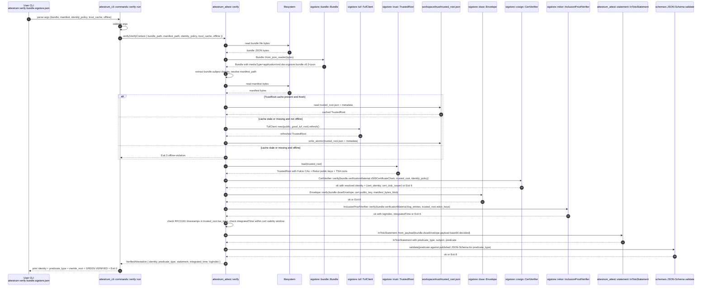

# `attestrum verify` flow — Sigstore Bundle v0.3 verify half

Source of truth: `code` as of Sprint 4 E4 (this commit). `crates/attestrum-attest/src/verify.rs` wraps `sigstore::bundle::verify::blocking::Verifier`; `crates/attestrum-attest/src/identity.rs` extracts the (SAN, OIDC issuer) tuple from the leaf cert; `crates/attestrum-cli/src/commands/verify.rs` is the user-facing subcommand driven by `crates/attestrum-cli/src/lifecycle.rs::VerifyState`; the contract test at `crates/attestrum-cli/tests/verify_flow_contract.rs` closes the per-`sequenceDiagram` obligation per PATH-A-BRIEF §7.1.

**Cosign byte-equivalence**: the cosign interop test that exercises `cosign v3.0.3+ verify-blob-attestation --new-bundle-format --bundle <bundle> <manifest>` against every CI-emitted bundle is **deferred to Sprint 4 E4.5** (paired CI workflow change to install cosign + run the test unignored). Until E4.5 lands, our verify path is internally consistent (sigstore-rs verifies what we sign via sigstore-rs) but byte-equivalence with cosign is asserted by passing the same VerificationPolicy tests sigstore-rs and cosign both consume — not yet by a direct cosign-vs-attestrum shell-out in CI.

**Contract-test obligation closed at `crates/attestrum-cli/tests/verify_flow_contract.rs`** (Sprint 4 E4). The contract test enumerates `verify_documented_transitions()` (20 edges) plus four proptest properties (documented-edges-reachable, undocumented-holds, paths-terminate-in-known-exit, exit-codes-in-allowed-set) plus four end-to-end smokes (missing-bundle → exit 2; missing-manifest → exit 2; malformed-bundle bytes → exit 1 or 6; valid-JSON-but-no-cert → exit 6).

**Subcommand contract (as shipped at E4)**: `attestrum verify <bundle> --manifest <PATH> --certificate-identity <REGEX> --certificate-oidc-issuer <REGEX> [--offline] [--print-predicate]`. All four shown non-bracketed flags are REQUIRED (no defaults). Bracketed flags are optional. Prints a 8-line success summary (verified verdict, identity, oidc_issuer, predicate_type, merkle_root, integrated_time, log_index, bundle_path); with `--print-predicate`, appends the canonical-JSON predicate body on its own line.

**Exit codes**: `0` ok; `1` runtime error (bundle file I/O, JSON parse fail, payload decode fail); `2` clap parse / arg error (incl. missing bundle / manifest); `3` `--offline` set but TrustRoot cache missing or stale beyond TUF freshness window; `5` network error (TUF refresh failed and `--offline` not set); `6` verification failure — cryptographic (cert chain invalid, signature mismatch, Rekor inclusion proof bad, RFC3161 timestamp outside cert validity window) OR identity policy mismatch (extracted identity doesn't match operator-supplied regex) OR identity-extraction failure (malformed cert, no SAN, no Fulcio OID); `8` predicate JSON-Schema validation failure — bundle verifies cryptographically but the in-toto predicate doesn't deserialise as a v0.3 `TrainingCorpusPredicate`.

**TrustRoot caching (as shipped at E4)**: E4 uses sigstore-rs's default cache at `~/.sigstore` via `Verifier::production()`. The diagram's planned `<workspace>/trust/` layout (atomic-rename writes, multi-process-safe, cache files `trusted_root.json` + `targets/<role>.json` + `metadata/<version>.json`) is a **deferred follow-up**. Trade-off: sigstore-rs's `~/.sigstore` is one cache per user across all attestrum workspaces (vs. one cache per workspace in the deferred design); good-enough for E4's verify surface but a stricter contract for fleet/CI use cases.

**Determinism strip-set for byte-identity comparison across the CI matrix** (CI-only concern, not part of the verify flow itself): pairwise `cmp` of bundles emitted across the 4-target matrix (linux-x86_64-glibc, linux-aarch64-glibc, macos-aarch64-darwin, linux-x86_64-musl) requires stripping the fields that legitimately differ across runs even with identical input. **Strip-set locked at E1.5 cross-check** (see `docs/cross-checks/e1.5/resolution.md` §6.4 for the convergence rationale and the cross-check's finding that the original strip-set hypothesis was wrong in its Bundle v0.3 field paths):

| # | Bundle v0.3 path | Reason to strip |
|---|---|---|
| 1 | `verificationMaterial.certificate.rawBytes` | Keyless leaf cert DER blob: contains ephemeral pubkey, validity window, serial, Fulcio signature, OIDC-derived extensions. **Primary v0.3 keyless path.** |
| 2 | `verificationMaterial.x509CertificateChain.certificates[*].rawBytes` | Legacy chain-form cert DER blob; same content as #1 but per-cert. Include only if legacy bundles are accepted. |
| 3 | `verificationMaterial.timestampVerificationData.rfc3161Timestamps[].signedTimestamp` | RFC3161 TSA response: signed time + nonce-dependent bytes. |
| 4 | `verificationMaterial.tlogEntries[].integratedTime` | Rekor wall-clock integration time. |
| 5 | `verificationMaterial.tlogEntries[].logIndex` | Rekor global log ingest order. |
| 6 | `verificationMaterial.tlogEntries[].inclusionPromise.signedEntryTimestamp` | Rekor SET over log-derived fields (optional but non-deterministic when present). |
| 7 | `verificationMaterial.tlogEntries[].inclusionProof.logIndex` | Tree index at proof time (distinct from #5). |
| 8 | `verificationMaterial.tlogEntries[].inclusionProof.rootHash` | Rekor tree state at proof time. |
| 9 | `verificationMaterial.tlogEntries[].inclusionProof.treeSize` | Rekor tree size at proof time. |
| 10 | `verificationMaterial.tlogEntries[].inclusionProof.hashes[]` | Sibling path depends on current tree shape. |
| 11 | `verificationMaterial.tlogEntries[].inclusionProof.checkpoint.envelope` | Signed checkpoint over log tree state. |
| 12 | `verificationMaterial.tlogEntries[].canonicalizedBody` | Rekor body embeds signature + cert chain material + serialization details. |
| 13 | `dsseEnvelope.signatures[0].sig` | DSSE signature changes under keyless ephemeral signing. Bundle v0.3 DSSE bundles MUST contain exactly one signature, so `[*]` is always `[0]`. |
| 14 | `dsseEnvelope.signatures[0].keyid` | Strip if populated from ephemeral key material (conditional). |
| 15 | `verificationMaterial.publicKeyIdentifier.hint` | Strip only for non-cert ephemeral-key-identifier flows (conditional). |
| 16 | `verificationMaterial.publicKey.rawBytes` | Strip only for embedded ephemeral-public-key flows (conditional, mutually exclusive with cert flow). |

The `dsseEnvelope.payload` (the in-toto Statement JSON, base64-encoded) IS deterministic with `--source-date-epoch` set — the payload byte-identity check is what actually proves cross-platform determinism of the predicate-building code. The strip-set is what the `attestrum_attest::canonicalize::canonicalize_for_compare(bundle) -> Vec<u8>` helper zeros out before pairwise `cmp`.

**Errata note**: an earlier version of this diagram (E1, before the E1.5 cross-check) listed `verificationMaterial.x509CertificateChain.certificates[*].validity.{notBefore,notAfter}` / `.serialNumber` / `.signatureValue` as separate strip targets. **These are not actual Bundle v0.3 JSON paths in the keyless flow** — the leaf cert is a single opaque DER blob at path #1 (or legacy path #2 for chain-form bundles). The wrong paths were carried over from `PATH-A-BRIEF.md` Part 6 Sprint 4 acceptance criterion wording and would have silently stripped nothing in CI. Per the founder's E1.5 disposition (option A — errata-by-reference), `PATH-A-BRIEF.md v0.2.0` stays immutable as a kickoff artifact; the corrected paths in the table above are authoritative; `docs/cross-checks/e1.5/resolution.md` §3.1 documents the discovery + fix. See `models:` frontmatter for the cross-reference.

**Normalization technique**: ZERO with sentinel `"__ATTESTRUM_STRIPPED__"` for string/base64 fields, `null` for object/array fields. Do NOT use plausible zeros like `"0000...0"` (a reviewer reading the canonical bundle could mistake them for a real hash). Do NOT remove fields entirely (changes object shape, hides presence/absence drift across runs).

**Pre-comparison pipeline**: (1) parse bundle JSON into a `serde_json::Value` tree; (2) apply strip-set transform per the 16-path table above; (3) re-emit via RFC 8785 JCS (JSON Canonicalization Scheme) or equivalent canonical JSON writer; (4) pin protobuf-JSON serialization options (default-field emission off, lowerCamelCase field names, int64 fields as string per ProtoJSON convention); (5) pairwise `cmp` the canonical bytes across the 4-target matrix. The helper that implements this lives at `crates/attestrum-attest/src/canonicalize.rs::canonicalize_for_compare(bundle: &Bundle) -> Vec<u8>` and ships at the same commit as the predicate Rust types.

**Verifiability invariant**: the canonical (stripped) bundle is **NOT cosign-verifiable** and exists ONLY as a CI byte-comparison artifact. The unmodified bundle (with all 16 fields populated) is what gets shipped, what gets verified by `cosign verify-blob-attestation --new-bundle-format`, and what verifiers consume in the wild. The CI README and the verify-flow caption document this distinction explicitly so a reader doesn't try to verify the canonical artifact.

**ECDSA k-nonce note**: an earlier E1 draft of this section claimed RFC 6979 deterministic ECDSA could be used to eliminate signature non-determinism. That reasoning was wrong: under the Sigstore keyless flow the ephemeral PRIVATE KEY itself changes per run, so deterministic-k ECDSA still produces different signature bytes when signing with a different key. Strip-set field #13 stays regardless of ECDSA mode. See `docs/cross-checks/e1.5/resolution.md` §3.5.

**What landed at Sprint 4 E4 (this commit)**:

- `crates/attestrum-attest/src/verify.rs` wraps `sigstore::bundle::verify::blocking::Verifier::production()`. Returns `VerifiedAttestation { identity, oidc_issuer, predicate_type, statement, predicate, integrated_time, log_index, bundle_path }`.
- `crates/attestrum-attest/src/identity.rs` extracts `(SAN, OIDC issuer)` from the leaf cert. Handles both Bundle v0.3 keyless form (`verificationMaterial.certificate.rawBytes`) AND legacy chain form (`verificationMaterial.x509CertificateChain.certificates[0].rawBytes`). OID resolution: tries Fulcio v1 `1.3.6.1.4.1.57264.1.8` (DER UTF8String) first, falls back to legacy `1.3.6.1.4.1.57264.1.1` (raw bytes). Shared between sign-side (`SignedAttestation::identity` enrichment, replacing E3.5's placeholder) and verify-side.
- `crates/attestrum-cli/src/commands/verify.rs` user-facing subcommand. `--certificate-identity` + `--certificate-oidc-issuer` REQUIRED (cosign-compatible explicit policy; no `attestrum.toml [verify]` block yet). Regex matching anchored `^…$` via `regex` crate (E4 promoted-to-direct dep) — sigstore-rs's `policy::Identity` is literal-only so the regex layer wraps it.
- `crates/attestrum-cli/src/lifecycle.rs::VerifyState` pure state machine — 10 non-terminal states, 20 documented transitions, 7 exit codes (0, 1, 2, 3, 5, 6, 8 per PATH-A-BRIEF §5.2).
- `crates/attestrum-cli/tests/verify_flow_contract.rs` contract test (closes the §7.1 obligation).
- E3.5's `SignedAttestation::identity` placeholder enriched via the shared identity extractor. `attestrum sign` success print drops the `(placeholder, see E4 for real cert parse)` suffix and shows the real SAN + OIDC issuer.

**E4 tactical defaults** (not contract-level, surfaceable at E4.5 / Sprint 5):

- TrustRoot cache = sigstore-rs's default `~/.sigstore` (per-user across all attestrum workspaces). The `<workspace>/trust/` layout in this diagram's `TrustRoot caching` section is deferred.
- `--manifest` REQUIRED (no auto-resolve from `bundle.subject[0].name`); flag is documented for E4-future-resolve.
- Default identity-policy = REQUIRED `--certificate-identity` + `--certificate-oidc-issuer` flags (no `attestrum.toml [verify]` block parsing). When the config-file format lands, flags will become overrides.
- Predicate schema validation = lightweight attempt-deserialise as `TrainingCorpusPredicate` (the Rust type IS the v0.3 schema via schemars derive). Exit 8 path is REAL at E4 (not just reserved). No `jsonschema-rs` dep.
- `--print-predicate` outputs canonical JSON via `attestrum_attest::deterministic_json` (sorted keys) per CLAUDE.md §7 determinism rules. Pipe-friendly.

**Deferred (E4.5 / Sprint 5+)**:

- cosign interop Rust test + CI workflow update to install `cosign v3+` and run `cosign verify-blob-attestation --new-bundle-format` against every CI-emitted bundle — **E4.5**.
- `<workspace>/trust/` cache layout with atomic-rename writes + per-workspace separation — follow-up.
- `--manifest`-omitted auto-resolution from `bundle.subject[0].name` — follow-up.
- `<workspace>/attestrum.toml`'s `[verify]` block for default identity-policy — follow-up.
- WASM verify (the static `verify.html` Sprint 6 deliverable per PATH-A-BRIEF Part 2.3) — Sprint 6 concern.
- Inclusion / non-inclusion predicate verify paths (E4 only verifies `training-corpus/v0.3`; the other two predicates ship in Sprint 5 alongside `attestrum prove`).
