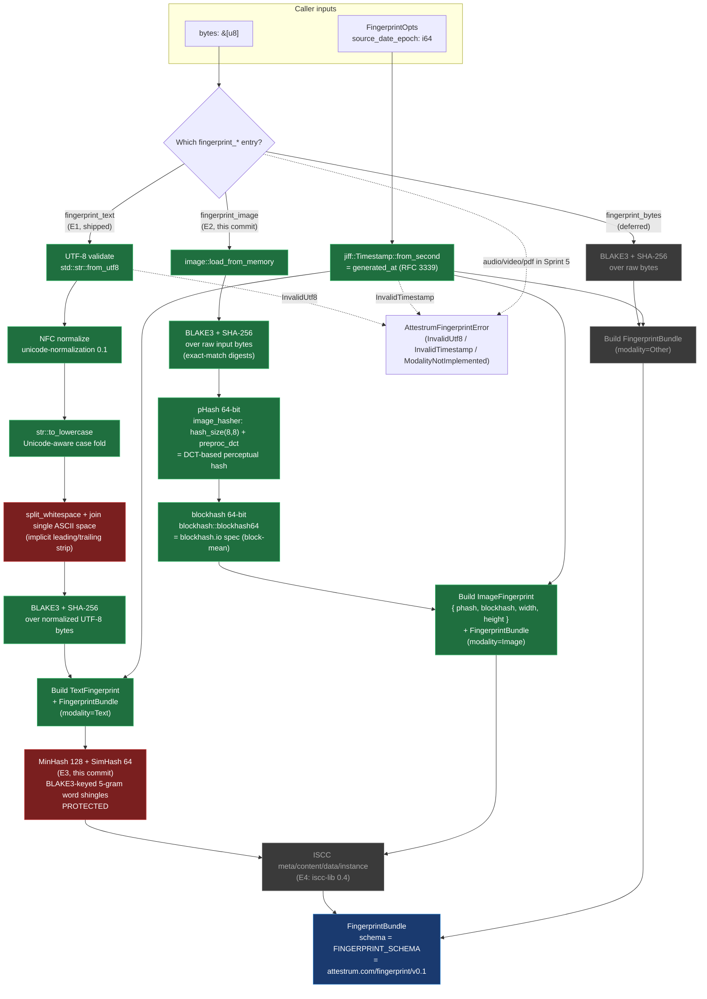

# Sprint 5 `attestrum-fingerprint` pipeline

Source of truth: **`diagram`** through S5-D1 E4. The diagram is the contract this crate implements; it flips to `source_of_truth: code` at S5-D1 E5 (the API freeze + cross-target determinism gate) per the Sprint 5 plan at `/Users/austinmunday/.claude/plans/you-re-picking-up-attestrum-stateful-hearth.md`.

**This is the ONLY diagram for S5-D1** per PATH-A-BRIEF Part 6 Sprint 5 line 1171. Per-E-commit diagram updates mean updating this file's `last_verified` SHA + flipping branch nodes from grey (deferred) to green (shipped) as each E-commit lands, NOT creating a new diagram per commit.

**Branch state at E3** (this commit): **text branch + image branch + text MinHash/SimHash sub-branch** all ship. The bytes (raw) branch and ISCC composition branch remain grey until E4 / E8 area land them. `fingerprint_text` (E1) + `fingerprint_image` (E2) remain the public entry-points; E3 extends `fingerprint_text` to populate two new `TextFingerprint` fields (`minhash: Vec<u64>` length 128, `simhash: u64`) unconditionally via the new private `text::minhash` + `text::simhash` modules.

**Modality reuse**: `attestrum_core::Modality` is re-exported from this crate as `attestrum_fingerprint::Modality` — there is NO second Modality enum in the workspace. The 6-variant attestrum-core enum (Text, Image, Audio, Video, Pdf, Other) is reused verbatim per its docstring at `crates/attestrum-core/src/lib.rs:50-52` ("Mirrors PATH-A-BRIEF §2.1's `Fingerprinter::modality` return type so `attestrum-fingerprint` re-uses this enum verbatim in Sprint 5."). Sprint 5's narrower-than-the-enum implementation scope is expressed by which `fingerprint_*` functions exist, not by which variants the enum has. Audio/Video/Pdf inputs in Sprint 5 either route to `fingerprint_bytes` (Other-as-bytes treatment) or surface as `AttestrumFingerprintError::ModalityNotImplemented(Modality)` from the dispatch entry-point when that lands.

**PROTECTED**: the text normalization pipeline (`NFC → str::to_lowercase → split_whitespace + " " join`) is locked per CLAUDE.md §4 as of E1. The MinHash 128 + SimHash 64 algorithm parameters (5-gram word shingles, 128 permutations, BLAKE3-keyed key derivation with the literal prefixes `"attestrum-minhash-v1-perm-"` + `"attestrum-simhash-v1"`, SimHash uniform weights) are locked as of E3 (this commit). Any subsequent change to either invalidates every inclusion proof emitted to that point and requires a `Protected-system-change:` commit-message footer + a schema URI bump from `https://attestrum.com/fingerprint/v0.1` → `…/v0.2` with a migration packet. The `FINGERPRINT_SCHEMA` const captures the URI; changing it without a version bump is the protocol violation.

**Determinism discipline**: `FingerprintOpts.source_date_epoch` is REQUIRED. The crate body never reads the system clock — `generated_at` is derived from the caller's epoch via `jiff::Timestamp::from_second`. Mirrors the `--source-date-epoch` discipline established in Sprint 3 E3 for the Parquet manifest writer (Reproducible Builds convention; see CLAUDE.md §7 determinism subsection).

**Legend**:

- **Green nodes** (`shipped`): land in or before this commit.
- **Red nodes** (`protected`): PROTECTED locking points per CLAUDE.md §4. `wsCollapse` is red because the text-normalization step it represents is PROTECTED as of E1. `minHash` is red because the MinHash + SimHash algorithm parameters are PROTECTED as of this commit (E3).
- **Grey nodes** (`deferred`): subsequent commits in S5-D1. Each future commit fills in its branch + updates this diagram's `last_verified` SHA. No new diagram file per commit.

## What lands at Sprint 5 E1 (text fingerprint)

- `crates/attestrum-fingerprint/Cargo.toml` — deps: `blake3` + `sha2` + `serde` + `serde_json` + `thiserror` (existing workspace deps) + NEW `unicode-normalization` (0.1) + NEW `jiff` (0.x) + path-dep `attestrum-core`. All pre-approved per `docs/license-inventory.md`. `schemars` deliberately omitted at E1 — `attestrum_core::Modality` does not currently derive `JsonSchema`, and adding the derive would propagate `schemars` as a transitive dep through every workspace crate; JSON-Schema emission for `FingerprintBundle` lands at E5 alongside whichever shim makes `Modality` satisfy `JsonSchema`.
- `crates/attestrum-fingerprint/src/lib.rs` — the public surface drawn above: `pub use attestrum_core::Modality`; `pub struct FingerprintBundle`; `pub struct TextFingerprint`; `pub struct FingerprintOpts`; `pub enum AttestrumFingerprintError`; `pub const FINGERPRINT_SCHEMA`; `pub fn fingerprint_text(&[u8], &FingerprintOpts) -> Result<FingerprintBundle, AttestrumFingerprintError>`. Private helpers: `normalize_text(&str) -> String` (PROTECTED pipeline) + thin hex wrappers around `attestrum_core::hex::encode`.
- Inline `#[cfg(test)]` unit tests exercising the normalization pipeline + NFC-equivalence pairs + UTF-8 rejection + serde round-trip + camelCase JSON shape.
- `Cargo.toml` (workspace) — `unicode-normalization = "0.1"` + `jiff = "0.2"` added to `[workspace.dependencies]`.
- `docs/license-inventory.md` — two new "Actually-used" rows (`unicode-normalization` + `jiff`).
- This diagram file (`docs/diagrams/sprint-5/fingerprint-pipeline.md`).
- `CHANGELOG.md` + `SESSION-LOG.md` per-commit entry per CLAUDE.md §6.

## What lands at Sprint 5 E2 (image fingerprint — this commit)

- `crates/attestrum-fingerprint/Cargo.toml` — adds `image = "0.25"` (default-features off + features `png, jpeg, webp, bmp, gif, tiff`), `image_hasher = "3.0"`, `blockhash = "0.5"` (all pre-approved per `docs/license-inventory.md`). `image_hasher 3.0` resolves to `3.1.1` in the lockfile (semver-compatible). `blockhash` default features include the `image` integration so `image::DynamicImage` satisfies `blockhash::Image` directly.
- `pub struct ImageFingerprint { phash: String, blockhash: String, width: u32, height: u32 }` — 16-char hex (64-bit) for both perceptual hashes; image dimensions for display.
- `pub fn fingerprint_image(bytes: &[u8], opts: &FingerprintOpts) -> Result<FingerprintBundle, AttestrumFingerprintError>` — decode via `image::load_from_memory`; pHash via `image_hasher::HasherConfig::new().hash_size(8, 8).preproc_dct().to_hasher()`; blockhash via `blockhash::blockhash64(&img)`; BLAKE3 + SHA-256 over the RAW input bytes (exact-match digest for `MatchEvidence::ExactBlake3`/`ExactSha256` paths means "same encoded file" semantics for images, distinct from text's "same normalized form" semantics).
- `AttestrumFingerprintError::ImageDecode(String)` — new error variant for non-image / corrupt input bytes.
- `FingerprintBundle.image: Option<ImageFingerprint>` — non-breaking serde addition (`#[serde(skip_serializing_if = "Option::is_none")]`); E1-emitted text bundles stay byte-identical because the field stays `None` + omitted in JSON.

## What lands at Sprint 5 E3 (text MinHash + SimHash — this commit)

- `crates/attestrum-fingerprint/src/text/mod.rs` (new) — declares `pub(crate) mod minhash; pub(crate) mod simhash;`. The `text` mod is added to `lib.rs` as `mod text;` (private, not `pub mod`) — implementation details, not part of the public API surface.
- `crates/attestrum-fingerprint/src/text/minhash.rs` (new) — `pub(crate) fn compute(normalized: &str) -> Vec<u64>` returning 128 BLAKE3-keyed min-hashes over 5-gram word shingles of the already-PROTECTED-normalized text. Per permutation `i`: `key_i = BLAKE3("attestrum-minhash-v1-perm-" || u64_le(i))`; for each shingle compute `BLAKE3_keyed(key_i, shingle_bytes)`, take first 8 bytes as little-endian `u64`, keep the MIN across all shingles. Empty input → `vec![u64::MAX; 128]`. Inputs of <5 tokens fall back to a single shingle containing the full token list. **PROTECTED**: the literal key prefix string, the 5-gram shingle size, and the 128-permutation count are all part of the locked spec.
- `crates/attestrum-fingerprint/src/text/simhash.rs` (new) — `pub(crate) fn compute(normalized: &str) -> u64`. Per-call key `BLAKE3("attestrum-simhash-v1")`; per-shingle `BLAKE3_keyed(key, shingle_bytes)[..8]` little-endian `u64`; `[i32; 64]` accumulator with **uniform weights** (+1 if bit i of the shingle hash is 1, else -1); final bit i of the SimHash is `1` iff `acc[i] > 0`. Empty input → `0`. **PROTECTED**: the literal key label, the 5-gram shingle size, the uniform weights, and the `acc > 0` tie-break (acc == 0 yields bit 0) are all part of the locked spec.
- `crates/attestrum-fingerprint/src/lib.rs` — `mod text;` added (private); `TextFingerprint` extended with `pub minhash: Vec<u64>` (always length 128) + `pub simhash: u64` (always populated); `fingerprint_text` populates both unconditionally; crate-level doc-comment refreshed to describe the post-E3 surface; `TextFingerprint` doc-comment refreshed to describe the locked params + caller-side Jaccard / Hamming computation guidance.
- Inline `#[cfg(test)]` tests added: 7 in `text/minhash.rs` (length invariant, determinism, empty-baseline, identical-inputs, paraphrase-Jaccard ≥ 0.5, unrelated-Jaccard ≤ 0.10, short-input fallback), 6 in `text/simhash.rs` (determinism, empty-baseline, identical-inputs, paraphrase-Hamming ≤ 16, unrelated-Hamming ≥ 24, short-input fallback), 4 new + 1 adjusted in `lib.rs` (unconditional population, NFC-equivalence, whitespace-equivalence, serde camelCase shape, `fingerprint_text_basic_ascii` extended to assert `minhash.len() == 128`).
- **No new external dependencies** per PATH-A-BRIEF Part 2.1 line 522 — MinHash + SimHash hand-rolled using the already-pulled `blake3` workspace dep.
- This diagram file (`docs/diagrams/sprint-5/fingerprint-pipeline.md`) — `minHash` node flipped from `e3Deferred` (grey) to `shipped` + `protected` (red, indicating the PROTECTED algorithm-parameter lock); `last_verified` SHA bumped to `6c92754`; `models:` frontmatter extended to reference the new `src/text/` files; legend updated; this section added.
- `CHANGELOG.md` + `SESSION-LOG.md` per-commit entries per CLAUDE.md §6.

## What's NOT in scope yet

- `fingerprint_bytes` — deferred. Trivial when needed (BLAKE3 + SHA-256 over raw bytes, modality=Other); will land alongside `attestrum-prove`'s manifest-walk path (E8 area) when there's a concrete consumer.
- ISCC composition — E4 (`iscc-lib` first-use commit).
- `fingerprint_path(&Path, ...)` dispatch entry — lands when `attestrum-prove` integrates the crate (E8 area).
- File-based golden fixtures under `tests/golden/fingerprint/image/` — for E2 the tests use programmatically-generated `image::ImageBuffer` patterns (4x checkerboard variants for Hamming-distance robustness assertions) rather than committed PNG fixtures. Committed binary fixtures land at E5 alongside the cross-target byte-determinism gate where the encoded-bytes round-trip stability matters.

## PROTECTED normalization detail

The locked text-normalization pipeline at `fingerprint_text` is:

1. `let s = std::str::from_utf8(bytes)?;` — UTF-8 validation
2. `let nfc: String = s.nfc().collect();` — Unicode Standard Annex #15 NFC
3. `let lower = nfc.to_lowercase();` — Unicode-aware case folding via `str::to_lowercase`
4. `let normalized = lower.split_whitespace().collect::<Vec<_>>().join(" ");` — any run of Unicode `White_Space`-property characters becomes a single ASCII `0x20`; leading/trailing whitespace implicitly stripped via `split_whitespace`'s skip-empty-pieces semantics
5. BLAKE3 + SHA-256 over `normalized.as_bytes()`

Step 4 uses `str::split_whitespace` (not `str::trim` + `replace("  ", " ")`) deliberately because `split_whitespace` is anchored to the Unicode `White_Space` property — handles every Unicode whitespace character (tab, newline, NBSP, ideographic space, etc.) uniformly. `str::trim` is also `White_Space`-anchored but doesn't collapse internal runs.

`fingerprint_text` is therefore deterministic to: the UTF-8 input bytes' Unicode content + the caller's `source_date_epoch`. No system clock, no locale, no environment.
