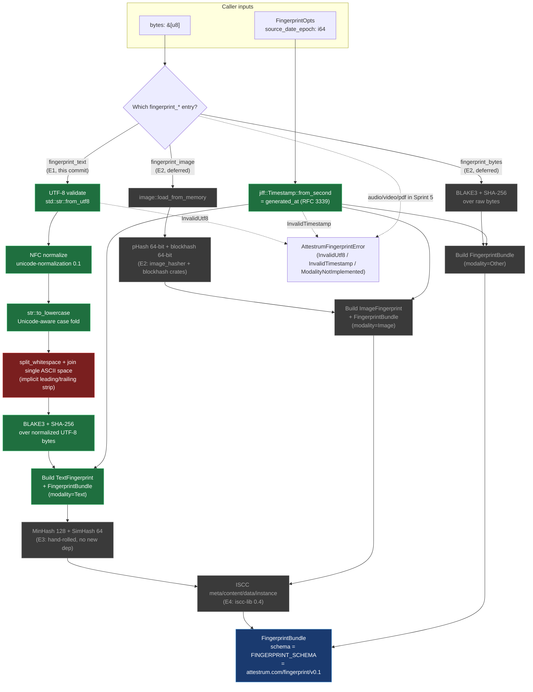

# Sprint 5 `attestrum-fingerprint` pipeline

Source of truth: **`diagram`** as of Sprint 5 E1 (this commit). The diagram is the contract this crate implements; it flips to `source_of_truth: code` at S5-D1 E5 (the API freeze + cross-target determinism gate) per the Sprint 5 plan at `/Users/austinmunday/.claude/plans/you-re-picking-up-attestrum-stateful-hearth.md`.

**This is the ONLY diagram for S5-D1** per PATH-A-BRIEF Part 6 Sprint 5 line 1171. Per-E-commit diagram updates mean updating this file's `last_verified` SHA + adding/flipping branch nodes as each E-commit lands, NOT creating a new diagram per commit.

**E1 (this commit) ships the text branch only** — the highlighted path. Image + bytes (raw) + MinHash + SimHash + ISCC are stubbed as future-commit branches so the reverse-reference linter sees the public API surface that future commits will extend without restructuring this diagram.

**Modality reuse**: `attestrum_core::Modality` is re-exported from this crate as `attestrum_fingerprint::Modality` — there is NO second Modality enum in the workspace. The 6-variant attestrum-core enum (Text, Image, Audio, Video, Pdf, Other) is reused verbatim per its docstring at `crates/attestrum-core/src/lib.rs:50-52` ("Mirrors PATH-A-BRIEF §2.1's `Fingerprinter::modality` return type so `attestrum-fingerprint` re-uses this enum verbatim in Sprint 5."). Sprint 5's narrower-than-the-enum implementation scope is expressed by which `fingerprint_*` functions exist, not by which variants the enum has. Audio/Video/Pdf inputs in Sprint 5 either route to `fingerprint_bytes` (Other-as-bytes treatment) or surface as `AttestrumFingerprintError::ModalityNotImplemented(Modality)` from the dispatch entry-point when that lands.

**PROTECTED**: the text normalization pipeline (`NFC → str::to_lowercase → split_whitespace + " " join`) is locked per CLAUDE.md §4 as of this commit. Any subsequent change to this pipeline invalidates every inclusion proof emitted to that point and requires a `Protected-system-change:` commit-message footer + a schema URI bump from `https://attestrum.com/fingerprint/v0.1` → `…/v0.2` with a migration packet. The `FINGERPRINT_SCHEMA` const captures the URI; changing it without a version bump is the protocol violation.

**Determinism discipline**: `FingerprintOpts.source_date_epoch` is REQUIRED. The crate body never reads the system clock — `generated_at` is derived from the caller's epoch via `jiff::Timestamp::from_second`. Mirrors the `--source-date-epoch` discipline established in Sprint 3 E3 for the Parquet manifest writer (Reproducible Builds convention; see CLAUDE.md §7 determinism subsection).

**Legend**:

- **Green nodes** (`E1`): land in this commit (`S5-D1 E1`). `wsCollapse` is **red** because the normalization step it represents is the PROTECTED locking-point per CLAUDE.md §4.
- **Grey nodes** (`E2`/`E3`/`E4`): deferred to subsequent commits in S5-D1. Each future commit fills in its branch + updates this diagram's `last_verified` SHA. No new diagram file per commit.

## What lands at Sprint 5 E1 (this commit)

- `crates/attestrum-fingerprint/Cargo.toml` — deps: `blake3` + `sha2` + `serde` + `serde_json` + `thiserror` (existing workspace deps) + NEW `unicode-normalization` (0.1) + NEW `jiff` (0.x) + path-dep `attestrum-core`. All pre-approved per `docs/license-inventory.md`. `schemars` deliberately omitted at E1 — `attestrum_core::Modality` does not currently derive `JsonSchema`, and adding the derive would propagate `schemars` as a transitive dep through every workspace crate; JSON-Schema emission for `FingerprintBundle` lands at E5 alongside whichever shim makes `Modality` satisfy `JsonSchema`.
- `crates/attestrum-fingerprint/src/lib.rs` — the public surface drawn above: `pub use attestrum_core::Modality`; `pub struct FingerprintBundle`; `pub struct TextFingerprint`; `pub struct FingerprintOpts`; `pub enum AttestrumFingerprintError`; `pub const FINGERPRINT_SCHEMA`; `pub fn fingerprint_text(&[u8], &FingerprintOpts) -> Result<FingerprintBundle, AttestrumFingerprintError>`. Private helpers: `normalize_text(&str) -> String` (PROTECTED pipeline) + thin hex wrappers around `attestrum_core::hex::encode`.
- Inline `#[cfg(test)]` unit tests exercising the normalization pipeline + NFC-equivalence pairs + UTF-8 rejection + serde round-trip + camelCase JSON shape.
- `Cargo.toml` (workspace) — `unicode-normalization = "0.1"` + `jiff = "0.2"` added to `[workspace.dependencies]`.
- `docs/license-inventory.md` — two new "Actually-used" rows (`unicode-normalization` + `jiff`).
- This diagram file (`docs/diagrams/sprint-5/fingerprint-pipeline.md`).
- `CHANGELOG.md` + `SESSION-LOG.md` per-commit entry per CLAUDE.md §6.

## What's NOT in scope for E1

- `fingerprint_image`, `fingerprint_bytes` — E2.
- MinHash + SimHash — E3 (`src/text/minhash.rs` + `src/text/simhash.rs` will land).
- ISCC composition — E4 (`iscc-lib` first-use commit).
- `fingerprint_path(&Path, ...)` dispatch entry — lands when `attestrum-prove` integrates the crate (E8 area).
- The `image` / `iscc` / image-perceptual-hash fields on `FingerprintBundle` — added by their respective commits via non-breaking serde additions (`Option<T>` with `#[serde(skip_serializing_if)]`).
- File-based golden fixtures under `tests/golden/fingerprint/text/` — for E1 the goldens are inline string constants in the test module because the text-normalization values are short enough to inline; the on-disk `tests/fixtures/fp/` directory pattern from PATH-A-BRIEF §2.1 line 530 lands at E2 alongside image fixtures (which DO require byte-on-disk files).

## PROTECTED normalization detail

The locked text-normalization pipeline at `fingerprint_text` is:

1. `let s = std::str::from_utf8(bytes)?;` — UTF-8 validation
2. `let nfc: String = s.nfc().collect();` — Unicode Standard Annex #15 NFC
3. `let lower = nfc.to_lowercase();` — Unicode-aware case folding via `str::to_lowercase`
4. `let normalized = lower.split_whitespace().collect::<Vec<_>>().join(" ");` — any run of Unicode `White_Space`-property characters becomes a single ASCII `0x20`; leading/trailing whitespace implicitly stripped via `split_whitespace`'s skip-empty-pieces semantics
5. BLAKE3 + SHA-256 over `normalized.as_bytes()`

Step 4 uses `str::split_whitespace` (not `str::trim` + `replace("  ", " ")`) deliberately because `split_whitespace` is anchored to the Unicode `White_Space` property — handles every Unicode whitespace character (tab, newline, NBSP, ideographic space, etc.) uniformly. `str::trim` is also `White_Space`-anchored but doesn't collapse internal runs.

`fingerprint_text` is therefore deterministic to: the UTF-8 input bytes' Unicode content + the caller's `source_date_epoch`. No system clock, no locale, no environment.
