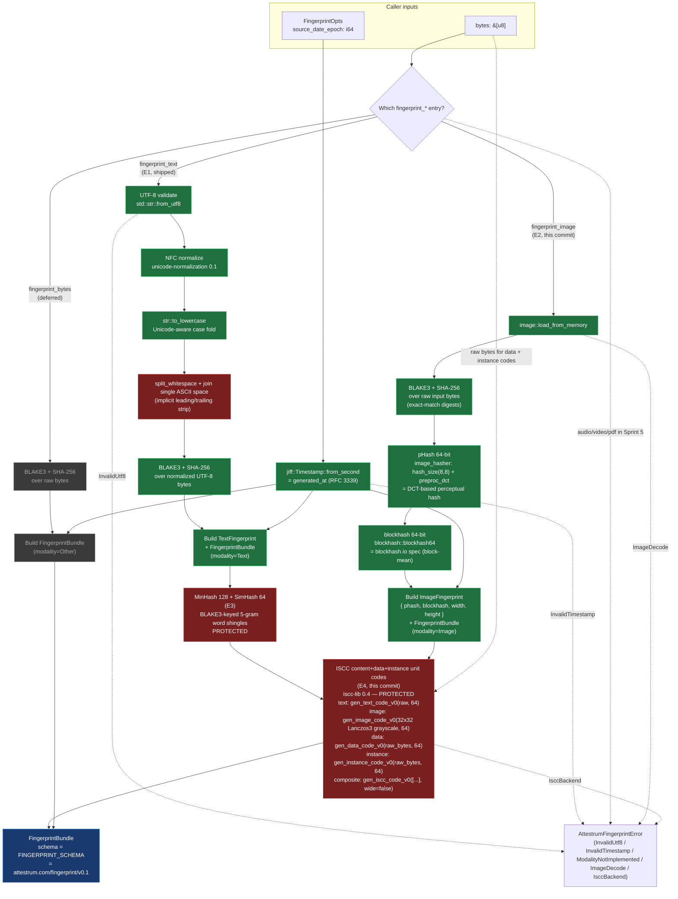

# Sprint 5 `attestrum-fingerprint` pipeline

Source of truth: **`code`** as of S5-D1 E5. The Rust types in `crates/attestrum-fingerprint/src/lib.rs` are authoritative; this diagram is now the derived view. Drift between the two is enforced by the diagram-linter's forward / reverse / drift checks (CLAUDE.md §5) and by three test-side gates that land at E5: `tests/api_surface.rs` (golden snapshot of every `pub` item), `tests/schema_derive.rs` (committed JSON Schema at `docs/schemas/fingerprint-v0.1.schema.json`), and `tests/determinism.rs` (committed PNG fixtures + golden bundle JSON, exercised by `cargo test --workspace` on all four targets of `.github/workflows/determinism.yml`).

The file was authored at `source_of_truth: diagram` through E1-E4 as the contract this crate implements; the flip to `code` landed at the E5 commit. Per-E-commit history is preserved in the "What lands at Sprint 5 E…" sections below.

**This is the ONLY diagram for S5-D1** per PATH-A-BRIEF Part 6 Sprint 5 line 1171. Per-E-commit diagram updates have meant updating this file's `last_verified` SHA + flipping branch nodes from grey (deferred) to green (shipped) as each E-commit lands, NOT creating a new diagram per commit.

**Branch state at E5** (this commit): **text branch + image branch + text MinHash/SimHash sub-branch + ISCC composition sub-branch** all ship. Only the bytes (raw) branch remains grey until E8 area lands `fingerprint_bytes`. `fingerprint_text` (E1) + `fingerprint_image` (E2) remain the public entry-points; E4 extended both to populate the `FingerprintBundle.iscc: Option<IsccComposition>` field via `iscc-lib 0.4`; E5 freezes that surface and adds the determinism gate.

**Modality reuse**: `attestrum_core::Modality` is re-exported from this crate as `attestrum_fingerprint::Modality` — there is NO second Modality enum in the workspace. The 6-variant attestrum-core enum (Text, Image, Audio, Video, Pdf, Other) is reused verbatim per its docstring at `crates/attestrum-core/src/lib.rs:50-52` ("Mirrors PATH-A-BRIEF §2.1's `Fingerprinter::modality` return type so `attestrum-fingerprint` re-uses this enum verbatim in Sprint 5."). Sprint 5's narrower-than-the-enum implementation scope is expressed by which `fingerprint_*` functions exist, not by which variants the enum has. Audio/Video/Pdf inputs in Sprint 5 either route to `fingerprint_bytes` (Other-as-bytes treatment) or surface as `AttestrumFingerprintError::ModalityNotImplemented(Modality)` from the dispatch entry-point when that lands.

**PROTECTED**: three locking points per CLAUDE.md §4 are locked across E1 / E3 / E4:

1. **E1** — the text normalization pipeline (`NFC → str::to_lowercase → split_whitespace + " " join`) consumed by BLAKE3 + SHA-256 + MinHash + SimHash.
2. **E3** — the MinHash 128 + SimHash 64 algorithm parameters (5-gram word shingles, 128 permutations, BLAKE3-keyed key derivation with the literal prefixes `"attestrum-minhash-v1-perm-"` + `"attestrum-simhash-v1"`, SimHash uniform weights, `acc > 0` tie-break).
3. **E4 (this commit)** — the ISCC composition recipe (`iscc-lib 0.4` version pin, RAW input text for `gen_text_code_v0`, 32×32 grayscale Lanczos3 resize for `gen_image_code_v0`, 64-bit per unit, `gen_iscc_code_v0(&[content, data, instance], wide=false)`, `IsccComposition` serde shape of 4 strings).

Any subsequent change to any of the three invalidates every inclusion proof emitted to that point and requires a `Protected-system-change:` commit-message footer + a schema URI bump from `https://attestrum.com/fingerprint/v0.1` → `…/v0.2` with a migration packet. The `FINGERPRINT_SCHEMA` const captures the URI; changing it without a version bump is the protocol violation.

**Determinism discipline**: `FingerprintOpts.source_date_epoch` is REQUIRED. The crate body never reads the system clock — `generated_at` is derived from the caller's epoch via `jiff::Timestamp::from_second`. Mirrors the `--source-date-epoch` discipline established in Sprint 3 E3 for the Parquet manifest writer (Reproducible Builds convention; see CLAUDE.md §7 determinism subsection).

**Legend**:

- **Green nodes** (`shipped`): land in or before this commit.
- **Red nodes** (`protected`): PROTECTED locking points per CLAUDE.md §4. Mermaid renders the last-applied class's style when a node is in multiple classes, so PROTECTED-and-shipped nodes display as red. `wsCollapse` is red because the text-normalization step it represents is PROTECTED as of E1. `minHash` is red because the MinHash + SimHash algorithm parameters are PROTECTED as of E3. `isccCompose` is red because the ISCC composition recipe is PROTECTED as of this commit (E4).
- **Grey nodes** (`deferred`): subsequent commits in S5-D1. Each future commit fills in its branch + updates this diagram's `last_verified` SHA. No new diagram file per commit.

## What lands at Sprint 5 E1 (text fingerprint)

- `crates/attestrum-fingerprint/Cargo.toml` — deps: `blake3` + `sha2` + `serde` + `serde_json` + `thiserror` (existing workspace deps) + NEW `unicode-normalization` (0.1) + NEW `jiff` (0.x) + path-dep `attestrum-core`. All pre-approved per `docs/license-inventory.md`. `schemars` deliberately omitted at E1 — `attestrum_core::Modality` does not currently derive `JsonSchema`, and adding the derive would propagate `schemars` as a transitive dep through every workspace crate; JSON-Schema emission for `FingerprintBundle` lands at E5 alongside whichever shim makes `Modality` satisfy `JsonSchema`.
- `crates/attestrum-fingerprint/src/lib.rs` — the public surface drawn above: `pub use attestrum_core::Modality`; `pub struct FingerprintBundle`; `pub struct TextFingerprint`; `pub struct FingerprintOpts`; `pub enum AttestrumFingerprintError`; `pub const FINGERPRINT_SCHEMA`; `pub fn fingerprint_text(&[u8], &FingerprintOpts) -> Result<FingerprintBundle, AttestrumFingerprintError>`. Private helpers: `normalize_text(&str) -> String` (PROTECTED pipeline) + thin hex wrappers around `attestrum_core::hex::encode`.
- Inline `#[cfg(test)]` unit tests exercising the normalization pipeline + NFC-equivalence pairs + UTF-8 rejection + serde round-trip + camelCase JSON shape.
- `Cargo.toml` (workspace) — `unicode-normalization = "0.1"` + `jiff = "0.2"` added to `[workspace.dependencies]`.
- `docs/license-inventory.md` — two new "Actually-used" rows (`unicode-normalization` + `jiff`).
- This diagram file (`docs/diagrams/sprint-5/fingerprint-pipeline.md`).
- `CHANGELOG.md` + `SESSION-LOG.md` per-commit entry per CLAUDE.md §6.

## What lands at Sprint 5 E2 (image fingerprint — this commit)

- `crates/attestrum-fingerprint/Cargo.toml` — adds `image = "0.25"` (default-features off + features `png, jpeg, webp, bmp, gif, tiff`), `image_hasher = "3.0"`, `blockhash = "0.5"` (all pre-approved per `docs/license-inventory.md`). `image_hasher 3.0` resolves to `3.1.1` in the lockfile (semver-compatible). `blockhash` default features include the `image` integration so `image::DynamicImage` satisfies `blockhash::Image` directly.
- `pub struct ImageFingerprint { phash: String, blockhash: String, width: u32, height: u32 }` — 16-char hex (64-bit) for both perceptual hashes; image dimensions for display.
- `pub fn fingerprint_image(bytes: &[u8], opts: &FingerprintOpts) -> Result<FingerprintBundle, AttestrumFingerprintError>` — decode via `image::load_from_memory`; pHash via `image_hasher::HasherConfig::new().hash_size(8, 8).preproc_dct().to_hasher()`; blockhash via `blockhash::blockhash64(&img)`; BLAKE3 + SHA-256 over the RAW input bytes (exact-match digest for `MatchEvidence::ExactBlake3`/`ExactSha256` paths means "same encoded file" semantics for images, distinct from text's "same normalized form" semantics).
- `AttestrumFingerprintError::ImageDecode(String)` — new error variant for non-image / corrupt input bytes.
- `FingerprintBundle.image: Option<ImageFingerprint>` — non-breaking serde addition (`#[serde(skip_serializing_if = "Option::is_none")]`); E1-emitted text bundles stay byte-identical because the field stays `None` + omitted in JSON.

## What lands at Sprint 5 E3 (text MinHash + SimHash — this commit)

- `crates/attestrum-fingerprint/src/text/mod.rs` (new) — declares `pub(crate) mod minhash; pub(crate) mod simhash;`. The `text` mod is added to `lib.rs` as `mod text;` (private, not `pub mod`) — implementation details, not part of the public API surface.
- `crates/attestrum-fingerprint/src/text/minhash.rs` (new) — `pub(crate) fn compute(normalized: &str) -> Vec<u64>` returning 128 BLAKE3-keyed min-hashes over 5-gram word shingles of the already-PROTECTED-normalized text. Per permutation `i`: `key_i = BLAKE3("attestrum-minhash-v1-perm-" || u64_le(i))`; for each shingle compute `BLAKE3_keyed(key_i, shingle_bytes)`, take first 8 bytes as little-endian `u64`, keep the MIN across all shingles. Empty input → `vec![u64::MAX; 128]`. Inputs of <5 tokens fall back to a single shingle containing the full token list. **PROTECTED**: the literal key prefix string, the 5-gram shingle size, and the 128-permutation count are all part of the locked spec.
- `crates/attestrum-fingerprint/src/text/simhash.rs` (new) — `pub(crate) fn compute(normalized: &str) -> u64`. Per-call key `BLAKE3("attestrum-simhash-v1")`; per-shingle `BLAKE3_keyed(key, shingle_bytes)[..8]` little-endian `u64`; `[i32; 64]` accumulator with **uniform weights** (+1 if bit i of the shingle hash is 1, else -1); final bit i of the SimHash is `1` iff `acc[i] > 0`. Empty input → `0`. **PROTECTED**: the literal key label, the 5-gram shingle size, the uniform weights, and the `acc > 0` tie-break (acc == 0 yields bit 0) are all part of the locked spec.
- `crates/attestrum-fingerprint/src/lib.rs` — `mod text;` added (private); `TextFingerprint` extended with `pub minhash: Vec<u64>` (always length 128) + `pub simhash: u64` (always populated); `fingerprint_text` populates both unconditionally; crate-level doc-comment refreshed to describe the post-E3 surface; `TextFingerprint` doc-comment refreshed to describe the locked params + caller-side Jaccard / Hamming computation guidance.
- Inline `#[cfg(test)]` tests added: 7 in `text/minhash.rs` (length invariant, determinism, empty-baseline, identical-inputs, paraphrase-Jaccard ≥ 0.5, unrelated-Jaccard ≤ 0.10, short-input fallback), 6 in `text/simhash.rs` (determinism, empty-baseline, identical-inputs, paraphrase-Hamming ≤ 16, unrelated-Hamming ≥ 24, short-input fallback), 4 new + 1 adjusted in `lib.rs` (unconditional population, NFC-equivalence, whitespace-equivalence, serde camelCase shape, `fingerprint_text_basic_ascii` extended to assert `minhash.len() == 128`).
- **No new external dependencies** per PATH-A-BRIEF Part 2.1 line 522 — MinHash + SimHash hand-rolled using the already-pulled `blake3` workspace dep.
- This diagram file (`docs/diagrams/sprint-5/fingerprint-pipeline.md`) — `minHash` node flipped from `e3Deferred` (grey) to `shipped` + `protected` (red, indicating the PROTECTED algorithm-parameter lock); `last_verified` SHA bumped to `6c92754`; `models:` frontmatter extended to reference the new `src/text/` files; legend updated; this section added.
- `CHANGELOG.md` + `SESSION-LOG.md` per-commit entries per CLAUDE.md §6.

## What lands at Sprint 5 E4 (ISCC composition — this commit)

- `Cargo.toml` (workspace) — adds `iscc-lib = "0.4"` to `[workspace.dependencies]`. Apache-2.0, pre-approved per `docs/license-inventory.md` PATH-A-BRIEF §2.1 row.
- `crates/attestrum-fingerprint/Cargo.toml` — adds `iscc-lib = { workspace = true }`.
- `deny.toml` — transitive-only allow-list expanded with `BSL-1.0` (Boost Software License 1.0) for `xxhash-rust v0.8.15` pulled in via `iscc-lib`'s CDC chunking. Same pattern as the existing `NCSA` (E2), `ISC` + `MIT-0` + `Zlib` + `CDLA-Permissive-2.0` (Sprint 4 E3) transitive entries — direct workspace deps remain restricted to CLAUDE.md §8's base list.
- `crates/attestrum-fingerprint/src/lib.rs` —
  - `pub struct IsccComposition { content_code, data_code, instance_code, composite }` (4 base32 ISCC strings, `#[serde(rename_all = "camelCase")]`).
  - `pub iscc: Option<IsccComposition>` added to `FingerprintBundle` (`#[serde(skip_serializing_if = "Option::is_none")]`).
  - `AttestrumFingerprintError::IsccBackend(String)` error variant + auto-`From<iscc_lib::IsccError>` impl.
  - Private helpers: `iscc_image_pixels(&DynamicImage) -> [u8; 1024]` (32×32 Lanczos3 grayscale resize → fixed-size byte array) and `compose_iscc(IsccContentInput, raw_bytes) -> Result<IsccComposition, _>`.
  - `fingerprint_text` populates `iscc: Some(compose_iscc(IsccContentInput::Text(raw_input), bytes)?)` — RAW text per ISCC spec, NOT the PROTECTED-normalized text.
  - `fingerprint_image` populates `iscc: Some(compose_iscc(IsccContentInput::Image(&pixels), bytes)?)` — image-code over 32×32 grayscale Lanczos3 resize.
  - Crate-level + `FingerprintBundle` doc-comments refreshed; PROTECTED block expanded to capture the third locking point.
- Inline `#[cfg(test)]` tests added: 4 text-branch e2e tests (`populates_iscc_composition`, `iscc_is_deterministic`, `distinct_content_distinct_composite`, `iscc_bundle_round_trips_via_serde_json`) + 3 image-branch e2e tests (same shape) + 3 existing tests adjusted (`fingerprint_text_basic_ascii`, `fingerprint_image_basic_shape`, `fingerprint_bundle_omits_text_image_and_iscc_fields_when_none` renamed from `…_text_and_image_…`).
- `docs/license-inventory.md` — new "Actually-used" row for `iscc-lib@0.4.0 | Apache-2.0 | 2026-05-25 | Sprint 5 S5-D1 E4 | attestrum-fingerprint`.
- This diagram file — `isccCompose` node flipped from `e4Deferred` (grey) to `shipped, protected` (red); the now-unused `classDef e4Deferred` removed; `last_verified` SHA bumped to `737d890`; `models:` frontmatter extended with `IsccComposition` + helper names; new dotted `bytes -.-> isccCompose` edge clarifying the raw-bytes data dependency; legend updated; this section added; "Branch state at E3" → "Branch state at E4"; "What's NOT in scope yet" pruned to drop the ISCC line.
- `CHANGELOG.md` + `SESSION-LOG.md` per-commit entries per CLAUDE.md §6.

## What lands at Sprint 5 E5 (API freeze + cross-target determinism gate — this commit)

- `crates/attestrum-fingerprint/Cargo.toml` — adds `schemars = { workspace = true }` so `FingerprintBundle` + nested types can derive `JsonSchema`. `schemars` was already a workspace dep (consumed by `attestrum-attest`); promotion from transitive to direct only.
- `crates/attestrum-core/Cargo.toml` + `src/lib.rs` — adds `schemars` dep and derives `schemars::JsonSchema` on `Modality`. Paired with the fingerprint-side derive so the canonical schema resolves the `modality` field's enum shape without a remote-derive shim (the strategy chosen per the E5 plan).
- `crates/attestrum-fingerprint/src/lib.rs` — derives `JsonSchema` on `FingerprintBundle`, `TextFingerprint`, `ImageFingerprint`, `IsccComposition`. `FingerprintOpts` + `AttestrumFingerprintError` deliberately skip the derive (caller-supplied options + error types aren't part of the on-disk bundle shape). Crate-level doc-comment refreshed to past-tense the E1-E4 paragraphs and add the new E5 paragraph. Perceptual-hash threshold assertions tightened from the loose `>= 8` placeholder bound (12.5%) to calibrated `>= 20` for pHash and `>= 30` for blockhash — values observed on macOS aarch64 are 22 + 32 respectively; 2-bit safety margin tolerates small cross-target jitter (image_hasher's DCT uses `f32` internally; Lanczos3 + blockhash are integer-only).
- `crates/attestrum-fingerprint/tests/api_surface.rs` + `tests/api-surface.golden.txt` — hand-rolled API-surface snapshot test (~150 LOC, mirroring the proven `attestrum-attest/tests/api_surface.rs` precedent). Scans every `pub` item in `src/lib.rs`, canonicalises to `<source>: <kind> <name>` lines, sorts into a `BTreeSet`, diffs against the checked-in golden. Three additional assertions pin the load-bearing items: `FINGERPRINT_SCHEMA` const present (PROTECTED URI), the four bundle structs present (`FingerprintBundle`, `TextFingerprint`, `ImageFingerprint`, `IsccComposition`), and the two entry-point fns present (`fingerprint_text`, `fingerprint_image`). Regen via `ATTESTRUM_REGEN_API_SURFACE=1 cargo test -p attestrum-fingerprint --test api_surface`.
- `crates/attestrum-fingerprint/tests/schema_derive.rs` + `docs/schemas/fingerprint-v0.1.schema.json` — derives the canonical JSON Schema from `FingerprintBundle` via `schemars::schema_for!`, injects `$id` (set to `https://attestrum.com/fingerprint/v0.1.schema.json`) + `title` ("Attestrum Fingerprint Bundle v0.1"), sorts keys recursively, pretty-prints. Diffs against the committed golden under `docs/schemas/`. Same pattern as the three predicate schemas at `docs/schemas/{training-corpus,inclusion-proof,non-inclusion-proof}-v0.3.schema.json`. Regen via `ATTESTRUM_REGEN_SCHEMAS=1 cargo test -p attestrum-fingerprint --test schema_derive` (shares the env var with the attestrum-attest schema regen).
- `crates/attestrum-fingerprint/tests/determinism.rs` + `tests/fixtures/{checkerboard,gradient}.png` + `tests/golden/{text-fixture,checkerboard-fixture,gradient-fixture}.bundle.json` — cross-target byte-determinism gate. Loads each PNG fixture (committed binary, ~258 / 230 bytes), fingerprints with `source_date_epoch = 1_748_109_600` (mirrors the `cosign_interop.rs` epoch convention), serialises to canonical pretty JSON (sort_keys → to_string_pretty + trailing newline), diffs against the committed `tests/golden/*.bundle.json`. The existing 4-target `determinism.yml` matrix runs `cargo test --workspace` and catches any cross-target drift on the same golden. Two regen env vars: `ATTESTRUM_REGEN_FINGERPRINT_FIXTURES=1` (rewrites the PNG bytes from in-test `ImageBuffer` patterns) + `ATTESTRUM_REGEN_FINGERPRINT_GOLDEN=1` (rewrites the JSON goldens against the current code). Separate so a benign golden regen doesn't silently rewrite the fixture inputs.
- This diagram file — `source_of_truth: diagram` → `code`; `last_verified` bumped to `cc066a6 2026-05-26`; `models:` extended with the three new test files; title expanded to include "E5"; branch-state header updated. No Mermaid-body structural changes (E5 freezes the existing surface, doesn't add nodes).
- `CHANGELOG.md` — `[Unreleased]` `### Added — Sprint 5` bullet expanded with the E5 milestones (API freeze, JSON Schema publication at v0.1, cross-target determinism gate).
- Local-only `SESSION-LOG.md` per-commit entry per CLAUDE.md §6 (outside the commit).

## What's NOT in scope yet

- `fingerprint_bytes` — deferred. Trivial when needed (BLAKE3 + SHA-256 over raw bytes, modality=Other); will land alongside `attestrum-prove`'s manifest-walk path (E8 area) when there's a concrete consumer.
- `fingerprint_path(&Path, ...)` dispatch entry — lands when `attestrum-prove` integrates the crate (E8 area).
- ISCC composite-distance helper (for `MatchEvidence::Iscc.composite_distance`) — lives in `attestrum-prove` (E9), not this crate. We emit the codes; the prover computes the distance via `iscc_lib::iscc_decompose` + Hamming over the binary digest representation.
- Audio / Video / Other-modality ISCC unit codes — out of Sprint 5 entirely (no `fingerprint_audio` / `fingerprint_video` entry-points; `iscc-lib` exposes `gen_audio_code_v0` / `gen_video_code_v0` for future use).
- Meta-Code via `gen_meta_code_v0` — requires metadata input we don't carry.
- Audio / Video / Pdf golden fixtures — out of Sprint 5 entirely. The text + image fingerprint determinism gate landed at E5 (`tests/fixtures/{checkerboard,gradient}.png` + `tests/golden/*.bundle.json`); audio/video/pdf surfaces await the corresponding `fingerprint_*` entry-points.

## PROTECTED normalization detail

The locked text-normalization pipeline at `fingerprint_text` is:

1. `let s = std::str::from_utf8(bytes)?;` — UTF-8 validation
2. `let nfc: String = s.nfc().collect();` — Unicode Standard Annex #15 NFC
3. `let lower = nfc.to_lowercase();` — Unicode-aware case folding via `str::to_lowercase`
4. `let normalized = lower.split_whitespace().collect::<Vec<_>>().join(" ");` — any run of Unicode `White_Space`-property characters becomes a single ASCII `0x20`; leading/trailing whitespace implicitly stripped via `split_whitespace`'s skip-empty-pieces semantics
5. BLAKE3 + SHA-256 over `normalized.as_bytes()`

Step 4 uses `str::split_whitespace` (not `str::trim` + `replace("  ", " ")`) deliberately because `split_whitespace` is anchored to the Unicode `White_Space` property — handles every Unicode whitespace character (tab, newline, NBSP, ideographic space, etc.) uniformly. `str::trim` is also `White_Space`-anchored but doesn't collapse internal runs.

`fingerprint_text` is therefore deterministic to: the UTF-8 input bytes' Unicode content + the caller's `source_date_epoch`. No system clock, no locale, no environment.
