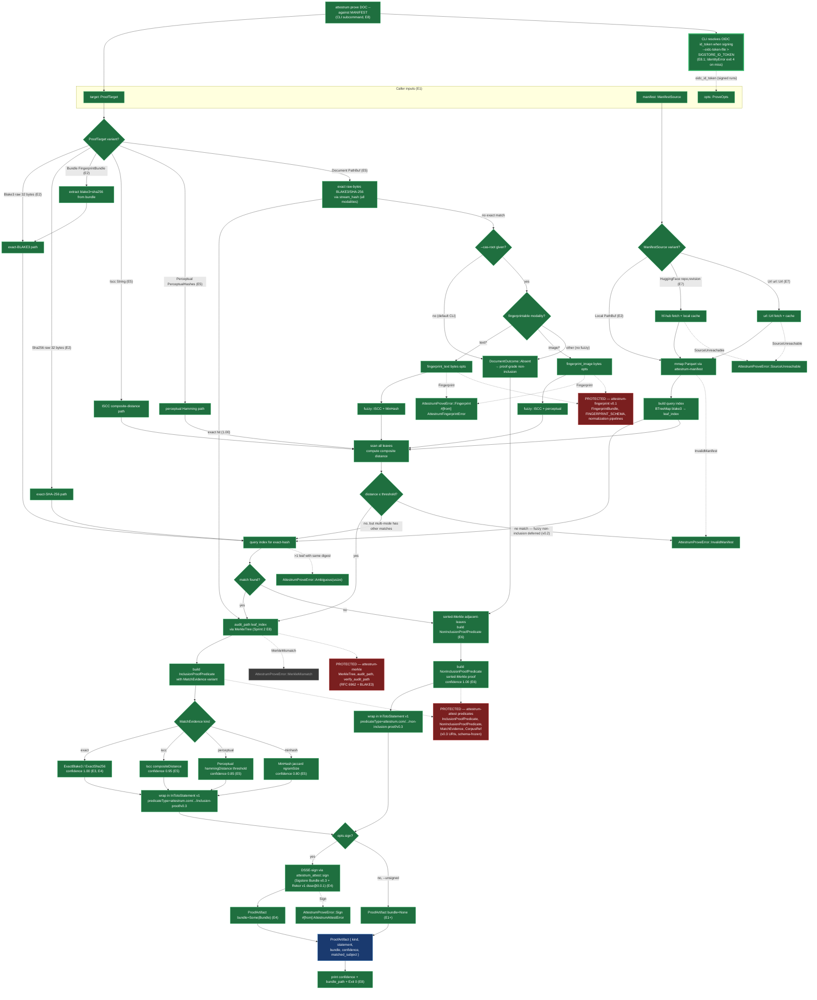

# Sprint 5 `attestrum-prove` pipeline

Source of truth: **`code`** as of S5-D2 E8 (this commit). The `crates/attestrum-prove/` + `crates/attestrum-cli/src/commands/prove.rs` codebase is now authoritative; this diagram is a derived view that must be re-verified (i.e. `last_verified` bumped) whenever any file in the `models:` field is staged. Drift gate 6 in the diagram-linter is now active for this file — staged changes to a `models:` file must co-stage this diagram in the same commit per CLAUDE.md §2. The diagram-vs-code source-of-truth direction is a one-way door — flipped from `diagram` (contract pre-implementation) to `code` (post-implementation derived view) at this commit, mirroring the S5-D1 E5 cadence for `fingerprint-pipeline.md`. The `attestrum-attest` predicate types (`InclusionProofPredicate`, `NonInclusionProofPredicate`, `MatchEvidence`) are already-locked PROTECTED schemas per CLAUDE.md §4 — this diagram references them but does not redefine them.

**This is the ONLY sprint-5 diagram for S5-D2** per the D1 cadence precedent (one diagram per deliverable; per-E-commit updates bump `last_verified` + flip branch nodes from grey-deferred to green-shipped rather than creating a new diagram per commit).

**Post-E8 correction (2026-05-30, real-corpus shakedown) — `ProofTarget::Document` exact-first + non-inclusion routing.** A real-corpus run surfaced that `dispatch_document` hashed the document via `fingerprint_text`/`_image` and tried exact-match on *that* digest — but `fingerprint_text` hashes the **normalized** bytes while the manifest stores the **raw-bytes** BLAKE3 (`attestrum_cas::stream_hash`). So an exact text file present in the corpus was silently downgraded to a fuzzy 0.95 (grade-wall violation, roadmap §5), and pdf/other modalities errored as "unsupported" before they could match. Fix: `dispatch_document` now hashes the document's **raw bytes** via `stream_hash_path` and tries `find_exact_match` **first**, for every modality → exact present documents prove as `ExactBlake3` / 1.00 by path. When there's no exact match: with no `--cas-root` (the default CLI shape) the exact document is provably absent → a proof-grade **non-inclusion** (reusing the E6 `dispatch_non_inclusion` helper), replacing the old confusing `InvalidManifest("fuzzy non-inclusion is v0.2 work")` error. With `--cas-root`, fuzzy is attempted; a genuine fuzzy miss keeps the honest v0.2 fuzzy-non-inclusion deferral. **No PROTECTED change** (fingerprint normalization untouched), **no new error variant** (the 6-variant `AttestrumProveError` lock holds), public API surface unchanged. The Mermaid nodes new at this correction: `docExact`, `docCas`, `docAbsent` (replacing the old `docPath`/`fpErr` nodes).

**Post-E8 addition — E8.1 (2026-06-03), CLI OIDC token wiring.** The `attestrum prove` CLI now resolves an OIDC id_token when signing (the default), mirroring `attestrum sign`/`bind`: `--oidc-token-file <PATH>` takes precedence over the `SIGSTORE_ID_TOKEN` env var, via the shared `crate::commands::oidc::resolve_oidc_token` helper. Before E8.1 the CLI hard-coded `ProveOpts.oidc_id_token = None`, so signed `prove` could not run from the command line — only the library/test path supplied a token. A missing token on a signed run now exits `IdentityError` (4) with a hint listing `--oidc-token-file` / `SIGSTORE_ID_TOKEN` / `--unsigned`; `--unsigned` skips resolution entirely. New Mermaid node `cliOidc` (🟩 thick green border = added this revision). No library, predicate, or PROTECTED change — CLI-only wiring into the unchanged `ProveOpts.oidc_id_token` field.

**Test-infra note (2026-06-03, Commit 3).** `crates/attestrum-prove/Cargo.toml` gained a `[dev-dependencies]` section (`attestrum-pipeline`, `base64`, `regex`) for the new `crates/attestrum-prove/tests/prove_sign_interop.rs` — the §2.5 third-party-validator gate that signs an inclusion proof over a real one-passage corpus and verifies it with stock `cosign` against the **passage file** (the proof's subject digest is the matched leaf's SHA-256, not the manifest's). All three dev-deps are already in the workspace lockfile. This is test-only and does **not** change the runtime dependency graph described below; `last_verified` is bumped per the drift gate because `Cargo.toml` is in this diagram's `models:`. The dedicated CI-interop sequence diagram lands in Commit 4 alongside the minting workflow.

**Branch state at E8** (this commit, CLI + API surface freeze + source_of_truth flip — v0.1 release-ready milestone): three deliverables land in one commit. (1) The new `attestrum prove <DOC> --against <MANIFEST>` CLI subcommand wraps `attestrum_prove::prove()` (file path or 64-char lowercase BLAKE3 hex digest in DOC; `Local` / `hf://repo[@revision]` / `https://...` URL in MANIFEST). The other four `ProofTarget` variants (`Sha256`, `Iscc`, `Perceptual`, `Bundle`) stay library-only at v0.1 — smaller surface, easier to freeze. Output is human key-value lines to stdout (no `--output json` flag at v0.1; deferred). `--source-date-epoch` is required (CLI flag > `SOURCE_DATE_EPOCH` env var > arg-error, mirroring the `sign.rs` precedent). HF auth is implicit via `$HF_TOKEN` env var (no `--hf-token` flag per the E7 D3-refactor-debt carry-forward). `--unsigned` toggles `opts.sign = false`; default is signed (E4 MVP-gate decision). Error → exit-code mapping reuses the existing `lifecycle::ExitCode` values (no new codes at E8): `SourceUnreachable` → 5 (`NetworkError`), `Sign` → 4 (`IdentityError`), all four runtime variants (`InvalidManifest` / `MerkleMismatch` / `Fingerprint` / `Ambiguous`) → 1 (`RuntimeError`), arg-parse → 2 (`ArgsError`), success → 0. (2) `crates/attestrum-prove/tests/api_surface.rs` + `tests/api-surface.golden.txt` freeze the `attestrum-prove` public surface against accidental drift, mirroring the proven S5-D1 E5 `attestrum-fingerprint` precedent. Extension over the precedent: a small pre-pass flattens multi-line `pub use prefix::{ ... };` re-export blocks into per-symbol synthetic lines, so the L91-96 attest re-export and the L97 fingerprint re-export each contribute one golden entry per symbol (16 + 2 = 18 re-export rows + 8 user-defined-type rows = 26 surface entries total). Regen via `ATTESTRUM_REGEN_API_SURFACE=1 cargo test -p attestrum-prove --test api_surface api_surface_matches_golden_file`. (3) This diagram's frontmatter flips from `source_of_truth: diagram` to `source_of_truth: code` — drift gate 6 now active. The `cliEntry` and `cliPrint` Mermaid nodes flip from grey-deferred to green-shipped at this commit. `ProveOpts` is unchanged (still 6 fields, locked at E7); `AttestrumProveError` is unchanged (still 6 variants, locked at E1 + E6 audit). No PROTECTED-system change. **Sprint 5 D2 closed; `attestrum-prove` v0.1 release-ready.**

**Earlier branch state — E7** (alternate manifest sources live with workspace-cached fetch): `attestrum-prove` now accepts all three `ManifestSource` variants end-to-end. A new private `resolve_local_manifest_path` helper turns `HuggingFace { repo, revision }` (resolved to `https://huggingface.co/datasets/{repo}/resolve/{revision_or_main}/attestrum/manifest.parquet` — matches the publisher convention in `docs/diagrams/overview/hub-publish.md`) and `Url(String)` (arbitrary HTTPS URL) into a local `PathBuf` that flows into the existing `attestrum_manifest::read_manifest` path. Fetched bytes land in `<workspace>/prove/manifest-cache/<sha256-of-source-descriptor>/manifest.parquet` (workspace dir matches E4's `opts.workspace.or($PWD/.attestrum)` convention); the source descriptor prefix (`huggingface:` vs `url:`) disambiguates source-types so identical-looking repo names and URL strings can't collide on cache key. Cache HITs skip the network entirely; misses do a `reqwest::blocking` GET + atomic `.tmp.<pid>` write + rename. **Minimal HF auth at v0.1 (D3 refactor debt)**: when `$HF_TOKEN` env var is set, the request carries `Authorization: Bearer $HF_TOKEN` (private HF datasets); when unset, the request is unauthenticated (public datasets). `ProveOpts` is unchanged — no new fields for the E8 API-surface freeze. `ManifestSource::Url` stays a `String` at v0.1; `url::Url` type promotion deferred to v0.2. All fetch errors (network, non-2xx, non-http(s) scheme, response-body read, cache write) map to `AttestrumProveError::SourceUnreachable(String)`; 401 / 403 responses get a "set HF_TOKEN" hint appended without growing the error surface. PATH-A-BRIEF §2.2's 6-variant `AttestrumProveError` lock stays intact through E7. The Mermaid nodes that flip from grey to green at this commit: `hfFetch`, `urlFetch`. The E2-E6-green nodes stay green. CLI (`cliEntry`, `cliPrint`) stays grey pending E8.

**Earlier branch state — E6 (PROTECTED `attestrum-merkle` extension landed):** `attestrum-prove` no longer panics on zero-match outcomes for the two exact arms that carry a BLAKE3 sort key. A new private `dispatch_non_inclusion` helper builds a `NonInclusionProofPredicate` over the manifest's sort-ordered leaves using the new PROTECTED-extension primitive `attestrum_merkle::find_adjacent_leaves` — emitting one of the three `BoundaryCase` shapes (`Interior` / `BeforeFirst` / `AfterLast`) with each neighbor carrying its own `inclusion_proof_audit_path` so the verifier can independently confirm both neighbors before checking the `leftIndex + 1 == rightIndex` adjacency invariant. The in-toto Statement carries a synthetic `absent:<target_hex>` subject (in-toto v1 recommends non-empty subjects; `absent:` flags the semantic). When `opts.sign=true`, the signed bundle is written to `<workspace>/prove/non-inclusion-proof.sigstore.json` (distinct from E4's `inclusion-proof.sigstore.json`). The `attestrum-merkle` PROTECTED surface gains `AdjacencyResult` (5 variants) + `find_adjacent_leaves` — additive only; `MerkleTree`, `audit_path`, `verify_audit_path`, `merkle_root` unchanged. Scope deferrals to v0.2: `ProofTarget::Sha256` non-inclusion returns `InvalidManifest("Sha256 non-inclusion is v0.2 work — use Blake3 target for non-inclusion proofs")` (needs a second sorted-tree built from the manifest's SHA-256 column); fuzzy non-inclusion via the direct `Iscc` / `Perceptual` targets (and via `Document` *with* `--cas-root` on a genuine fuzzy miss) returns `InvalidManifest("fuzzy non-inclusion is v0.2 work — exhaustive-search proof shape not yet specified")` (sorted-by-BLAKE3 adjacency doesn't model "no leaf was within threshold"). **Superseded for `Document` exact-misses by the post-E8 correction above** — a `Document` with no exact match and no fuzzy scan (no `--cas-root`, or an unfingerprintable modality) now emits a proof-grade non-inclusion rather than this error. The Mermaid nodes that flip from grey to green at this commit: `nonInc`, `predNonIncl`, `stmtNI`. The E2-E5-green nodes stay green. `fpErr` stays grey (only fires for Audio/Video/Pdf modality dispatch which is post-Sprint-5). HF / URL fetches (`hfFetch`, `urlFetch`) panic pending E7. CLI (`cliEntry`, `cliPrint`) stays grey pending E8.

**Parent overview**: `docs/diagrams/overview/prove-pipeline.md` carries the architectural-overview view (sourced from PATH-A-BRIEF Part 1.3 verbatim). This sprint-5 diagram is the implementation-detail view: specific Rust function calls, internal helpers, error edges to typed variants, and the per-E-commit progress tracker. Different audiences.

**PROTECTED dependencies** (CLAUDE.md §4 — `attestrum-prove` consumes these, never modifies them):

1. **`attestrum-attest::predicate::{InclusionProofPredicate, NonInclusionProofPredicate, MatchEvidence}`** — Frozen at v0.3 per the predicate URIs (`attestrum.com/attestation/{inclusion,non-inclusion}-proof/v0.3`). Any schema change requires a v0.4 URI bump + migration packet.
2. **`attestrum-merkle::{MerkleTree, audit_path, verify_audit_path}`** — RFC 6962 binary Merkle over BLAKE3. Audit-path layer landed at Sprint 2 E8.
3. **`attestrum-fingerprint`** — Frozen at v0.1 as of S5-D1 E5 (just landed). `FingerprintBundle` shape, `FINGERPRINT_SCHEMA` URI, normalization pipelines.
4. **PROTECTED extension landed at E6 (non-inclusion proof)**: `attestrum-merkle` gained `AdjacencyResult` enum (5 variants: `Found`, `Interior`, `BeforeFirst`, `AfterLast`, `Empty`) + `find_adjacent_leaves` free function for sorted-leaf binary-search adjacency lookup. Additive only — `MerkleTree`, `audit_path`, `verify_audit_path`, `merkle_root`, `leaf_hash`, `node_hash` unchanged. Founder approval recorded in the E6 commit footer per CLAUDE.md §4.

**Legend**:

- **Grey nodes** (`deferred`): not yet shipped. Each E-commit flips its sub-graph from grey to green. Pre-E1 state: everything grey.
- **Green nodes** (`shipped`): land in or before the current commit.
- **Red nodes** (`protected`): PROTECTED dependencies per CLAUDE.md §4. Consumed but never modified by `attestrum-prove`.
- **Blue nodes** (`output`): user-facing returned values.
- **Thick green border** (`added`): 🟩 new this revision (2026-06-03 — E8.1 CLI OIDC token wiring).

## What lands at Sprint 5 D2 E1 — scaffold + types (proposed)

- `crates/attestrum-prove/Cargo.toml` — fills the currently-empty `[dependencies]` block with the MINIMAL set for E1 (per CLAUDE.md §14 "Eager generalization" anti-pattern; each subsequent E-commit adds its own deps):
  - `attestrum-core = { path = "..." }` — for `Modality` + `AttestrumError`
  - `attestrum-attest = { path = "..." }` — for `InclusionProofPredicate`, `MatchEvidence`, `AttestrumAttestError` (the `#[from]` source for `AttestrumProveError::Sign`)
  - `attestrum-fingerprint = { path = "..." }` — for `FingerprintBundle` (carried in `ProofTarget::Bundle`) + `AttestrumFingerprintError` (the `#[from]` source for `AttestrumProveError::Fingerprint`)
  - `serde = { workspace = true }` — derive macros on the public types
  - `thiserror = { workspace = true }` — `AttestrumProveError`
  - Deferred to later E-commits: `parquet`, `arrow`, `attestrum-manifest`, `attestrum-merkle` (E2), `hf-hub`, `url` (E7).
- `crates/attestrum-prove/src/lib.rs` — replaces the 1-line stub with the public API surface:
  - `pub enum ProofTarget { Blake3([u8;32]), Sha256([u8;32]), Iscc(String), Perceptual(PerceptualHashes), Document(PathBuf), Bundle(FingerprintBundle) }` — six variants per PATH-A-BRIEF §2.2 (one delta from the brief: explicit `Sha256` variant since the predicate's `ExactSha256` evidence implies the caller needs to be able to drive it independently of BLAKE3).
  - `pub struct PerceptualHashes { pub phash: [u8;8], pub blockhash: [u8;8] }` — caller-supplied 64-bit perceptual hashes for the non-fingerprint-inline path.
  - `pub enum ManifestSource { Local(PathBuf), HuggingFace { repo: String, revision: Option<String> }, Url(url::Url) }` — three variants per the brief. `url::Url` deferred behind a feature gate or replaced with `String` at E1 since `url` isn't yet a dep — TBD by founder review.
  - `pub struct ProveOpts { pub sign: bool, pub source_date_epoch: i64, pub oidc_id_token: Option<String>, pub workspace: Option<PathBuf> }` — `sign=true` is default; `--unsigned` flag at E8 flips it.
  - `pub struct ProofArtifact { pub kind: ProofKind, pub statement: InTotoStatement, pub bundle: Option<Bundle>, pub confidence: f32, pub matched_subject: Option<Subject> }` — `Bundle` re-exported from `attestrum-attest`.
  - `pub enum ProofKind { Inclusion, NonInclusion }`.
  - `pub enum AttestrumProveError` — six variants from the brief: `SourceUnreachable`, `InvalidManifest`, `MerkleMismatch`, `Fingerprint(#[from] AttestrumFingerprintError)`, `Sign(#[from] AttestrumAttestError)`, `Ambiguous(usize)`.
  - `pub fn prove(target: ProofTarget, manifest: ManifestSource, opts: &ProveOpts) -> Result<ProofArtifact, AttestrumProveError>` — body is `unimplemented!("S5-D2 E2+ fills this in")`. Pre-locks the contract.
- Inline `#[cfg(test)]` tests: type-construction smoke tests (each `ProofTarget` variant constructs without panic; `AttestrumProveError` round-trips via Debug).
- This diagram file (`docs/diagrams/sprint-5/prove-pipeline.md`) — `last_verified` SHA bump to the E1 commit. No structural changes to the Mermaid; only the legend's "Branch state at E…" header updates.
- `CHANGELOG.md` `[Unreleased]` — new `### Added — Sprint 5` sub-bullet for D2 E1 (scaffolding only — no user-facing prove() yet).

## What lands at Sprint 5 D2 E2-E8 (one-line each)

- **E2**: local-Parquet manifest read + exact-BLAKE3/SHA-256 match path + `InclusionProofPredicate` emission WITHOUT audit-path (placeholder `audit_path: vec![]`) and WITHOUT signing (`opts.sign=false` forced). First end-to-end shape.
- **E3**: audit-path via `attestrum-merkle::MerkleTree::audit_path(leaf_index)`. Predicate now carries a real proof; verifier can recompute the root.
- **E4**: DSSE-sign via `attestrum-attest::sign`. **MVP gate** — first demonstrable signed inclusion proof verifiable end-to-end via `cosign v3+ verify-blob-attestation --new-bundle-format`.
- **E5**: fuzzy-match paths (`Iscc`, `Perceptual`, `MinHash`) with confidence reporting per the PATH-A-BRIEF §2.2 thresholds. `ProofTarget::Document` runs `attestrum-fingerprint` inline.
- **E6**: `NonInclusionProofPredicate` via sorted-Merkle adjacent-leaves. **Requires a PROTECTED-system extension to `attestrum-merkle`** (sorted-tree build + adjacent-pair lookup helpers); requires explicit founder approval in the commit footer.
- **E7**: alternate manifest sources (`HuggingFace`, `Url`) with caching. May depend on `attestrum-publish` (Sprint 5 D3) for HF Hub auth patterns — coordinate.
- **E8**: CLI subcommand `attestrum prove DOC --against MANIFEST` + hand-rolled `tests/api_surface.rs` (mirroring D1 E5 precedent) + `source_of_truth: diagram → code` flip on this file. **v0.1 release-ready** after E8.

## What's NOT in scope yet

- **Proof verification CLI** — `attestrum verify <bundle>` already covers single-bundle verification (Sprint 4 E4); a separate `attestrum verify-inclusion <proof-bundle> --against <manifest>` may land in Sprint 6 or be deferred to v0.2.
- **Multi-document batch prove** — given a list of documents, emit one inclusion-or-non-inclusion proof per document. Useful for "I want to attest this entire derivative corpus is a subset of that source corpus"; v2 territory.
- **Threshold-tuning knobs** — exposing the `ISCC ≤ 4` / `Perceptual ≤ 6` / `MinHash ≥ 0.85` thresholds as caller-tunable options. v0.1 hardcodes the PATH-A-BRIEF §2.2 values; tuning lands when a publisher actually asks for it.
- **Witness federation** — submitting non-inclusion-proof entries to Rekor or HF for third-party witness signatures. v0.2 — out of Sprint 5 entirely.

## Design notes carrying forward to commit time

1. **E1 dep minimization** — only the deps actually consumed at E1 are in Cargo.toml. Per CLAUDE.md §14 "Eager generalization" anti-pattern, each later E adds its own deps.
2. **`ManifestSource::Url` URL type** — using `url::Url` requires the `url` crate at E1 even though no E1 code parses URLs. **Recommendation**: use `pub url: String` at E1 (carry the string verbatim); promote to `url::Url` at E7 when fetching code lands. Avoids a phantom dep.
3. **Trait abstraction over `ManifestSource`** — DO NOT introduce `trait ManifestReader` at E1. Match-based dispatch in `prove()` is fine for two-three concrete variants; extract a trait at E7 when the second source (HF) goes live and the duplication is concrete.
4. **`E5` fuzzy-match thresholds** — hardcode the §2.2 table values (`Iscc ≤ 4`, `Perceptual ≤ 6`, `MinHash ≥ 850_000` ppm). No exposed knobs in v0.1; v0.2 considers `ProveOpts` extension.
5. **`E6` sorted-Merkle PROTECTED extension** — adding sorted-tree build + adjacent-pair lookup to `attestrum-merkle` is a PROTECTED-system extension. The commit footer must carry `Protected-system-change: approved-by=Austin on=YYYY-MM-DD` per CLAUDE.md §4.
6. **`E7` HF auth** — coordinate with Sprint 5 D3 (`attestrum-publish`) on the HF Hub token-handling patterns. May land D3 before D2 E7 to avoid duplicating auth logic.
