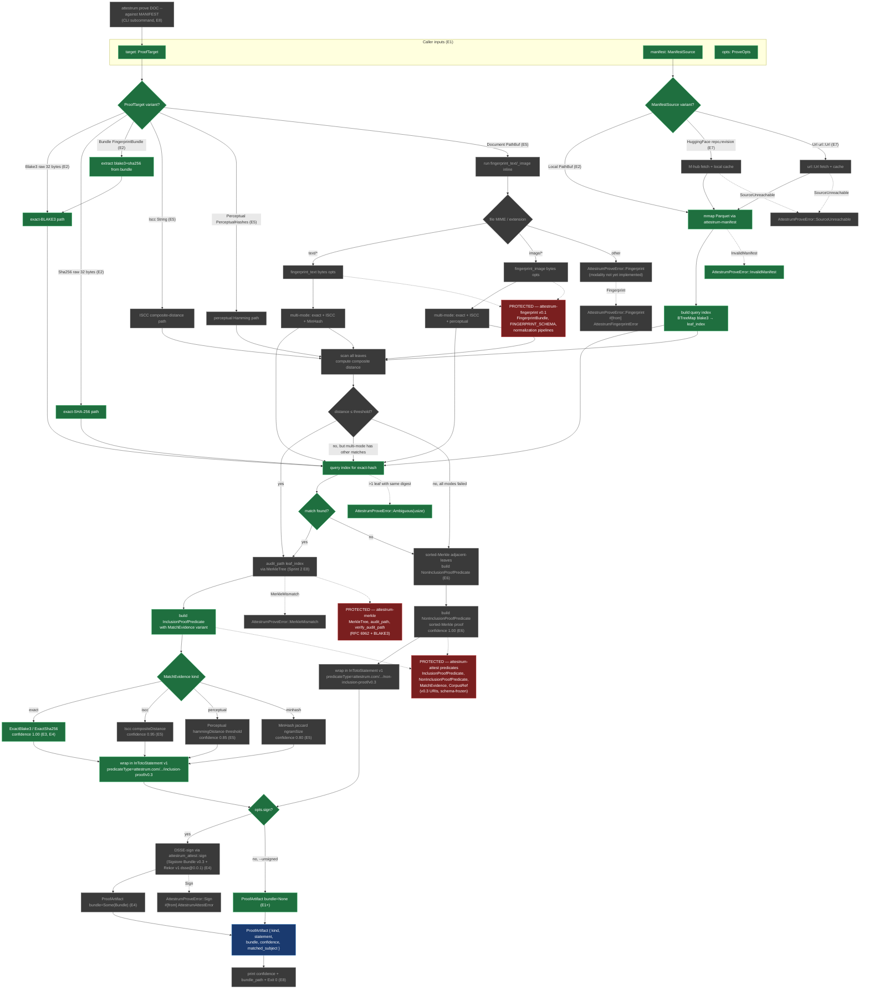

# Sprint 5 `attestrum-prove` pipeline

Source of truth: **`diagram`** through S5-D2 E1-E7. This diagram is the contract `attestrum-prove` implements; it flips to `source_of_truth: code` at S5-D2 E8 (the CLI + API freeze commit, mirroring the D1 E5 cadence). The `attestrum-attest` predicate types (`InclusionProofPredicate`, `NonInclusionProofPredicate`, `MatchEvidence`) are already-locked PROTECTED schemas per CLAUDE.md §4 — this diagram references them but does not redefine them.

**This is the ONLY sprint-5 diagram for S5-D2** per the D1 cadence precedent (one diagram per deliverable; per-E-commit updates bump `last_verified` + flip branch nodes from grey-deferred to green-shipped rather than creating a new diagram per commit).

**Branch state at E2** (this commit, exact-match path live, audit-path stubbed): `prove()` now resolves the exact-hash dispatch arms (`ProofTarget::Blake3`, `Sha256`, `Bundle` against `ManifestSource::Local`) end-to-end — reads the local Parquet manifest via `attestrum_manifest::read_manifest`, finds the matching leaf, recomputes the RFC 6962 BLAKE3 Merkle root via `attestrum_merkle::merkle_root`, builds an `InclusionProofPredicate` (with `audit_path: vec![]` placeholder), wraps it in an `InTotoStatement` at predicate type `attestrum.com/attestation/inclusion-proof/v0.3`, and returns an unsigned `ProofArtifact { kind: Inclusion, confidence: 1.0, bundle_path: None, ... }`. The Mermaid nodes that flip from grey to green at this commit: `target`, `manifest`, `opts`, `dispatch`, `resolve`, `exactB3`, `exactS256`, `bundleExact`, `localPq`, `loadIdx`, `matchQuery`, `matchDec`, `predIncl`, `evidenceVariant`, `evExact`, `stmt`, `signCheck`, `unsignedOut`, plus the two now-reachable error edges `errMan` (manifest parse failure) and `errAmb` (multiple leaves with same digest). `auditPath` stays grey because its body is stubbed (`vec![]`) — E3 lands the real audit-path via `attestrum_merkle::MerkleTree::audit_path` and flips that node. Fuzzy paths (`isccPath`, `perceptPath`, `docPath`, `docMulti*`, `fuzzyScan`, `fuzzyDec`, `evIscc`, `evPercept`, `evMinhash`) panic with `unimplemented!("S5-D2 E5+")` pending E5. HF / URL fetches (`hfFetch`, `urlFetch`) panic with `unimplemented!("S5-D2 E7")` pending E7. The non-inclusion path (`nonInc`, `predNonIncl`, `stmtNI`) panics with `unimplemented!("S5-D2 E6")` pending E6. DSSE-sign + signed-output (`dsseSign`, `signedOut`) and CLI (`cliEntry`, `cliPrint`) stay grey pending E4 and E8.

**Parent overview**: `docs/diagrams/overview/prove-pipeline.md` carries the architectural-overview view (sourced from PATH-A-BRIEF Part 1.3 verbatim). This sprint-5 diagram is the implementation-detail view: specific Rust function calls, internal helpers, error edges to typed variants, and the per-E-commit progress tracker. Different audiences.

**PROTECTED dependencies** (CLAUDE.md §4 — `attestrum-prove` consumes these, never modifies them):

1. **`attestrum-attest::predicate::{InclusionProofPredicate, NonInclusionProofPredicate, MatchEvidence}`** — Frozen at v0.3 per the predicate URIs (`attestrum.com/attestation/{inclusion,non-inclusion}-proof/v0.3`). Any schema change requires a v0.4 URI bump + migration packet.
2. **`attestrum-merkle::{MerkleTree, audit_path, verify_audit_path}`** — RFC 6962 binary Merkle over BLAKE3. Audit-path layer landed at Sprint 2 E8.
3. **`attestrum-fingerprint`** — Frozen at v0.1 as of S5-D1 E5 (just landed). `FingerprintBundle` shape, `FINGERPRINT_SCHEMA` URI, normalization pipelines.
4. **PROTECTED extension required at E6 (non-inclusion proof)**: `attestrum-merkle` does not yet have a sorted-Merkle build / adjacent-pair lookup helper. Adding one is a PROTECTED-system extension requiring explicit founder approval in the E6 commit footer.

**Legend**:

- **Grey nodes** (`deferred`): not yet shipped. Each E-commit flips its sub-graph from grey to green. Pre-E1 state: everything grey.
- **Green nodes** (`shipped`): land in or before the current commit.
- **Red nodes** (`protected`): PROTECTED dependencies per CLAUDE.md §4. Consumed but never modified by `attestrum-prove`.
- **Blue nodes** (`output`): user-facing returned values.

## What lands at Sprint 5 D2 E1 — scaffold + types (proposed)

- `crates/attestrum-prove/Cargo.toml` — fills the currently-empty `[dependencies]` block with the MINIMAL set for E1 (per CLAUDE.md §14 "Eager generalization" anti-pattern; each subsequent E-commit adds its own deps):
  - `attestrum-core = { path = "..." }` — for `Modality` + `AttestrumError`
  - `attestrum-attest = { path = "..." }` — for `InclusionProofPredicate`, `MatchEvidence`, `AttestrumAttestError` (the `#[from]` source for `AttestrumProveError::Sign`)
  - `attestrum-fingerprint = { path = "..." }` — for `FingerprintBundle` (carried in `ProofTarget::Bundle`) + `AttestrumFingerprintError` (the `#[from]` source for `AttestrumProveError::Fingerprint`)
  - `serde = { workspace = true }` — derive macros on the public types
  - `thiserror = { workspace = true }` — `AttestrumProveError`
  - Deferred to later E-commits: `parquet`, `arrow`, `attestrum-manifest`, `attestrum-merkle` (E2), `hf-hub`, `url` (E7).
- `crates/attestrum-prove/src/lib.rs` — replaces the 1-line stub with the public API surface:
  - `pub enum ProofTarget { Blake3([u8;32]), Sha256([u8;32]), Iscc(String), Perceptual(PerceptualHashes), Document(PathBuf), Bundle(FingerprintBundle) }` — six variants per PATH-A-BRIEF §2.2 (one delta from the brief: explicit `Sha256` variant since the predicate's `ExactSha256` evidence implies the caller needs to be able to drive it independently of BLAKE3).
  - `pub struct PerceptualHashes { pub phash: [u8;8], pub blockhash: [u8;8] }` — caller-supplied 64-bit perceptual hashes for the non-fingerprint-inline path.
  - `pub enum ManifestSource { Local(PathBuf), HuggingFace { repo: String, revision: Option<String> }, Url(url::Url) }` — three variants per the brief. `url::Url` deferred behind a feature gate or replaced with `String` at E1 since `url` isn't yet a dep — TBD by founder review.
  - `pub struct ProveOpts { pub sign: bool, pub source_date_epoch: i64, pub oidc_id_token: Option<String>, pub workspace: Option<PathBuf> }` — `sign=true` is default; `--unsigned` flag at E8 flips it.
  - `pub struct ProofArtifact { pub kind: ProofKind, pub statement: InTotoStatement, pub bundle: Option<Bundle>, pub confidence: f32, pub matched_subject: Option<Subject> }` — `Bundle` re-exported from `attestrum-attest`.
  - `pub enum ProofKind { Inclusion, NonInclusion }`.
  - `pub enum AttestrumProveError` — six variants from the brief: `SourceUnreachable`, `InvalidManifest`, `MerkleMismatch`, `Fingerprint(#[from] AttestrumFingerprintError)`, `Sign(#[from] AttestrumAttestError)`, `Ambiguous(usize)`.
  - `pub fn prove(target: ProofTarget, manifest: ManifestSource, opts: &ProveOpts) -> Result<ProofArtifact, AttestrumProveError>` — body is `unimplemented!("S5-D2 E2+ fills this in")`. Pre-locks the contract.
- Inline `#[cfg(test)]` tests: type-construction smoke tests (each `ProofTarget` variant constructs without panic; `AttestrumProveError` round-trips via Debug).
- This diagram file (`docs/diagrams/sprint-5/prove-pipeline.md`) — `last_verified` SHA bump to the E1 commit. No structural changes to the Mermaid; only the legend's "Branch state at E…" header updates.
- `CHANGELOG.md` `[Unreleased]` — new `### Added — Sprint 5` sub-bullet for D2 E1 (scaffolding only — no user-facing prove() yet).

## What lands at Sprint 5 D2 E2-E8 (one-line each)

- **E2**: local-Parquet manifest read + exact-BLAKE3/SHA-256 match path + `InclusionProofPredicate` emission WITHOUT audit-path (placeholder `audit_path: vec![]`) and WITHOUT signing (`opts.sign=false` forced). First end-to-end shape.
- **E3**: audit-path via `attestrum-merkle::MerkleTree::audit_path(leaf_index)`. Predicate now carries a real proof; verifier can recompute the root.
- **E4**: DSSE-sign via `attestrum-attest::sign`. **MVP gate** — first demonstrable signed inclusion proof verifiable end-to-end via `cosign v3+ verify-blob-attestation --new-bundle-format`.
- **E5**: fuzzy-match paths (`Iscc`, `Perceptual`, `MinHash`) with confidence reporting per the PATH-A-BRIEF §2.2 thresholds. `ProofTarget::Document` runs `attestrum-fingerprint` inline.
- **E6**: `NonInclusionProofPredicate` via sorted-Merkle adjacent-leaves. **Requires a PROTECTED-system extension to `attestrum-merkle`** (sorted-tree build + adjacent-pair lookup helpers); requires explicit founder approval in the commit footer.
- **E7**: alternate manifest sources (`HuggingFace`, `Url`) with caching. May depend on `attestrum-publish` (Sprint 5 D3) for HF Hub auth patterns — coordinate.
- **E8**: CLI subcommand `attestrum prove DOC --against MANIFEST` + hand-rolled `tests/api_surface.rs` (mirroring D1 E5 precedent) + `source_of_truth: diagram → code` flip on this file. **v0.1 release-ready** after E8.

## What's NOT in scope yet

- **Proof verification CLI** — `attestrum verify <bundle>` already covers single-bundle verification (Sprint 4 E4); a separate `attestrum verify-inclusion <proof-bundle> --against <manifest>` may land in Sprint 6 or be deferred to v0.2.
- **Multi-document batch prove** — given a list of documents, emit one inclusion-or-non-inclusion proof per document. Useful for "I want to attest this entire derivative corpus is a subset of that source corpus"; v2 territory.
- **Threshold-tuning knobs** — exposing the `ISCC ≤ 4` / `Perceptual ≤ 6` / `MinHash ≥ 0.85` thresholds as caller-tunable options. v0.1 hardcodes the PATH-A-BRIEF §2.2 values; tuning lands when a publisher actually asks for it.
- **Witness federation** — submitting non-inclusion-proof entries to Rekor or HF for third-party witness signatures. v0.2 — out of Sprint 5 entirely.

## Design notes carrying forward to commit time

1. **E1 dep minimization** — only the deps actually consumed at E1 are in Cargo.toml. Per CLAUDE.md §14 "Eager generalization" anti-pattern, each later E adds its own deps.
2. **`ManifestSource::Url` URL type** — using `url::Url` requires the `url` crate at E1 even though no E1 code parses URLs. **Recommendation**: use `pub url: String` at E1 (carry the string verbatim); promote to `url::Url` at E7 when fetching code lands. Avoids a phantom dep.
3. **Trait abstraction over `ManifestSource`** — DO NOT introduce `trait ManifestReader` at E1. Match-based dispatch in `prove()` is fine for two-three concrete variants; extract a trait at E7 when the second source (HF) goes live and the duplication is concrete.
4. **`E5` fuzzy-match thresholds** — hardcode the §2.2 table values (`Iscc ≤ 4`, `Perceptual ≤ 6`, `MinHash ≥ 850_000` ppm). No exposed knobs in v0.1; v0.2 considers `ProveOpts` extension.
5. **`E6` sorted-Merkle PROTECTED extension** — adding sorted-tree build + adjacent-pair lookup to `attestrum-merkle` is a PROTECTED-system extension. The commit footer must carry `Protected-system-change: approved-by=Austin on=YYYY-MM-DD` per CLAUDE.md §4.
6. **`E7` HF auth** — coordinate with Sprint 5 D3 (`attestrum-publish`) on the HF Hub token-handling patterns. May land D3 before D2 E7 to avoid duplicating auth logic.
