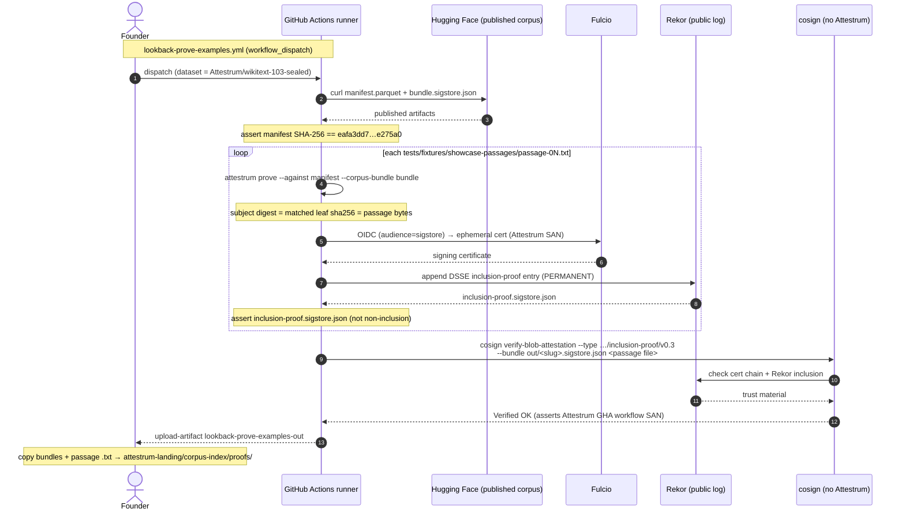

# Signed inclusion-proof showcase — mint + third-party cosign interop

Source of truth: `code` — this diagram is a derived view of the two
workflows and the interop test named in `models:`. Re-verify on any change
to `lookback-prove-examples.yml`, `prove-sign-interop.yml`, or
`crates/attestrum-prove/tests/prove_sign_interop.rs`.

Two coupled flows prove the `inclusion-proof/v0.3` predicate end-to-end:

1. **`prove-sign-interop.yml`** (push:`main`, automatic) — the §2.5
   third-party-validator gate. On every push it seals a real one-passage
   fixture corpus, mints a signed inclusion proof under the Attestrum GHA
   identity, and asserts stock `cosign` returns `Verified OK` against the
   **passage file** (plus four tamper negatives). This keeps the emitter
   honest commit-to-commit.
2. **`lookback-prove-examples.yml`** (`workflow_dispatch`, founder-run) —
   mints the curated **showcase** proofs against the *published* WikiText-103
   manifest, for the landing-page "verify this yourself" panel. Irreversible:
   each sign writes a permanent public Rekor entry.

The load-bearing correctness fact in both: an inclusion proof's subject
digest is the matched **leaf's** SHA-256, i.e. the passage file's bytes — so
the `cosign` blob is the **passage file, not the manifest**. A passage that
is not byte-identical to a sealed leaf yields a *non-inclusion* proof; both
the gate and the showcase workflow assert against that.

## Why the showcase needs its own workflow

`prove-sign-interop.yml` proves the *mechanism* over a throwaway fixture on
every push; it never touches the published corpus. The showcase needs proofs
bound to the **real** published manifest (so a visitor's pasted passage,
matched against the same corpus, lines up with a downloadable signed bundle)
and it mints permanent Rekor entries — both reasons it is dispatch-only and
founder-gated, never automatic.
