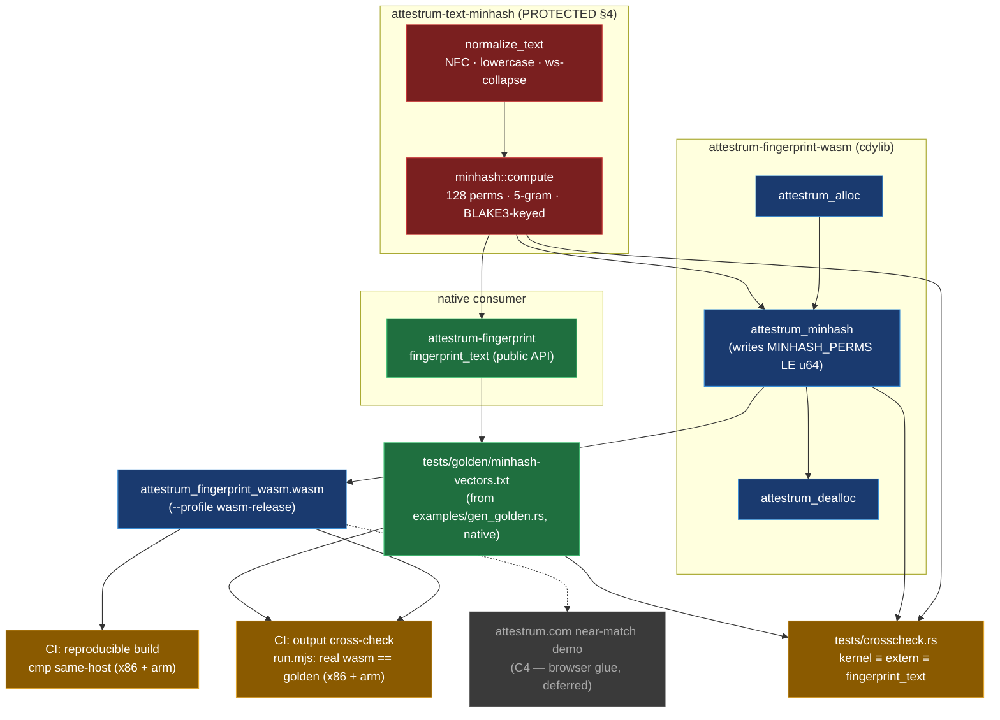

# C2 — wasm text-MinHash kernel

Source of truth: **`code`**. `crates/attestrum-fingerprint-wasm/src/lib.rs` and the
`attestrum-text-minhash` kernel it wraps are authoritative; this diagram is the derived view.

**One kernel, two compile targets.** The PROTECTED text-MinHash kernel (CLAUDE.md §4) lives in
`attestrum-text-minhash` (`normalize_text` + `minhash::compute`, extracted byte-identically in C1).
Two crates consume it: `attestrum-fingerprint` (native, via the public `fingerprint_text` path) and the
new `attestrum-fingerprint-wasm` (a `cdylib` compiled to `wasm32-unknown-unknown`). The wasm crate adds
**no algorithm** — it only marshals bytes across a raw `extern "C"` ABI (`attestrum_alloc` →
`attestrum_minhash` → `attestrum_dealloc`, writing `MINHASH_PERMS` = 128 little-endian `u64`). Because
the browser runs the *identical Rust*, there is no second implementation that could drift from the CLI.

**The §4 safeguard is the cross-check gate, not a footer.** C2 is founder-confirmed routine (the C1 §4
footer already named "byte-identical WASM reuse" as its approved purpose, and C2 changes no protected
parameter). What actually prevents drift is byte-identity enforced in CI (`.github/workflows/wasm.yml`):

- **reproducible build** — each host (x86 + arm) builds the `wasm-release` artifact twice and `cmp`s
  same-host, proving the committed/served `.wasm` re-verifies on its build toolchain. (We deliberately
  do *not* `cmp` the binary across host arches: rustc→wasm32 codegen is reproducible per host but not
  bit-identical between x86 and arm hosts, and the artifact is built once — so cross-arch *binary*
  identity is neither required nor achievable. The host-independent property that matters is the
  *output*, proven next, on both arches.)
- **output cross-check** (load-bearing) — a no-dependency Node loader (`tools/wasm-crosscheck/run.mjs`)
  runs every passage through the **actual** `.wasm` and diffs against the committed golden
  (`crates/attestrum-fingerprint-wasm/tests/golden/minhash-vectors.txt`), on **both** x86 and arm. A
  native-only golden can't catch wasm-codegen / pure-blake3 drift; running the real artifact can.

The golden is produced from the **native** kernel (`examples/gen_golden.rs`); `tests/crosscheck.rs`
ties the native kernel, the `extern "C"` export, and `fingerprint_text`'s public output all to that same
golden. So: native kernel ≡ extern export ≡ public API (native test) and real wasm ≡ golden (Node gate)
→ the browser's near-match answer is byte-identical to the CLI's.

`pure` blake3 is scoped to the wasm32 target only, so native `cargo test --workspace` keeps the default
backend; the P1 spike proved `pure` == default byte-for-byte.

