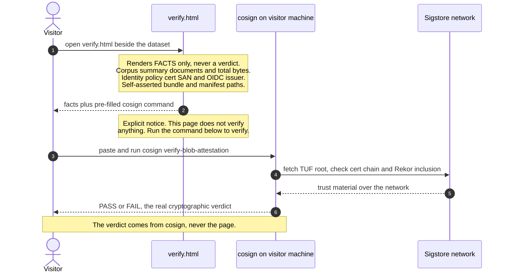

# verify.html — visitor verification handoff

Source of truth: `code` — the enriched, verdict-less renderer has landed
at `crates/attestrum-emit/src/verify_html.rs`; this diagram is now a
derived view of that code. Re-verify on any change to the renderer's
page structure or copy.

`verify.html` is the static page Attestrum commits beside a published
dataset. It is deliberately **verdict-less**: it renders *facts* (the
corpus summary, the signing identity policy, and the bundle's
self-asserted file paths) plus a pre-filled `cosign` command, and it
performs **no cryptographic check of its own**. The real verification is
done by stock `cosign` on the visitor's machine — no Attestrum install
required (CLAUDE.md §12 vendor neutrality).

The page must never render an affirmative "verified" / "checks passed"
element. A non-cryptographic page that looked verified would be a
false trust signal — the worst failure class for a provenance product.
The verdict belongs to `cosign`, never to the page.

## Why verdict-less

Native `attestrum verify` (`crates/attestrum-attest/src/verify.rs`) does
**not** recompute the Merkle root; it asserts the manifest's SHA-256
matches the bundle's signed subject digest. That single
cryptographically meaningful check is exactly what the `cosign`
command already performs. An in-browser re-implementation would buy no
additional assurance while adding greenfield crypto and false-green
risk, so the page hands off to `cosign` rather than judging anything
itself.

The page therefore displays no Merkle root: no tool reachable from the
page actually rechecks it, so showing it would be a displayed-but-
unchecked value that invites a false sense of proof.
