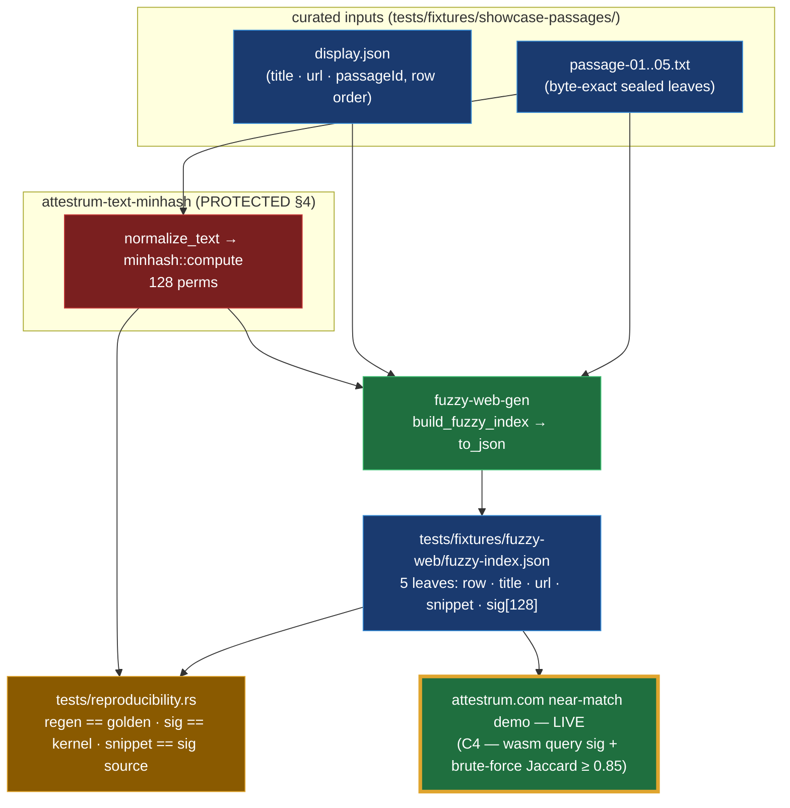

# C3 — bounded fuzzy-corpus generator

Source of truth: **`code`**. `tools/fuzzy-web-gen` is authoritative; this diagram is the derived view.

**What it produces.** The attestrum.com near-match demo matches a visitor's pasted text against a
*bounded* corpus shipped to the browser. C3 generates that corpus artifact — `fuzzy-index.json` — from the
5 curated showcase passages (founder-scoped; real LSH-neighbors over the full 822k corpus stay deferred).

**One kernel, end to end.** `fuzzy-web-gen` computes each passage's 128-permutation MinHash with
`attestrum-text-minhash` (`normalize_text` → `minhash::compute`) — the **same PROTECTED kernel** the C2
wasm compiles from and that `attestrum index build` / `attestrum prove` use. So the corpus signatures in
`fuzzy-index.json` are byte-identical to what the browser's wasm recomputes (C2's cross-check gate proves
wasm == kernel) and to what the CLI would match against. The demo is a faithful client-side mirror of the
production fingerprint path, not a re-implementation.

**Why a single JSON, not a binary index.** At 5 leaves the artifact is ~22 KB; the browser fetches it
wholesale and brute-forces exact Jaccard against the 5 signatures — the exhaustive **recall oracle**,
byte-identical in result to the production LSH candidate path, with no banding machinery. The scalable
`.idx`→binary band-directory + Range-fetch re-encoder is deferred to land with the full corpus (when the
format gets its second, real use). `params` mirrors the kernel/threshold constants
(`sigWidth 128`, `bands 32`, `rows 4`, `jaccardThresholdPpm 850000`, `ngram 5`) so the C4 glue stays in
sync without hardcoding them.

**Reproducible + tracked.** `tools/fuzzy-web-gen/tests/reproducibility.rs` regenerates the artifact and
byte-compares it to the committed golden, and asserts every leaf signature equals the kernel and that
`snippet` is the exact byte-source of `sig` (so C4's in-page conformance check — `wasm(normalize(snippet))
== sig` — holds). This fills the gap that the demo's browser artifacts previously had no tracked generator.
The committed JSON is the source of truth; C4 copies it to the landing site as an intentional public asset.

🟧 revised this revision: the browser near-match demo is now **LIVE** on attestrum.com — C4 shipped 2026-06-06. The browser lazy-loads `corpus-index/attestrum_fingerprint_wasm.wasm` (the C2 kernel) + `corpus-index/fuzzy-index.json` (this artifact), runs an in-page conformance check (wasm sig of a known passage == its shipped sig), then on an exact miss computes the pasted text's MinHash and brute-forces Jaccard ≥ 0.85 against the 5 leaves.
