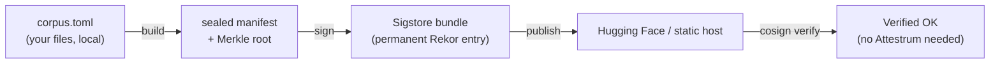

# Attestrum Guide — seal, sign, and publish a dataset's provenance

This is the task-oriented guide to producing a verifiable provenance bundle for a training corpus. For the conceptual walkthrough ("who are the actors, what crosses the line"), see [`docs/research/how-attestrum-works-end-to-end.md`](../research/how-attestrum-works-end-to-end.md); for *why* the seal is trustworthy, see the [research papers](#further-reading).

> **Status:** Attestrum is pre-MVP — there is no published release yet (`v0.1.0` is the first planned tag). Build the CLI from source (below). Commands and flags are accurate as of this writing; run any subcommand with `--help` for the authoritative flag set.

## What you'll produce

A **sealed manifest** (a Merkle root committing to your corpus, hashes only — your data never leaves your machine), a **Sigstore bundle** (a keyless signature over that root, anchored in the public Rekor transparency log), and a **published artifact set** anyone can verify with stock `cosign` — no Attestrum install required.



## Prerequisites

- **A Linux environment** — see the next section. A CI runner (GitHub Actions) is the recommended home.
- **Rust** to build the CLI from source: `cargo build --release -p attestrum-cli` produces `target/release/attestrum`.
- **`cosign` v2.5+ or v3+** for anyone verifying (the verifier's only dependency).

## The recommended path: seal + sign on serverless Linux

**Run the production build and signing on Linux — ideally a CI runner (GitHub Actions) or a Linux cloud box.** This is one recommendation, not two, because the same environment wins on both axes:

1. **Speed.** Sealing is dominated by durable content-store writes (`fsync`). On macOS those are genuinely durable and slow; on a Linux server / CI runner they are an order of magnitude cheaper. Our reference WikiText-103 seal (822,559 passages) ran **~5 minutes on Ubuntu 24.04 vs ~94 minutes on macOS** — byte-identical output, so this is a pure speed win with no accuracy cost. (See [`deterministic-by-construction.md` §4.1](../research/deterministic-by-construction.md).)
2. **Signing identity.** `attestrum sign` is **keyless and requires an OIDC identity token** — it has no interactive browser login and no local/test mode. CI provides that token automatically (the GitHub Actions OIDC exchange below). Locally you would have to obtain a Sigstore-audience OIDC JWT yourself, which is why CI is the natural signing home.

> **Signing is irreversible.** A real `attestrum sign` writes a **permanent, public Rekor transparency-log entry** under whatever identity issued the OIDC token. There is no dry-run that signs. Shake out the pipeline with `attestrum publish --target static` (no signing identity asserted) or your CI's workflow identity — never a casual local sign.

- **macOS** is fine for development and small corpora — it produces the *identical, correct* seal, just slower.
- **Windows** is **untested and not recommended** — it is not in the determinism matrix, so byte-identity is unproven there.

---

## Step 1 — `build`: seal the corpus (offline)

```bash
attestrum build \
  --corpus corpus.toml \
  --workspace work \
  --source-date-epoch 1735689600
```

- `--corpus` — a TOML file listing the corpus contents.
- `--workspace work` — outputs land under `work/.attestrum/`: the sealed manifest at `work/.attestrum/manifests/manifest.parquet` and the Merkle root at `work/.attestrum/manifests/merkle.root`.
- `--source-date-epoch` — a **fixed** timestamp (epoch seconds). Required on purpose: Attestrum never reads the wall clock, so the same corpus sealed twice is byte-identical. Use any stable value (in CI, the commit timestamp works well).

`build` never makes network calls. For a large corpus you can shard the work with `attestrum plan --corpus corpus.toml --shards N --out shards/`, build each shard, then `attestrum merge --inputs 'shards/shard-*.parquet' --out manifest.parquet` — the merged root equals an unsharded build.

## Step 2 — `sign`: keyless Sigstore bundle

```bash
# Requires an OIDC id_token in SIGSTORE_ID_TOKEN (or --oidc-token-file <PATH>).
attestrum sign \
  work/.attestrum/manifests/manifest.parquet \
  --workspace work \
  --source-date-epoch 1735689600
```

- The manifest path is **positional**.
- Networks against Fulcio + Rekor + the TUF trust root. `--offline` exits immediately — there is no offline sign.
- The token resolves from `--oidc-token-file` (takes precedence) or the `SIGSTORE_ID_TOKEN` env var. There is no interactive login at this version.
- The bundle lands at `work/bundles/manifest.sigstore.json`.
- Optional predicate fields: `--takedown-contact mailto:...`, `--dataset-homepage <url>`, `--publication-intent {hf,zenodo,github-release,eu-ai-office,private}`.

## Step 3 — `publish`: put the verification surface beside the data

Two targets work today: **`huggingface`** (push to the Hub) and **`static`** (write the artifact set locally for Zenodo / GitHub Pages / S3 / any static host). `--target github-release` is not yet implemented (returns exit 1).

```bash
# Hugging Face Hub. Auth is the HF_TOKEN env var (the --token-file flag is
# reserved/unused at this version).
HF_TOKEN=hf_... attestrum publish \
  --target huggingface \
  --dataset my-org/my-dataset \
  --manifest work/.attestrum/manifests/manifest.parquet \
  --bundle   work/bundles/manifest.sigstore.json \
  --merkle-root work/.attestrum/manifests/merkle.root \
  --source-date-epoch 1735689600 \
  --license CC-BY-4.0
```

For a static artifact set instead, swap `--target static` and add `--out-dir out/` (no network, nothing signed by this step — safe to inspect before any push). `--license` accepts an SPDX id, `mixed`, or is omitted (recorded as the honest token `unknown`). Other optional metadata: `--version`, `--cite-as`, `--publisher`, `--classification`, `--pretty-name`, `--attribution-file`.

## Step 4 — verify with stock `cosign` (no Attestrum)

This is the payoff: anyone can check the bundle with `cosign` alone.

```bash
cosign verify-blob-attestation \
  --new-bundle-format \
  --type https://attestrum.com/attestation/training-corpus/v0.3 \
  --bundle work/bundles/manifest.sigstore.json \
  --certificate-identity-regexp '^https://github\.com/YOUR-ORG/YOUR-REPO/\.github/workflows/.+@refs/.+$' \
  --certificate-oidc-issuer https://token.actions.githubusercontent.com \
  work/.attestrum/manifests/manifest.parquet
```

`--new-bundle-format` and `--type` are both required (recent cosign rejects the v0.3 predicate type without `--type`). The identity regex and issuer pin *who* signed — set them to your own signing identity. A successful run prints `Verified OK`.

Attestrum also ships its own richer verifier — `attestrum verify <bundle> --manifest <m> --certificate-identity <regex> --certificate-oidc-issuer <regex>` — which additionally validates the predicate against the v0.3 schema. The `cosign` path is the one to document for third parties, because it requires nothing from us.

## Optional — `prove`: is a specific work in the corpus?

```bash
attestrum prove <file-or-64char-blake3-hex> \
  --against work/.attestrum/manifests/manifest.parquet \
  --source-date-epoch 1735689600
```

Emits a signed inclusion- or non-inclusion-proof attestation (add `--unsigned` to skip signing). `--against` also accepts `hf://repo[@revision]` or an `https://` URL.

## The serverless path, concretely (GitHub Actions)

This is the recommended production shape — keyless signing works here because the runner mints the OIDC token. Adapted from Attestrum's own publish workflow.

```yaml
permissions:
  contents: read
  id-token: write          # REQUIRED: lets the runner mint the Sigstore OIDC token

jobs:
  seal-sign-publish:
    runs-on: ubuntu-24.04   # Linux: fast fsync + the OIDC identity live here
    steps:
      - uses: actions/checkout@v4
      - uses: dtolnay/rust-toolchain@stable
      - run: cargo build --release -p attestrum-cli

      - name: Reproducible timestamp from the commit
        run: echo "SOURCE_DATE_EPOCH=$(git log -1 --format=%ct)" >> "$GITHUB_ENV"

      - name: Fetch the Sigstore-audience OIDC token
        run: |
          set -euo pipefail
          token="$(curl --fail-with-body -sS \
            -H "Authorization: bearer $ACTIONS_ID_TOKEN_REQUEST_TOKEN" \
            "${ACTIONS_ID_TOKEN_REQUEST_URL}&audience=sigstore" | jq -r '.value')"
          echo "::add-mask::$token"
          echo "SIGSTORE_ID_TOKEN=$token" >> "$GITHUB_ENV"

      - name: Build (seal)
        run: ./target/release/attestrum build --corpus corpus.toml --workspace work --source-date-epoch "$SOURCE_DATE_EPOCH"

      - name: Sign (keyless — PERMANENT public Rekor entry)
        run: ./target/release/attestrum sign work/.attestrum/manifests/manifest.parquet --workspace work --source-date-epoch "$SOURCE_DATE_EPOCH"

      - name: Publish to Hugging Face
        env:
          HF_TOKEN: ${{ secrets.HF_TOKEN }}
        run: |
          ./target/release/attestrum publish --target huggingface \
            --dataset my-org/my-dataset \
            --manifest work/.attestrum/manifests/manifest.parquet \
            --bundle   work/bundles/manifest.sigstore.json \
            --merkle-root work/.attestrum/manifests/merkle.root \
            --source-date-epoch "$SOURCE_DATE_EPOCH" \
            --license CC-BY-4.0
```

The `audience=sigstore` value is mandatory; mask the token before exporting it.

## Troubleshooting

- **`sign` fails "OIDC id_token required".** No token was found — set `SIGSTORE_ID_TOKEN` or pass `--oidc-token-file`. In CI, confirm `permissions: id-token: write` and the token-fetch step.
- **`sign --offline` exits 3.** Signing always needs network; the flag exists only as a "did you mean this?" guard.
- **A re-seal doesn't match a prior root.** You changed `--source-date-epoch`, the corpus inputs, or sealed on an untested platform (e.g. Windows). The epoch and inputs fully determine the bytes; platform must not.
- **`cosign` rejects the predicate type.** Add `--type https://attestrum.com/attestation/training-corpus/v0.3` and `--new-bundle-format`, and ensure cosign is v2.5+/v3+.
- **`publish --target github-release` exits 1.** Not implemented yet — use `huggingface` or `static`.

## Further reading

- [`how-attestrum-works-end-to-end.md`](../research/how-attestrum-works-end-to-end.md) — the conceptual walkthrough.
- [`deterministic-by-construction.md`](../research/deterministic-by-construction.md) — why seals are byte-identical, and the cross-platform performance data.
- [`provenance-without-disclosure.md`](../research/provenance-without-disclosure.md) — how the corpus stays private.
- [`cross-target-determinism.md`](../research/cross-target-determinism.md) — which fields are byte-identical across platforms, and the one that isn't.
