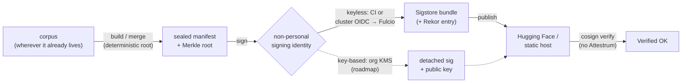

# Sealing at scale — where to run the seal, and what identity signs it

The [main guide](./README.md) walks the seal → sign → publish path on a single GitHub Actions runner. This companion answers the two questions that come up once the corpus is large or the publisher isn't on GitHub:

1. **Where do I run the seal** when the corpus is hundreds of GB and doesn't fit a free CI runner?
2. **What identity signs the manifest**, if I'm not signing from GitHub Actions?

The short answer to both: **these are independent choices.** Attestrum's seal is deterministic, so *where* you compute the manifest doesn't change the bytes — and the signing identity is a separate decision you make to fit your own org. Pick each on its own merits.

> **Status:** Attestrum is pre-MVP (`v0.1.0` is the first planned tag). Commands and flags are accurate as of this writing; run any subcommand with `--help` for the authoritative set. Keyless signing from any Fulcio-accepted CI or cluster identity works today; KMS-key signing (below) is a documented future direction, not yet emitted by `attestrum sign`.

## The one idea: identity ⟂ compute

Two requirements get conflated because a CI runner happens to supply both:

- **Build compute** — turn the corpus into a sealed manifest + Merkle root. *Any* machine that reproduces the canonical root will do.
- **Signing identity** — a non-personal, org-attributable identity that signs that root, so a third party trusts the provenance.

They're independent, and the property that makes them independent is **determinism**. Attestrum never reads the wall clock and pins every source of non-determinism, so the same corpus sealed on a laptop, a CI runner, a cloud VM, or a training cluster produces the **byte-identical** Merkle root (see [`cross-target-determinism.md`](../research/cross-target-determinism.md)). The root is what gets signed — so compute location can't change what you're attesting. That's what lets you move the heavy seal anywhere and choose the signing identity separately.

## Where to run the seal (compute)

**Seal where the corpus already lives.** The most expensive part of sealing a large corpus is reading every byte once. If the data is already on a machine — your training cluster, an object store you can mount, a cloud VM — seal it there and you avoid downloading it anywhere. `attestrum build` makes **no network calls**; only fingerprints (not your data) ever leave the machine, and only if you publish.

Options, roughly by corpus size:

| Situation | Where to run | Notes |
|---|---|---|
| Small corpus (fits a free runner's disk after cleanup) | **GitHub-hosted runner** | The [main guide](./README.md) path. Free for public repos; bounded by runner disk (~14 GB guaranteed) and job concurrency. |
| Large corpus, too big for one runner | **Shard it.** `attestrum plan --shards N` → build each shard → `attestrum merge` | The merged root equals an unsharded build. Each shard job needs only its slice on disk. |
| Very large corpus, or data you already hold | **A Linux box / cloud VM / cluster you control** | No CI quotas, no re-download. Use a self-hosted CI runner (below) if you want to keep a CI signing identity, or sign with a cluster/cloud identity. |

**Streaming merge.** `attestrum merge` combines shard manifests with bounded memory (it does not hold the whole corpus — only the sorted fingerprint stream), so merging a 100M-row manifest fits a commodity machine. Sharded or unsharded, the root is identical.

**Linux is the supported target.** The determinism matrix covers Linux (x86-64 glibc, ARM, musl) and macOS; **Windows is untested** and not in the matrix, so byte-identity is unproven there. Seal production bundles on Linux.

## What identity signs it

This is the part §A9 of Attestrum's own rulebook is strict about, and the advice is the same for any publisher: **the signing identity must be a non-personal, organization-attributable identity — never an individual's personal Sigstore/email identity.** A reviewer trusts a provenance claim because it's bound to an *org or automated workflow*, not a person who could be anyone.

`attestrum sign` is **issuer-agnostic**: it needs a Sigstore-audience OIDC token in `SIGSTORE_ID_TOKEN` (or `--oidc-token-file`). Whatever trusted identity issues that token becomes the certificate's subject — and the verifier pins it with `--certificate-oidc-issuer` + `--certificate-identity-regexp`. So you have three families of non-personal identity:

### A. CI workflow identity (keyless) — available today

A CI system mints an OIDC token whose subject is the *workflow*, and the public Sigstore Fulcio accepts a fixed set of CI issuers. Each yields a workflow-bound certificate SAN:

- **GitHub Actions** (`token.actions.githubusercontent.com`)
- **GitLab CI** (`gitlab.com` and self-managed instances)
- **Buildkite**, **Codefresh**, **CircleCI**

The [main guide's GitHub Actions example](./README.md#the-serverless-path-concretely-github-actions) shows the token exchange; on another provider, fetch that provider's `sigstore`-audience OIDC token into `SIGSTORE_ID_TOKEN` and sign the same way. The verifier just pins your issuer and identity regex.

**Self-hosted runners keep the same identity.** Running a GitHub Actions workflow on a *self-hosted* runner (a big box or an ephemeral cloud VM you control, for a large-corpus seal) produces the **same certificate SAN** as a hosted runner — the OIDC subject is derived from the repo/workflow/ref, independent of where the runner physically executes (only an internal `runner_environment` claim differs). This is the clean way to get unbounded compute *and* keep your CI workflow identity. (Self-hosted runners carry their own security trade-offs — gate them to trusted, dispatch-triggered workflows; don't expose them to untrusted pull requests.)

### B. Cloud / cluster workload identity (keyless) — available today

If you seal on a Kubernetes cluster, the pod's projected service-account token (audience `sigstore`) is accepted by public Fulcio for **GKE, AWS EKS, and Azure AKS** out of the box — the cluster's OIDC issuer is pre-trusted. A **Google identity token** (`gcloud auth print-identity-token --audiences=sigstore`) works too. Drop that token into `SIGSTORE_ID_TOKEN` and sign in place on your cluster, no CI required.

> **Honest caveat:** a *plain* (non-Kubernetes) AWS EC2 or Azure VM is **not** directly accepted by public Fulcio — only the managed-Kubernetes issuers (EKS/AKS) and Google are. From a bare cloud VM you'd federate its identity to a trusted issuer first, or use option A (a self-hosted CI runner) or option C.

### C. Organization KMS key (key-based) — roadmap

A long-lived, org-controlled key in a cloud KMS (AWS KMS, GCP KMS, Azure Key Vault, HashiCorp Vault) is non-personal by construction and is what many security-conscious orgs will prefer over ephemeral keyless. `cosign` already verifies KMS-signed blobs against the key's public half (`cosign verify-blob --key …`). Note this is a **different verify path** from keyless — it checks a public key, not a Fulcio certificate identity — and **`attestrum sign` does not emit a KMS-signed bundle yet.** It's documented here as the intended direction for orgs that sign with their own keys; track the roadmap for support.

## Picking a combination

| You have… | Seal on | Sign with |
|---|---|---|
| A public repo + a modest corpus | GitHub-hosted runner | A. GitHub Actions keyless |
| A large corpus you already hold, and a CI org | Self-hosted / ephemeral cloud runner | A. Your CI workflow identity (SAN unchanged) |
| A training cluster (GKE/EKS/AKS) | The cluster, in place | B. Cluster workload identity |
| A GCP environment | A GCP VM/cluster | B. Google / GKE identity token |
| A strict key-management policy | Anywhere | C. Org KMS key *(when supported)* |

Whatever you pick, the payoff is identical and is the whole point: **anyone verifies with stock `cosign` and no Attestrum install** (see [main guide, Step 4](./README.md#step-4--verify-with-stock-cosign-no-attestrum)). The verifier only changes which issuer/identity (or which public key) they pin.

## Further reading

- [`README.md`](./README.md) — the basic seal → sign → publish walkthrough.
- [`cross-target-determinism.md`](../research/cross-target-determinism.md) — which fields are byte-identical across platforms (the property that makes "seal anywhere" safe).
- [`deterministic-by-construction.md`](../research/deterministic-by-construction.md) — why seals are byte-identical, with cross-platform performance data.
- [`how-attestrum-works-end-to-end.md`](../research/how-attestrum-works-end-to-end.md) — the conceptual walkthrough.
