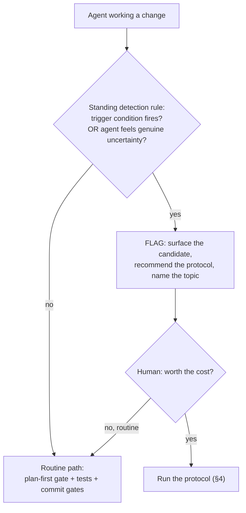
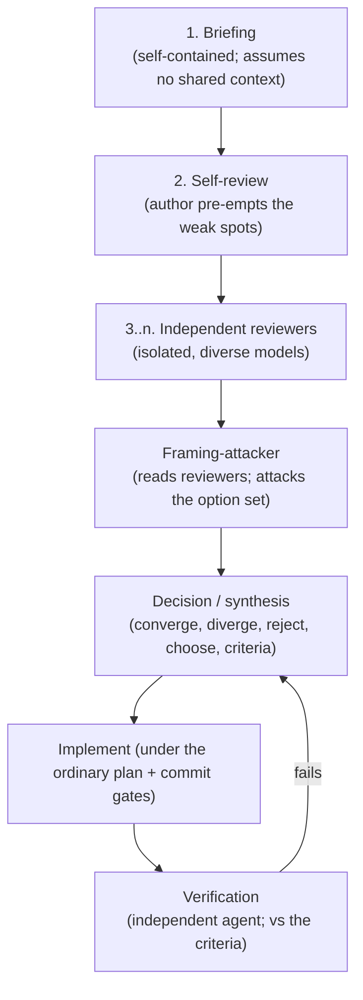

# Adversarial Multi-Agent Review for High-Stakes Decisions

### A protocol for the decisions that single-agent reasoning, and a single human approval, cannot safely make — a methodology report from the Attestrum project

**Status:** research / methodology. Companion to `docs/research/specification-first-agentic-engineering.md`, which introduces this protocol as one of three pillars; this document is the dedicated, deeper treatment. It is descriptive and prescriptive: it explains what the protocol is, why it works, and how to adopt it. All examples are abstracted; this report contains no project-specific deliberations.

---

## Abstract

Most software decisions are safe to make quickly: a plan, a review, a test, a commit. A small minority are not. A decision that changes an externally-verifiable artifact, pins an upstream-dependency posture, alters a stable public interface, or chooses among options where *the option set itself might be wrong* shares two properties: it is expensive to reverse, and the first agent to frame it anchors everyone who reviews it afterward. For this class, neither a single capable agent nor a single human approval is a sufficient filter — the agent can be confidently wrong inside a flawed frame, and a human approving a technically complex decision is granting *permission to proceed*, not performing *verification*. We report a structured, **adversarial multi-agent review protocol** used on the Attestrum project for exactly this class of decision. It produces a fixed set of artifacts — a self-contained briefing, an author self-review, multiple independent reviewer responses on diverse models, a dedicated *framing-attacker*, a synthesized decision, and an independent post-implementation verification — and is governed by two design principles we argue are the load-bearing ones: **reviewer isolation** and **separation of detection from invocation**. We give the trigger criteria, the artifact templates, the failure modes the protocol defends against, an abstracted worked example, and a step-by-step adoption guide.

---

## 1. Introduction: decisions that resist single-agent reasoning

The default engineering loop — plan, implement, test, review, commit — assumes that errors caught late are cheap to fix. For most work this holds. It fails for a specific class of decision with two compounding properties:

1. **Irreversibility.** Once an externally-verifiable artifact (a wire format, a signed bundle, a published schema, a public API) is in the wild, changing it breaks third parties. The cost of a wrong choice is not a follow-up commit; it is a migration, a version bump, and a coordination problem.
2. **Framing dependence.** The hardest part of these decisions is often not picking among the options but noticing that the options are wrong — that the matrix omits a better path, or fuses two independent decisions into one false binary. The agent (or person) who first writes the options down anchors every subsequent reviewer to that framing.

A single agent, however capable, is a poor filter here: it can reason flawlessly *inside* a frame it never thought to question. And the usual backstop — a human approving the decision — is weaker than it looks. Approving a technically intricate decision is, in practice, *granting permission to proceed*, not *verifying correctness*; the approver frequently cannot, in the moment, re-derive the analysis well enough to catch a subtle error. If the process leans on that approval as if it were verification, the decision is effectively unreviewed.

The protocol in this report is the response: route this narrow class of decision through several *independent*, *adversarial* perspectives before any code is written, and put the verification burden in the process rather than on the approver.

The intellectual lineage is old. Janis's analysis of *groupthink* (1972) identified that cohesive groups converging on consensus suppress dissent and make worse decisions; the classic correctives are independent assessment and an assigned devil's advocate. Recent work on language models echoes it: multi-agent debate and ensemble-of-judges methods improve factuality and reasoning over single-pass generation (e.g., multi-agent debate, Du et al., 2023). This protocol is a disciplined, artifact-producing instance of that idea, specialized for high-stakes engineering decisions.

---

## 2. When to invoke — and when not to

The protocol is heavy. It is justified only for the irreversible / framing-dependent tail. Trigger it when **any** of the following holds:

- The decision changes the behavior of a **stable, protected subsystem** — one where a wrong change invalidates prior emitted artifacts.
- The decision changes **bytes a third party verifies** — an emitted format, a signed artifact, a public schema, a rendered output others depend on.
- The decision **pins or rewrites an upstream-dependency posture** — forking a dependency, choosing a spec version, committing to an interface with an external ecosystem.
- The **option matrix itself is contested** — someone has said, in effect, "are these even the right options?"
- The decision is **likely to be re-questioned in six months** — "we chose this back when X was true; is X still true?"

Do **not** invoke it for routine implementation, bug fixes with a known cause, refactors, internal-only naming, or dependency bumps with no behavior change. Those run under the ordinary plan-and-gate discipline (in this repository, the plan-first gate of `CLAUDE.md` §3 and the protected-system rules of §4). Over-applying the protocol is itself a failure mode (§7): its entire value is concentrated in the tail, and spending it on routine work trains the team to treat it as ceremony.

A useful rule of thumb: *cheaper to invoke once unnecessarily than to discover three weeks in that the decision needed it.* But "when in doubt" should be calibrated by the trigger list, not by anxiety.

---

## 3. The core design principle: separate detection from invocation

The most common reason a protocol like this fails in practice is not that it is badly designed — it is that **nobody remembers to invoke it.** The person best positioned to recognize a high-stakes decision is usually mid-flow, focused on the implementation, and does not pause to ask "is this one of the dangerous ones?"

The fix is to split the mechanism in two:

- **Detection** is a *standing rule*, always loaded into the working agent's context, that enumerates the trigger conditions (§2) as concrete, checkable signals and instructs the agent to **flag** — not silently proceed — whenever one fires. Detection is cheap and continuous.
- **Invocation** is the heavy protocol itself, run only after a flag is raised and confirmed.

This separation converts "an agent might invoke this" (passive, forgettable) into "an agent is required to flag whenever specific conditions hold" (active, auditable). It is the single highest-leverage part of the design: the protocol only helps decisions it is actually run on, and the standing detection rule is what makes it run.

Two refinements make detection robust:

1. **The agent's own uncertainty is itself a trigger.** Enumerated conditions are a floor, not a ceiling. If the working agent feels genuine uncertainty, or genuine conflict between options, on a decision that bears on correctness, that felt conflict is sufficient cause to flag — even when no enumerated condition literally fires. The most expensive failures come from an agent that sensed the conflict, resolved it silently to keep moving, and was wrong.
2. **Flag, do not auto-invoke.** The agent surfaces the candidate and recommends the protocol; a human decides whether to spend it. (Deciding *whether the protocol is worth its cost* is a legitimate human call. Deciding *which technical option is correct* is what the protocol itself is for — see §7.)

*Figure 1. Detection is a cheap, continuous, standing rule; invocation is the heavy protocol, run only on confirmed flags. Most work takes the routine path.*

---

## 4. The protocol — a fixed set of artifacts

Once invoked, the protocol produces a fixed, named set of artifacts. Naming them in advance is deliberate: it makes the process repeatable, makes a half-finished protocol visibly incomplete, and gives each artifact a single clear job.

### 4.1 Artifact 1 — The briefing (the load-bearing document)

A self-contained document that any reviewer can read with **zero shared context**. If the briefing is wrong about the state of the world, every downstream artifact inherits the error, so it receives disproportionate effort. Required sections:

- **Purpose and how to review** — what you are asking the reviewer to do, in priority order: *challenge the diagnosis → refine the option matrix → recommend → flag risks*. Open by explicitly inviting attack: "this diagnosis was produced by one agent; challenge it, do not accept it."
- **Context** — enough background that a reviewer with no prior exposure can reason about second-order effects.
- **The problem, chronologically** — what happened, when, with concrete references.
- **The diagnosis** — what the author believes is going on and the evidence for it. This is what the first reviewer is asked to attack.
- **The option matrix** — each option with pros, cons, scope cost, and second-order effects. Explicitly note that *the matrix itself may be wrong*.
- **Constraints reviewers must respect** — the invariants, policies, and commitments a recommendation cannot violate.
- **Specific, numbered questions** for reviewers.

### 4.2 Artifact 2 — The self-review

The author re-reads the briefing and writes a short structured self-critique: what they are now second-guessing, what they believe but should double-check, where the option matrix might be incomplete, and what a hostile reviewer would attack first. Its purpose is to give reviewers a head start on the weak spots, not to re-litigate.

### 4.3 Artifacts 3..n — Independent reviewers

Two or more reviewers, each reading the briefing fresh, **in isolation**, on **diverse models** (see §5). Each produces: a verdict on the diagnosis (agree / disagree / agree-with-caveats, with specifics), a verdict on the option matrix (are these the right options? is one mis-described? is there a missing one?), a recommended option with reasoning against the stated constraints, risks the author did not flag, and what they wanted to read but could not. Reviewers render *judgment*, not code.

### 4.4 The framing-attacker (the decisive reviewer)

A dedicated reviewer whose explicit job is to **attack the framing, not pick a side** (§6). It reads the briefing *and* the prior reviewers' responses and asks: is the option matrix itself wrong? Is a single decision actually two fused decisions? Did a prior reviewer get captured by the briefing's framing? It then commits to a decisive recommendation. This role is the protocol's most distinctive element and, in practice, its highest-value one.

### 4.5 The decision (synthesis)

Written after all reviews are in. It records: what was decided (one sentence), what was rejected and why, where reviewers **converged** (a strong signal), where they **diverged** (often the most informative part — and how it was resolved), what the briefing got wrong in retrospect, the concrete implementation plan, and the criteria the post-implementation verification must check.

### 4.6 The verification (post-implementation)

Written by an agent that did **not** implement the change, after it ships. It checks the implementation against the decision's stated criteria and records every place reality diverged from the plan. A decision is not closed until its verification passes; a failed verification re-opens it rather than being silently accepted.

*Figure 2. The artifact sequence. The verification loop means a decision is not "done" until an independent check confirms the implementation matches the decision.*

---

## 5. Reviewer isolation and model diversity

Two properties make the reviews worth more than one agent thinking N times.

**Isolation.** Each reviewer must start from the briefing with no shared context — not the orchestrator's reasoning, and not each other's responses (except the framing-attacker, which is *meant* to read the others). The threat isolation defends against is anchoring: a reviewer who sees the author's preferred answer, or another reviewer's, tends to converge on it. In an agentic setting, isolation is achieved by spawning each reviewer as a fresh agent context given only the briefing and the governing rules; the strongest form is genuinely separate sessions. The point is that nothing leaks the framing in except the briefing itself — which is exactly the thing under test.

**Model diversity.** Run reviewers on *different* models where possible. Two instances of the same model share a training-data bias and a characteristic blind spot; a second one largely doubles cost without doubling signal. A mix — two different model families, or a model plus a human — yields genuinely different failure modes and catches more. A practical caveat: tooling often lets you pin a model *tier* but not a specific version, which caps achievable diversity; surface the limit and use separate sessions when finer diversity is needed.

A note against false comfort: isolation via separate agent contexts *approximates* independence but does not perfectly achieve it — shared base models share priors. Treat the reviews as strongly-correlated-but-not-identical samples, which is why the framing-attacker (a structural role, not just another sample) matters.

---

## 6. The framing-attacker, and the false-binary failure mode

If two isolated reviewers split cleanly between options X and Y, the intuitive read is "we have a genuine disagreement; pick the stronger argument." Frequently the correct read is the opposite: **both reviewers silently accepted that X and Y are the only options, and the disagreement is an artifact of a flawed frame.**

The framing-attacker exists to catch this. Its instruction is not "break the tie" but "attack the option set." Its highest-value moves:

- **Detect a false binary.** Show that X and Y are not alternatives but *sequencing positions on one axis* — that the real decision is a 2×2, and a composite path (do A as X, do B separately) dominates both pure options. A clean binary split is often evidence the matrix fused two independent decisions into one.
- **Detect framing capture.** Show that a prior reviewer adopted a premise from the briefing (or from a stated preference presented as a constraint) that should have been questioned. A stated preference, inside this protocol, carries *no evidentiary weight* — testing it is the whole point.
- **Resolve the catalog of constraints.** Surface a constraint or fact (a dependency status, a published-or-not state, an irreversibility detail) that neither prior reviewer could assess, and that changes the calculus.

Empirically, on the Attestrum project, the framing-attacker has repeatedly turned an apparent binary into a strictly better composite that neither prior reviewer proposed. That outcome — a *better option appearing*, rather than one side winning — is the signature of the role working.

---

## 7. Failure modes and guardrails

| Failure mode | Symptom | Guardrail |
|---|---|---|
| **Framing capture** | All reviewers agree too cleanly | The framing-attacker is a *standing* role, not a contingency. If even it agrees, suspect deep capture and add a reviewer instructed to argue the strongest case for the rejected options. |
| **Wrong option matrix** | Reviewers split totally, for opposite reasons | Treat the split as evidence the matrix is wrong (§6); revise the briefing before writing the decision. |
| **Approval mistaken for verification** | A complex decision is "approved" quickly and treated as reviewed | Put the verification burden in the process (reviewers, criteria, the §4.6 check), never on the approver. Do not present a decision in a way that invites a rubber-stamp and then treat the stamp as review. |
| **Implementation drift** | The shipped code quietly diverges from the decision | The §4.6 verification records every divergence; do not silently edit the decision to match the implementation. |
| **Over-invocation** | The protocol is run on routine work | If, in retrospect, a decision was not high-stakes, record it so the trigger criteria (§2) get tightened. The value is in the tail. |
| **Waved-off concern** | A human dismisses a concern the agent believes is correctness-critical | The agent re-states the stakes in concrete terms and, if still declined, proceeds but records that it flagged and proceeded against its own recommendation, so the decision is auditable. Deference on *cost* is fine; silent capitulation on *correctness* is not. |

---

## 8. An abstracted worked example

Consider a hypothetical decision: a function computes a digest that is embedded in an externally-verifiable artifact, and a review finds the digest is computed over a representation that is non-deterministic (it includes volatile metadata). Two questions are tangled together in the briefing as one: *"how do we fix the digest, and do we bump the artifact's version to do it?"* The option matrix is presented as a binary:

- **Option A:** bump the artifact to a new version (treat any byte change as a new contract).
- **Option B:** treat it as a determinism bugfix and preserve the version (the old value was never reproducible, so there was no stable contract to break).

Two isolated reviewers on different models split: one argues A is the only safe choice because the version string is a contract; the other argues B because a non-deterministic value never constituted a contract. The framing-attacker reads both and observes that the briefing **fused two decisions**: (1) *how the digest is computed* (a local correctness question, internal to this component) and (2) *whether the version must change* (a contract question about the external artifact). It shows the genuine decision space is a 2×2, that the fix-the-computation half does not depend on the version half, and that a composite — fix the computation as an isolated, independently-verified change, and preserve the version because the old value was a determinism bug rather than a published contract — dominates both pure options. It also surfaces a fact neither reviewer could assess (whether any external party had ever consumed the old value), which settles the version question. The synthesis adopts the composite; the implementation lands the correctness fix in isolation first, proven reproducible, before anything is built on top.

The lesson is not the specific answer but the *shape*: a binary disagreement was resolved not by choosing a side but by re-framing, and the re-framing produced a better option than either reviewer began with.

---

## 9. How to adopt this in your practice

### Step 1 — Define your triggers
Write down, concretely, the decision classes that warrant the protocol (§2): externally-verifiable artifacts, protected interfaces, upstream-dependency posture, contested option matrices, decisions likely re-questioned later. Make them checkable, not vibes.

### Step 2 — Build the detection layer (separate from invocation)
Put the trigger list in a standing rule that your working agent loads every session, and instruct it to **flag** (not silently proceed) when a trigger fires or when it feels genuine uncertainty (§3). This is the highest-leverage step: a protocol nobody remembers to run is worthless. Keep detection cheap and continuous; keep invocation gated on a confirmed flag.

### Step 3 — Template the briefing
Provide the briefing's required sections (§4.1) as a template. The briefing is load-bearing; a weak briefing produces shallow reviews. Budget disproportionate effort here, and write it to be read by someone with no shared context.

### Step 4 — Set up isolated, diverse reviewers
Spawn at least two reviewers as fresh agent contexts (or separate sessions) on different models, each given only the briefing and your governing rules — never the orchestrator's reasoning, never each other's responses (§5). If your tooling only pins a model tier, accept it or use separate sessions for finer diversity.

### Step 5 — Add a framing-attacker as a standing role
After the parallel reviewers return, run a third reviewer that reads their responses and attacks the option set itself (§6). Make this a default, not a contingency you add only when reviewers disagree.

### Step 6 — Synthesize and define verification criteria
Write the decision (§4.5) with explicit, measurable criteria for what "correctly implemented" means. Implement under your ordinary plan-and-commit discipline.

### Step 7 — Verify independently, and close the loop
Have an agent that did not implement the change check it against the criteria (§4.6). A failed verification re-opens the decision. Record over-invocations so you can tighten the triggers over time.

### Practical defaults that worked for us
- **Three reviewers by default:** two parallel + the framing-attacker. Two is a bare minimum; the third is where the reframing happens.
- **Different models for the two parallel reviewers**, to avoid a shared blind spot.
- **Keep it off the routine path entirely.** The plan-first gate and your normal review handle the other 95% of work; reserve this for the irreversible tail.

---

## 10. Limitations

- **Expensive.** Multiple model invocations and several artifacts per decision. Justified only in the high-stakes tail; corrosive if applied to routine work.
- **Isolation is approximate.** Reviewers built on shared base models share priors; treat the reviews as correlated samples, which is why the framing-attacker is a structural role rather than just another sample.
- **The briefing is a single point of failure.** Every downstream artifact reasons against the briefing, not the world. A wrong briefing produces confident, wrong reviews. Invest accordingly, and let the framing-attacker challenge the briefing's premises.
- **Detection is only as good as the trigger list.** Too broad and the protocol fires constantly; too narrow and the dangerous decision slips through under the routine path. Expect to tune it, and use the agent's-own-uncertainty trigger to cover the gaps.
- **Human judgment is still required.** The protocol decides *whether an option is correct*; it does not decide *whether the work is worth doing*. The latter remains a human call, and the protocol should not be used to launder that call onto the reviewers.

---

## 11. Conclusion

A small number of engineering decisions are both expensive to reverse and dangerous to frame, and for those, a single capable agent — or a single quick human approval — is not a sufficient filter. The protocol reported here is a disciplined, artifact-producing form of an old idea (independent assessment plus an assigned adversary), specialized for agentic software engineering and adapted to its realities: detection separated from invocation so the protocol actually runs; reviewer isolation and model diversity so the perspectives are genuinely different; and a dedicated framing-attacker because the costliest error is usually not a wrong choice among the options but a wrong set of options. The cost is hours; the cost of an under-deliberated, hard-to-reverse decision is weeks. Spent only on the tail it is meant for, it is one of the cheapest insurance policies in an agentic workflow.

---

## References

- Janis, I. L. (1972). *Victims of Groupthink.* (Independent assessment and assigned devil's advocacy as correctives to consensus failure.)
- Du, Y., et al. (2023). *Improving Factuality and Reasoning in Language Models through Multiagent Debate.*
- The LLM-as-judge / ensemble-evaluation literature on using independent model judgments to assess outputs.
- Companion methodology report: `docs/research/specification-first-agentic-engineering.md` (this protocol as one of three pillars).
- This repository's governing rules referenced generically herein: `CLAUDE.md` §3 (plan-first gate) and §4 (protected-system change discipline).
