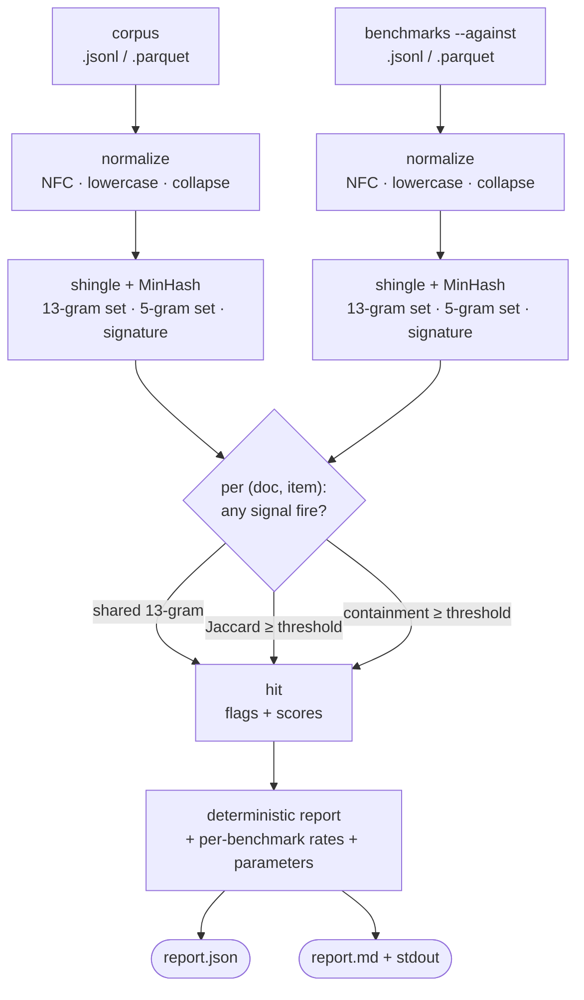
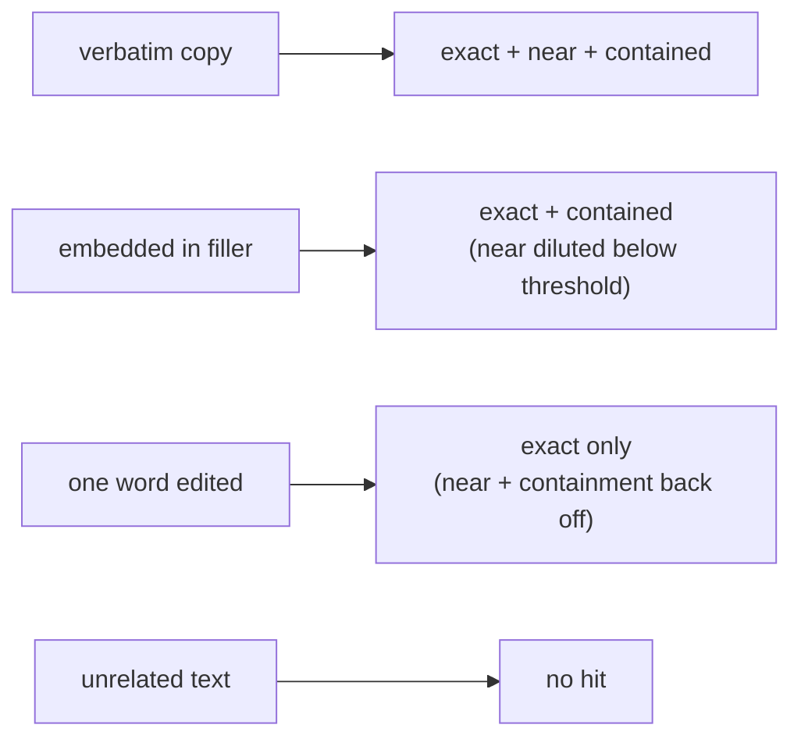

# Benchmark Contamination Scanning: A Byte-Reproducible Audit of Eval-Set Leakage in a Training Corpus

Engineering documentation / feature explanation. Describes `attestrum decontaminate`,
the read-only subcommand that scans a training corpus for leaked evaluation-benchmark
questions and emits a deterministic contamination report — *did the test set leak into
the training data, and can anyone re-check the answer byte-for-byte?* Intended for
engineers, auditors, and partners evaluating how Attestrum reasons about corpus
**composition** (what is — and isn't — inside a corpus), alongside its single-corpus
seal pipeline and its cross-version diff.

Companion to [`how-attestrum-works-end-to-end.md`](./how-attestrum-works-end-to-end.md)
(the single-corpus seal → sign → publish pipeline whose fingerprint kernel this reuses),
[`deterministic-by-construction.md`](./deterministic-by-construction.md) (the byte-identity
disciplines the report's determinism promise rests on), and
[`corpus-version-diffing.md`](./corpus-version-diffing.md) (the sibling read-only,
unsigned analysis subcommand for corpus *evolution*).

Status: applies to the `attestrum-decontaminate` crate and the `attestrum decontaminate`
subcommand as landed. The worked example in §3 is genuine, unedited tool output.

---

## TL;DR

Every model that posts a benchmark score eventually draws the same accusation — *"you
trained on the test set"* — and there is rarely a neutral way to settle it: both sides
run incompatible one-off scripts and neither can reproduce the other's. The *detection*
methods are old and settled (exact n-gram overlap traces to GPT-3; MinHash near-duplicate
is textbook); what's missing is a single-purpose, reproducible auditor. `attestrum
decontaminate --corpus <…> --against <benchmark…>` scans a corpus (JSONL or Parquet)
against benchmark files and flags every (document, benchmark-item) pair on three signals —
**exact** (a shared 13-gram), **near** (MinHash Jaccard ≥ a threshold), and **contained**
(most of a benchmark item's shingles present in one document, catching an answer buried in
filler) — as a byte-reproducible `report.json` plus a human-readable summary. The same
corpus and benchmarks produce the identical report on any machine. And because the near
signal rides Attestrum's *protected* fingerprint kernel — the very same 128-permutation
BLAKE3 MinHash that backs its inclusion proofs — a contamination finding and an inclusion
proof are measured with one ruler, not two.

## 1. What it is

`attestrum decontaminate` is a deterministic, read-only scan of a training corpus against
one or more evaluation benchmarks. It has no write path, signs nothing, mutates nothing,
and makes no network call — it reads the corpus and benchmark files and reports what
overlaps.

A single run reports:

- **Per-(document, item) hits**, each tagged with which of the three signals fired and the
  underlying numbers (shared 13-gram count, MinHash Jaccard estimate, containment fraction).
- **Per-benchmark summary** — for each benchmark, the total item count and how many distinct
  items were flagged by each signal, plus an overall contamination rate.
- **Scan parameters** — the exact n-gram widths, MinHash permutation count, and thresholds,
  recorded in-band so a reader can reproduce the scan.

Three signals decide a hit, and **any one** firing flags the pair. They are deliberately
complementary — each catches a leakage mode the others miss:

- **exact** — the document and the benchmark item share at least one 13-word shingle. This
  is the classic verbatim-overlap signal.
- **near** — the document's and item's MinHash signatures agree on ≥ 80% of their
  components (Jaccard estimate ≥ the `--near-threshold`). This catches paraphrase and light
  edits.
- **contained** — ≥ 90% of the benchmark item's 5-word shingles appear somewhere in the
  document. This catches an item buried inside a much larger document, where whole-document
  Jaccard is diluted far below the near threshold but the item is nonetheless present in
  full.

Output comes in two surfaces: a byte-reproducible `report.json` (full detail, canonical
key ordering) and a concise human summary (`report.md` and a one-line stdout digest).
Documents are scanned in parallel, but every hit is collected and sorted before the report
is assembled, so thread scheduling can never change the output bytes.



## 2. Why it is valuable

The honest starting state for most benchmark disputes is a standoff. A team posts a strong
MMLU or GSM8K number; a critic replies *"the eval leaked into your pretraining set"*; and
there is no shared instrument to settle it. Each side writes a throwaway n-gram script, the
scripts disagree, and neither result is reproducible on the other's machine. `attestrum
decontaminate` replaces the argument with an artifact: a contamination report anyone holding
the same corpus and benchmarks can recompute byte-for-byte.

This fills a specific gap in the tooling landscape. The *capability* to detect contamination
already exists — but it lives buried inside corpus-curation mega-frameworks. [Dolma](https://github.com/allenai/dolma),
[datatrove](https://github.com/huggingface/datatrove), and [NeMo Curator](https://github.com/NVIDIA/NeMo-Curator)
all include decontamination as one stage of a much larger pipeline; to use just the check,
you adopt the whole framework, and none of them promise a byte-reproducible standalone
report. The alternative — an ad-hoc n-gram script — is the de-facto status quo: fast to
write, fine for a private gut-check, and useless for settling a public dispute, because the
moment a script picks up a wall-clock, a hash-map iteration order, or a locale-dependent
sort, its output stops being evidence and goes back to being a claim. The methods are
settled and openly acknowledged as such; the contribution is the *packaging* — one focused
tool that gives everyone the same answer.

Attestrum adds one thing a standalone auditor cannot: **the contamination scan and the
provenance proofs share a single ruler.** The near signal is computed with the same
*protected* 128-permutation BLAKE3 MinHash kernel that Attestrum's inclusion and
non-inclusion proofs use, over the same NFC → lowercase → whitespace-collapse normalization.
So a near-duplicate contamination finding is measured in exactly the units a published
inclusion proof speaks — not a second, parallel notion of similarity that happens to live in
the same repo. One corpus, one fingerprint basis, two questions answered.

There is also a compliance dimension. The EU AI Act's Article 53(1)(d) obliges
general-purpose AI model providers to publish a [sufficiently detailed summary of training
content](https://www.wilmerhale.com/en/insights/blogs/wilmerhale-privacy-and-cybersecurity-law/european-commission-releases-mandatory-template-for-public-disclosure-of-ai-training-data).
A provider who can say *"here is a reproducible scan of our published corpus against the
standard evaluation suites, and here is the overlap"* has a cleaner, evidence-grade way to
back a transparency claim than an assertion that the data was decontaminated.

Two caveats, stated up front. First, **overlap is not intent**: a shared 13-gram can be
coincidental — common phrasing, a quoted proverb, a boilerplate instruction — and the tool
reports the overlap, not whether anyone cheated. Second, **the scan only knows the
benchmarks you give it**: it audits the corpus against the `--against` files and is silent
about any eval set you didn't supply. The report is a measurement; the interpretation is
yours.

## 3. How to use it

The command takes one or more corpus files and one or more benchmark files:

```
attestrum decontaminate --corpus <file…> --against <benchmark…> [--out <dir>] [--near-threshold <0..1>] [--text-key <field>]
```

- **`--corpus <file>`** (repeatable) — the corpus to scan. JSONL or Parquet, auto-detected
  by extension.
- **`--against <file>`** (repeatable) — the benchmark(s) to scan against. Each file is one
  benchmark, named by its file stem (so `gsm8k.jsonl` → the benchmark `gsm8k`).
- **`--out <dir>`** — directory to write `report.json` + `report.md` into (default: the
  current directory).
- **`--near-threshold <0..1>`** — the MinHash Jaccard cutoff for the `near` signal
  (default `0.80`).
- **`--text-key <field>`** — the JSON field / Parquet column holding the text (default
  `text`).

The report carries **no wall-clock at all**, which is what keeps the output byte-identical
across runs and machines. It is read-only: nothing is signed, no manifest is touched, no
network request is made.

### Worked example (genuine output)

Take a tiny three-item slice of a GSM8K-style benchmark and a four-document corpus
deliberately salted to exhibit each contamination mode: `web-000042` is a **verbatim** copy
of one item, `web-001337` is that same item **embedded** in ~40 words of unrelated filler,
`web-002718` is a different item **lightly edited** (one word swapped), and `web-003900` is
**clean** (unrelated text):

```
$ attestrum decontaminate --corpus corpus.jsonl --against gsm8k.jsonl --out out
decontaminate: scanned 4 document(s) against 1 benchmark(s) → 3 hit(s)
  out/report.json
  out/report.md
```

The human summary (`out/report.md`):

```
# attestrum decontaminate report (v0.1.0)

- corpus: corpus.jsonl (4 documents, 185 words)
- detection: 13-gram exact · minhash(128) jaccard ≥ 0.8 · containment ≥ 0.9

## Per-benchmark summary

| benchmark | items | exact | near | contained | flagged | rate |
|---|---:|---:|---:|---:|---:|---:|
| gsm8k | 3 | 2 | 1 | 1 | 2 | 66.667% |

## Top hits (3 total)

- gsm8k/0017 in doc web-000042 — [exact,near,contained] shared-13grams=19 jaccard=1.00 containment=1.00
- gsm8k/0017 in doc web-001337 — [exact,contained] shared-13grams=19 jaccard=0.40 containment=1.00
- gsm8k/0103 in doc web-002718 — [exact] shared-13grams=8 jaccard=0.63 containment=0.76
```

Read the three hits carefully, because they teach the whole model — each fired a different
combination of signals, and the combination tells you *how* the item leaked:

- **`web-000042` — verbatim copy → all three.** Identical text shares 13-grams (exact),
  has Jaccard 1.00 (near), and contains 100% of the item's shingles (contained).
- **`web-001337` — item embedded in filler → exact + contained, but not near.** The item
  is present in full, so it still shares 13-grams (exact) and 100% containment — but the
  surrounding filler dilutes whole-document Jaccard to **0.40**, well below the 0.80 near
  threshold. This is exactly the case the containment signal exists to catch: near alone
  would have missed a verbatim leak.
- **`web-002718` — one word edited → exact only.** A single swapped word leaves an intact
  13-word run (exact, 8 shared shingles) but pulls Jaccard to **0.63** and containment to
  **0.76** — both below threshold. The other two signals correctly back off; exact alone
  flags it.

The `gsm8k/0042` item appears nowhere in the corpus, so it is not flagged — which is why the
benchmark's contamination rate is **2 of 3 (66.667%)**, not 100%. The signal pattern
degrades sensibly with the contamination mode, and every number above recomputes
identically on any machine.



## 4. When to use it

`attestrum decontaminate` is built for the moments where someone needs a defensible answer
to *"did the eval leak in?"*:

- **Before publishing a benchmark score** — scan your pretraining corpus against the suites
  you report on, and attach the contamination report to the result.
- **When a contamination accusation lands** — re-run the scan and hand over a report the
  accuser can recompute, instead of trading incompatible scripts.
- **In CI**, to gate or document a corpus: scan each new corpus revision against a pinned
  benchmark set and fail the build (or attach the report) when contamination crosses a
  threshold you care about.
- **When publishing a training corpus** — ship a reproducible decontamination report
  alongside it, as evidence behind a transparency or Article 53 summary.
- **When auditing a data pipeline** — confirm that a decontamination stage actually removed
  what it claimed to, independent of the pipeline's own logs.

## 5. Why we made it — design philosophy

**One ruler, not two.** The decision that shapes everything is reuse of the *protected*
fingerprint kernel. Normalization (NFC → lowercase → whitespace-collapse) and the near
signal's MinHash come straight from `attestrum-text-minhash`, unchanged — the same
128-permutation BLAKE3 kernel that backs Attestrum's inclusion and non-inclusion proofs.
The contamination scan therefore measures near-duplication in *exactly* the units the rest
of the system uses; it does not ship a second, divergent notion of similarity. The exact and
containment signals add only a small BLAKE3 shingle-set helper on top — they touch no
protected component and add no new dependency.

**Three signals because leakage has three shapes.** A single detector always has a blind
spot: pure n-gram overlap misses paraphrase; pure MinHash misses a short item drowned in a
long document; pure containment over-fires on common phrasing. Running all three and
recording *which* fired turns the report from a yes/no verdict into a description of *how*
the overlap looks — verbatim, paraphrased, or embedded — which is the information an auditor
actually needs.

**The report declares its own limits, in-band.** Rather than leave you to discover the
edges, the design is explicit about what this version deliberately does *not* do:

- **No semantic / embedding similarity** — detection is lexical (exact, MinHash, containment).
  A conceptual paraphrase with no shared shingles is out of scope by design.
- **No bundled or auto-fetched benchmarks yet** — you supply benchmark files via `--against`.
  Pinned, hash-verified benchmark fetching is deliberately a later, separate decision.
- **No signed contamination artifact yet** — the report is the reversible, unsigned *leaf*,
  intentionally not a frozen, signed predicate.
- **It measures overlap, not intent** — a flagged pair is evidence of shared text, not proof
  of misconduct.

**Determinism is the one absolute promise, and it is CI-enforced.** Same corpus + same
benchmarks → byte-identical report on any machine. Documents scan in parallel but every hit
is sorted before reporting, every keyed aggregate is a `BTreeMap`, scores round to six
decimals for stable float formatting, and JSON rendering rides Attestrum's shared
canonical-key primitive. There is no wall-clock in the output. A committed golden plus a
double-run byte-compare gate this across a four-target build matrix on every push.

That is the whole intent: a small, single-purpose instrument whose output is meant to stand
as evidence. It tells you exactly which benchmark items overlap your corpus and how, declares
exactly what it can and cannot claim, measures it with the same ruler as the rest of
Attestrum, and produces the same bytes every time. Precision over breadth.

---

### Sources

- [Dolma — an open corpus and toolkit (decontamination tooling)](https://github.com/allenai/dolma)
- [datatrove — large-scale text processing](https://github.com/huggingface/datatrove)
- [NVIDIA NeMo Curator](https://github.com/NVIDIA/NeMo-Curator)
- [WilmerHale — European Commission Releases Mandatory Template for Public Disclosure of AI Training Data](https://www.wilmerhale.com/en/insights/blogs/wilmerhale-privacy-and-cybersecurity-law/european-commission-releases-mandatory-template-for-public-disclosure-of-ai-training-data)
