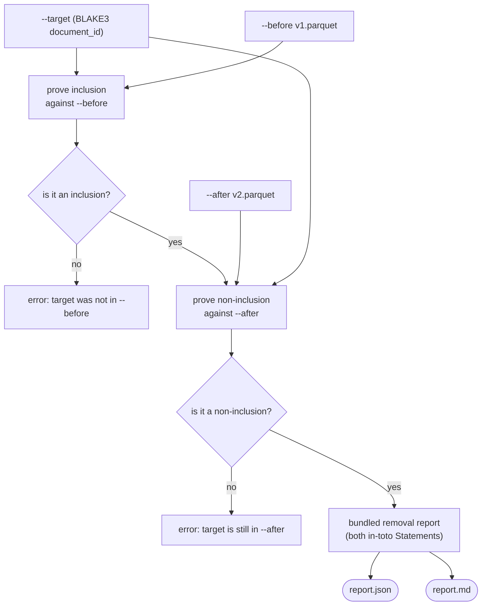
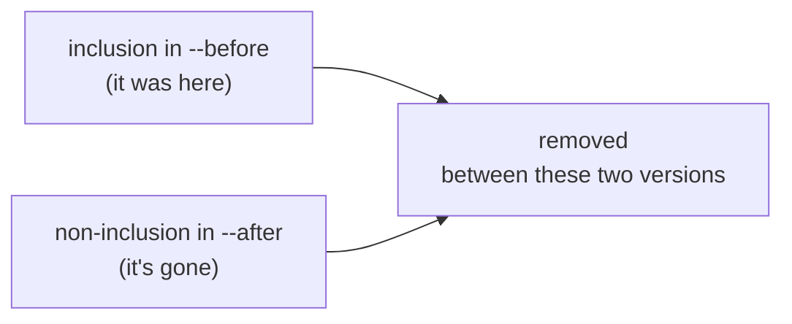

# Corpus Removal Evidence: Byte-Reproducible Proof a Document Was Removed Between Two Sealed Versions

Engineering documentation / feature explanation. Describes `attestrum remove`, the read-only
subcommand that proves a document was **removed** between two sealed corpus versions — present
in the earlier one, absent from the later one — and bundles the two cryptographic proofs into
an unsigned report. *Can you prove a takedown actually happened, in evidence anyone can verify
without trusting you?* Intended for engineers, auditors, and compliance leads evaluating how
Attestrum reasons about corpus **evolution and removal**.

Companion to [`how-attestrum-works-end-to-end.md`](./how-attestrum-works-end-to-end.md) (the
single-corpus seal → sign → publish pipeline whose proof machinery this reuses),
[`provenance-without-disclosure.md`](./provenance-without-disclosure.md) (the threat model and
privacy properties of cryptographic corpus provenance), and
[`corpus-version-diffing.md`](./corpus-version-diffing.md) (the sibling read-only analysis
subcommand that reports the *full* delta between two corpus versions, of which a single
removal is one case).

Status: applies to the `attestrum-remove` crate and the `attestrum remove` subcommand as
landed. The worked example in §3 is genuine, unedited tool output.

---

## TL;DR

Takedowns and erasure requests are routine — a DMCA notice, a
[GDPR right-to-erasure](https://gdpr-info.eu/art-17-gdpr/) request, a dataset opt-out — and the
usual answer is an unverifiable *"we removed it."* `attestrum remove --before <v1> --after <v2>
--target <doc-id>` turns that into evidence: it proves, cryptographically, that the document
was **included** in the earlier sealed corpus and is **absent** from the later one. Under the
hood it reuses the existing inclusion / non-inclusion proof machinery — an RFC 6962 audit path
for "it was here" and a sorted-Merkle adjacency proof for "it's gone" — and bundles both
in-toto Statements into one unsigned `report.json` that anyone can verify with stock `cosign`,
no Attestrum install required. It mints no new attestation type and changes nothing about
either corpus.

## 1. What it is

`attestrum remove --before <v1.parquet> --after <v2.parquet> --target <document-id>` is a
deterministic, read-only proof that one document was removed between two sealed corpus
versions. It signs nothing new and mutates nothing — it reads two manifests and emits evidence.

A single run does two things and bundles the result:

- **Proves inclusion against `--before`** — that the target document (named by its 64-character
  BLAKE3 `document_id`) was in the earlier corpus, with an RFC 6962 Merkle **audit path** to the
  corpus root.
- **Proves non-inclusion against `--after`** — that the same document is absent from the later
  corpus, via the sorted-Merkle **adjacency proof** (the two neighbors that would bracket it if
  it were present, and the assertion that they are adjacent).
- **Validates honestly, then bundles** — it asserts a removal *only* if the before-proof is
  genuinely an inclusion and the after-proof is genuinely a non-inclusion; otherwise it errors
  rather than emit a misleading report. The two in-toto Statements are embedded verbatim in the
  output, so the evidence stands on its own.

Both proofs are produced by the same `attestrum prove` engine the single-document workflow uses,
run unsigned. The result is a `report.json` (the two embedded Statements) and a human-readable
`report.md` summary.



## 2. Why it is valuable

"We took it down" is a claim a data publisher makes constantly and can rarely back. When a
rightsholder files a takedown, a person exercises a
[right to erasure](https://gdpr-info.eu/art-17-gdpr/), or a creator uses a dataset opt-out, the
honest follow-up question is *show me*. `attestrum remove` answers it with cryptography rather
than a promise: the before-proof binds the document to a corpus whose root is published, and the
after-proof binds its absence to the next version's root. Anyone holding the two sealed manifests
can recompute the identical evidence, and — because the proofs are standard in-toto Statements —
[verify them with stock `cosign`](https://docs.sigstore.dev/cosign/verifying/verify/) without
installing or trusting Attestrum.

This is a different question from the one a file-level data-version-control system answers. Tools
like [DVC](https://dvc.org/doc/command-reference/diff) and
[lakeFS](https://lakefs.io/data-version-control/) can tell you a blob disappeared between two
commits, but a blob-level diff is not a content-addressed cryptographic proof tied to a published
corpus root on each side. `attestrum remove` is specifically the latter: evidence about *content
identity* (the BLAKE3 `document_id`) and *membership* (Merkle inclusion / non-inclusion), the two
things a takedown actually turns on.

Two caveats, stated up front. First, `attestrum remove` proves a removal **between the two sealed
versions you point it at** — it is a statement about those two specific corpus states, not a live,
continuous guarantee that the document never reappears in some later version. Second, this is the
read-only, unsigned **leaf**: it reuses the existing proof types and bundles them, but it is not
the full signed-and-witnessed takedown ledger that a continuous removal-tracking system would
need (see §5).

## 3. How to use it

The command takes the two sealed manifests and the target document id:

```
attestrum remove --before <v1.parquet> --after <v2.parquet> --target <doc-id> [--out <dir>]
```

- **`--before <path>`** — the sealed `manifest.parquet` of the earlier version (target present).
- **`--after <path>`** — the sealed `manifest.parquet` of the later version (target removed).
- **`--target <hex>`** — the 64-character lowercase BLAKE3 `document_id` of the removed document.
- **`--out <dir>`** — directory for `report.json` + `report.md` (default: current directory).

If the target is *not* in `--before`, or *still in* `--after`, the command errors instead of
emitting a removal report — a removal you can't actually prove is not reported as one.

### Worked example (genuine output)

Take two versions of a corpus where the target document (`document_id` `1414…1414`) was present
in `v1` and removed in `v2`:

```
$ attestrum remove --before v1/manifest.parquet --after v2/manifest.parquet \
    --target 1414141414141414141414141414141414141414141414141414141414141414 --out out
remove: target 1414141414141414141414141414141414141414141414141414141414141414 proved removed (included in --before, absent from --after)
  out/report.json
  out/report.md
```

The human-readable `report.md` (genuine, unedited):

```
# attestrum remove — removal evidence (v0.1.0)

- target: `1414141414141414141414141414141414141414141414141414141414141414`
- result: **removed**

## Evidence

1. **inclusion** against `v1/manifest.parquet` — proves the document was present.
2. **non-inclusion** against `v2/manifest.parquet` — proves the document is absent.

Both in-toto Statements are embedded in `report.json`; verify them with stock `cosign` — no Attestrum install required.
```

The cryptographic substance lives in `report.json`. The inclusion side carries an
`inclusion-proof/v0.3` predicate with the document's `leafIndex`, the `merkleRoot` of `v1`, a
two-hash RFC 6962 `auditPath`, and `matchMode: exact-blake3`. The non-inclusion side carries a
`non-inclusion-proof/v0.3` predicate with the `boundaryCase` and the left/right neighbors that
bracket where the document *would* sit in `v2`'s sorted leaves — the proof that there is no room
for it. Neither is something you take on faith: each is a standard in-toto Statement a verifier
can check independently.

The evidence model in one picture — a removal is two proofs about two corpus states, not a log
line:



## 4. When to use it

`attestrum remove` is built for the moments where a removal has to be demonstrable, not just
asserted:

- **Honoring a takedown or erasure request** — produce evidence that the specific document is
  gone from the published corpus, for the requester or a regulator.
- **Responding to a dataset opt-out** — show a creator that their work was removed in the named
  version.
- **Building an audit trail of corrections** — attach a removal proof to each corpus revision
  that drops content.
- **When re-publishing a corrected corpus version** — back the "this version removes X" claim
  with verifiable proof rather than release notes.

## 5. Why we made it — design philosophy

**Honest validation is the centerpiece.** A removal report is only emitted when the before-proof
is genuinely an inclusion *and* the after-proof is genuinely a non-inclusion. If the target was
never in `--before`, or is still in `--after`, the tool errors — it will not dress up a
non-removal as a removal. The claim and the evidence are the same object.

**It reuses the existing proof types — it mints nothing new.** The inclusion and non-inclusion
predicates (`inclusion-proof/v0.3`, `non-inclusion-proof/v0.3`) and the Merkle audit paths are
the ones the single-document `attestrum prove` workflow already ships. `attestrum remove` is a
read-only composition of two of them; it introduces no new attestation type and changes no
protected format. That is what keeps it a small, reversible leaf rather than a schema commitment.

**The evidence is vendor-neutral and self-contained.** The two Statements are embedded verbatim
in the report and verify with stock `cosign` — no Attestrum install, no trusted Attestrum
service. A removal proof you can only check with the tool that made it is not evidence; one
anyone can check is.

**The report declares its own limit, in-band — and this one is the largest.** This leaf bundles
two existing read-only proofs. It deliberately does **not** yet ship the heavier removal
machinery: a signed `takedown` predicate (a new attestation type), an append-only removal
**ledger** with external witnesses, or a corpus-version *chain* that links each version's root to
its predecessor's. Those would turn a point-in-time removal proof into a continuous, tamper-evident
takedown history — and each is a schema-affecting, protected-system change, kept out of this leaf
on purpose and called out so no reader mistakes the leaf for the whole.

**Determinism holds, with one honest footnote.** The same inputs and the same reproducible-build
timestamp produce byte-identical evidence — every aggregate is canonical, the Statements serialize
through the shared canonical-key primitive. The one machine-specific element is by design: each
embedded proof records the `file://` URI of the manifest it was generated against, so the report
bytes are deterministic *per manifest path*. The determinism test pins byte-identity across
repeated runs on the same inputs.

That is the whole intent: a small, single-purpose instrument that turns "we removed it" into two
cryptographic proofs anyone can verify, refuses to claim a removal it cannot prove, and is explicit
about the larger takedown system it is the first step toward.

---

### Sources

- [GDPR Article 17 — Right to erasure ('right to be forgotten')](https://gdpr-info.eu/art-17-gdpr/)
- [in-toto Attestation Framework](https://github.com/in-toto/attestation)
- [RFC 6962 — Certificate Transparency (Merkle audit & consistency proofs)](https://datatracker.ietf.org/doc/html/rfc6962)
- [Sigstore cosign — verifying signatures and attestations](https://docs.sigstore.dev/cosign/verifying/verify/)
