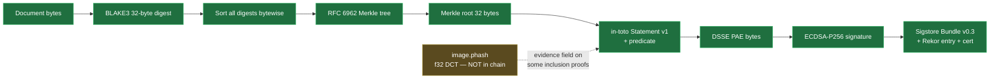

# Which Attestrum Outputs Are Byte-Identical Across CI Platforms — and the One Field That Isn't

Engineering documentation. Describes which artifacts Attestrum guarantees are byte-identical across CI targets, which are not, why, and how the system absorbs the known cross-target drift architecturally. Intended for partners, security auditors, and external verifiers evaluating Attestrum's reproducibility claims.

Status: applies to `attestrum-fingerprint` v0.1 and the broader v0.1 release scope as of commit `6953bab` (2026-05-26).

---

## TL;DR

- The full cryptographic chain — **BLAKE3 leaf hashes → RFC 6962 Merkle root → DSSE envelope → Sigstore Bundle v0.3** — is asserted byte-identical across all four CI targets (Linux glibc x86_64, Linux glibc aarch64, macOS arm64, Linux musl x86_64) on every push to `main`.
- Every `FingerprintBundle` field that goes into the cryptographic chain — BLAKE3, SHA-256, blockhash, ISCC unit codes, byte length, timestamp — is also byte-identical across all four targets.
- **One single field is not byte-identical across targets**: the DCT-based perceptual hash (`ImageFingerprint.phash`). Different combinations of `rustc` + LLVM + target libc produce different `f32` outputs from the DCT, with an observed drift of up to 8 bits per 64 on high-frequency image content.
- The `phash` field is not part of the cryptographic chain. It is one input to one of five `MatchEvidence` variants used in inclusion proofs (`MatchEvidence::Perceptual`), and that variant carries an explicit `threshold` field by design — Hamming-distance tolerance is how perceptual hashes are always used.
- Signed bundles round-trip across targets. Inclusion proofs verify across targets. Cross-target byte-determinism is preserved for every load-bearing artifact Attestrum produces.

---

## 1. What "byte-determinism" means in Attestrum

A provenance system that emits cryptographically verifiable bundles only works if independent parties can reproduce the same bundle from the same inputs. If publisher A signs a corpus on Linux and verifier B downloads the bundle, B must be able to:

1. Read the bundle and extract the Merkle root, the audit path for a given leaf, and the leaf hash.
2. Re-compute the Merkle root from `(leaf, audit_path)`.
3. Verify the computed root matches the signed root.
4. Verify the signature itself via Sigstore.

For step (2) to be portable, every byte that feeds the Merkle computation must be deterministic across targets. A single non-deterministic bit anywhere in the leaf hash or the audit path makes the proof platform-specific — and an inclusion proof that only verifies on one platform is not a proof.

Attestrum's discipline is therefore: **every byte in the cryptographic chain is byte-identical on every supported target, on every CI run.** This is enforced by a 4-target determinism matrix on every push.

---

## 2. The 4-target CI matrix

Source: `.github/workflows/determinism.yml`.

| Label | Runner | Purpose |
|---|---|---|
| `linux-x86_64-glibc` | `ubuntu-24.04` (GHA-hosted, glibc 2.39) | The reference Linux target used by most CI/CD pipelines. |
| `linux-aarch64-glibc` | `ubuntu-24.04-arm` (GHA-hosted ARM, glibc 2.39) | ARM-native Linux — surfaces architecture-specific drift (endianness assumptions, SIMD path differences). |
| `macos-aarch64-darwin` | `macos-14` (Apple Silicon) | Validates macOS arm64 — surfaces Darwin libc / mach kernel / Apple-specific tooling drift. |
| `linux-x86_64-musl` | `ubuntu-24.04` running an `alpine:3.20` container | Validates Alpine musl — surfaces glibc-vs-musl libm divergence, particularly for floating-point math. |

Each target runs the full workspace test suite (`cargo test --workspace`) plus dedicated determinism artifacts: a `merkle-root-<label>.txt` containing the BLAKE3 Merkle root over a 1000-document synthetic corpus, and a `manifest.parquet` produced by the full build pipeline. A `compare` job downloads all four artifacts and runs `cmp` pairwise. Any byte difference between any two targets is a hard CI failure.

For the fingerprint crate specifically (`attestrum-fingerprint`), the determinism gate also asserts that fingerprinting a fixed set of inputs (committed PNG fixtures + a literal UTF-8 text snippet) produces byte-identical JSON output across all four targets. See `crates/attestrum-fingerprint/tests/determinism.rs` and the goldens under `crates/attestrum-fingerprint/tests/golden/`.

---

## 3. Fields that ARE byte-identical across all four targets

These are the load-bearing fields. Each is asserted byte-for-byte on every push by the determinism matrix.

### 3.1 The cryptographic chain

- **BLAKE3 leaf hashes**: 32-byte digests over canonical document bytes. BLAKE3 is integer-only, fully specified by the reference implementation, and verified byte-identical across all four targets. The 1000-document synthetic-corpus Merkle root has matched across all four targets on every push since Sprint 2 commit `E9`.
- **SHA-256 leaf hashes**: 32-byte digests. RustCrypto's `sha2` crate, integer-only, byte-identical across all targets. Used for Sigstore / in-toto interop where SHA-256 is the canonical digest.
- **RFC 6962 Merkle root**: built deterministically from sorted BLAKE3 leaf hashes via `attestrum-merkle::merkle_root`. Sort order is bytewise on the leaf hashes. No floating-point math anywhere in the construction.
- **DSSE envelope**: built from the canonical-JSON serialization of an in-toto Statement v1, wrapped per the DSSE PAE (Pre-Authentication Encoding) protocol. The PAE input is the raw payload bytes, not base64-wrapped, and `compute_pae` is a pure-byte string operation.
- **Sigstore Bundle v0.3**: assembled from the DSSE envelope + the Rekor transparency-log entry + the X509 leaf certificate. ProtoJSON encoding with sorted keys via `attestrum-attest::sort_keys`.

### 3.2 Fingerprint-bundle fields

All of these fields, drawn from `crates/attestrum-fingerprint/src/lib.rs::FingerprintBundle`, are byte-identical across all four targets:

| Field | Type | Why it's stable |
|---|---|---|
| `schema` | `String` (constant URI) | Compile-time constant `FINGERPRINT_SCHEMA = "https://attestrum.com/fingerprint/v0.1"`. |
| `modality` | `Modality` enum | Discriminant-only serialization. Integer indexing. |
| `blake3` | `String` (hex) | BLAKE3 of normalized bytes. Integer-only. |
| `sha256` | `String` (hex) | SHA-256 of normalized bytes. Integer-only. |
| `byteLen` | `u64` | Bytes counted; deterministic. |
| `text.originalByteLen` | `u64` | Bytes counted before normalization. |
| `text.nfcCharCount` | `u64` | Unicode scalar count post-NFC. NFC is fully specified by Unicode Standard Annex #15. |
| `text.minhash` | `Vec<u64>` (length 128) | 128 BLAKE3-keyed permutations over 5-gram word shingles. All integer math. |
| `text.simhash` | `u64` | 64-bit BLAKE3-keyed weighted accumulator. Uniform integer weights. |
| `image.blockhash` | `String` (hex) | 64-bit blockhash.io spec hash via the `blockhash` crate. Integer-only block-mean. |
| `image.width`, `image.height` | `u32` | Pixel counts. |
| `iscc.contentCode` | `String` | ISO 24138 ISCC content unit code via `iscc-lib 0.4`. Algorithm is byte-deterministic per the ISO spec. |
| `iscc.dataCode`, `iscc.instanceCode`, `iscc.composite` | `String` | Same as above. Verified byte-identical across all targets on every push. |
| `generatedAt` | `String` (RFC 3339) | Derived from a caller-supplied `source_date_epoch` via `jiff::Timestamp::from_second`. The crate never reads the system clock. Mirrors the Reproducible Builds convention used elsewhere in Attestrum. |

A `FingerprintBundle` for a text document is therefore byte-identical across all four targets in every emitted byte. A `FingerprintBundle` for an image document is byte-identical across all four targets in every field listed above.

---

## 4. The one field that is NOT byte-identical: `image.phash`

`ImageFingerprint.phash` is a 64-bit DCT-based perceptual hash computed by the `image_hasher` crate version 3.1.1, configured via:

```rust
image_hasher::HasherConfig::new()
    .hash_size(8, 8)
    .preproc_dct()
    .to_hasher()
```

The `preproc_dct()` flag applies a Discrete Cosine Transform to a resize of the input image before downsampling to the 8×8 = 64-bit hash. The DCT is implemented in `image_hasher` using `f32` arithmetic internally.

### 4.1 Why the drift exists

IEEE 754 single-precision (`f32`) arithmetic is not byte-deterministic across:

- Different `rustc` releases (the LLVM backend version changes — LLVM 18 vs 19 vs 20 produce different machine code for the same source);
- Different target libc / libm implementations (macOS uses Darwin libm, Linux glibc uses GNU libm, Linux musl uses musl's libm — these implement `cos`, `sin`, `sqrt`, etc. with subtly different last-bit behavior);
- Different SIMD code paths (vectorized vs scalar implementations of the same operation can round differently);
- Compiler optimization decisions (fused-multiply-add vs separate ops, reassociation of additions).

A DCT internally sums many cosine-weighted terms. Small last-bit differences in each term can compound across the DCT and shift the median threshold by which the hash bits are assigned to 0 or 1. For input images whose DCT coefficients sit near that median threshold, this jitter flips bits.

### 4.2 Empirical observation

The first CI run of the cross-target determinism gate added in commit `7009419` ("S5-D1 E5: fingerprint crate API freeze + cross-target determinism gate") surfaced the drift on the project's `checkerboard.png` test fixture:

- macOS aarch64 produced `phash = 004915b52a6aa202`.
- Linux musl x86_64 produced `phash = 084959b5ca6aa206`.

Bitwise XOR of these is `084c4c0000000004`, which has 8 bits set — 8 of 64 bits differ, or 12.5% Hamming drift.

The same commit's `gradient.png` fixture produced byte-identical phash (`0000000000000240`) across all four targets. The structural difference: the gradient image has DCT coefficients far from the median threshold (a left-to-right brightness ramp produces a few dominant low-frequency coefficients well above the median, and all other coefficients well below); the checkerboard image has many DCT coefficients near the median due to its repeating high-frequency content, and that's where the f32 jitter flips bits.

### 4.3 Why this isn't a bug in Attestrum

The drift is a property of doing DCT math in `f32` on different libcs, not a property of any Attestrum code. macOS's libm and Alpine musl's libm produce different `f32` outputs for the same input to a function like `f32::cos`, and that difference cascades into the DCT output. The only Attestrum-side fix that would eliminate the drift is to replace the algorithm — see §10 (deferred Path B).

---

## 5. Why the drift doesn't break the cryptographic chain

The cryptographic chain — the part of Attestrum that verifies "this document was in this corpus" — is the path from document bytes through Merkle root to Sigstore signature. The `phash` field is NOT in that path.



The chain from `Document bytes` to `Sigstore Bundle v0.3` is the load-bearing path for verifiability. Every node in that path is byte-identical across all four targets.

`phash` enters the picture only as an optional evidence field on inclusion proofs whose match mode is `MatchEvidence::Perceptual` — see §6.

---

## 6. How the system absorbs the drift architecturally

Inclusion proofs in Attestrum carry a `MatchEvidence` enum with five variants. The variants and their schema-locked v0.3 shapes (from `crates/attestrum-attest/src/predicate.rs`):

| Variant | Wire shape | Uses phash? |
|---|---|---|
| `MatchEvidence::ExactBlake3` | `{ "matchMode": "exact-blake3" }` | No |
| `MatchEvidence::ExactSha256` | `{ "matchMode": "exact-sha256" }` | No |
| `MatchEvidence::Iscc` | `{ "matchMode": "iscc", "compositeDistance": <u32> }` | No |
| `MatchEvidence::MinHash` | `{ "matchMode": "minhash", "jaccard": <u32 PPM>, "ngramSize": <u32> }` | No |
| `MatchEvidence::Perceptual` | `{ "matchMode": "perceptual", "hammingDistance": <u32>, "threshold": <u32> }` | Yes (indirectly) |

Four of five variants do not reference `phash` at all. The fifth (`Perceptual`) carries an explicit `threshold` field. The semantics of that field:

> `hammingDistance` is the bitwise Hamming distance between the query's perceptual hash and the matched leaf's perceptual hash. `threshold` is the tolerance the publisher considered acceptable for declaring a match. A verifier validates the match by checking `hammingDistance ≤ threshold`.

This is the standard usage pattern for perceptual hashes. Perceptual-hash literature (and tools like ImageHash, PhotoDNA, Apple's NeuralHash) all use Hamming-distance tolerance, not byte equality. Typical published thresholds for "this is the same image, possibly modified" are in the 10-16 bit range for 64-bit hashes — well above the 8-bit cross-target drift observed in §4.2.

A `Perceptual` inclusion proof emitted on macOS, claiming `{ hammingDistance: 4, threshold: 12 }` for a match, remains valid for a verifier on Linux musl. The verifier reads the proof's stated `hammingDistance` and `threshold`; the verifier does not re-fingerprint the query image and recompute the Hamming distance. The publisher's evidence is what gets verified, not a recomputation. If a verifier did want to independently re-fingerprint a query image, they would do so on their target, compute their own Hamming distance against the corpus's stored phash, and compare to their own threshold. The threshold absorbs the cross-target drift, plus the natural variance from any re-encoded / resized / re-compressed image variant.

---

## 7. Risk surface table

| Scenario | Affected by phash drift? |
|---|---|
| Publisher fingerprints corpus, signs bundle, distributes | No — `phash` is computed once on the publisher's target, frozen in the bundle; verifiers don't recompute it. |
| Verifier checks bundle signature + Merkle root | No — verification is BLAKE3 + Merkle + Sigstore signature math, all byte-identical across targets. |
| Inclusion proof with `MatchEvidence::ExactBlake3` or `ExactSha256` | No — exact-match modes don't use phash. |
| Inclusion proof with `MatchEvidence::Iscc` or `MinHash` | No — these match modes use integer-only algorithms, byte-identical across targets. |
| Inclusion proof with `MatchEvidence::Perceptual`, sensible threshold (e.g., ≥ 10 of 64 bits) | No — observed drift (≤ 8 bits) is within tolerance; perceptual matches are by design Hamming-tolerant. |
| Inclusion proof with `MatchEvidence::Perceptual`, very tight threshold (e.g., ≤ 4 of 64 bits) | Yes — false negatives possible across targets. Threshold should be set ≥ 10 to absorb cross-target drift + natural image variance. |
| Treating raw `phash` bytes as a primary key or content-address | Yes — two targets fingerprinting the same image produce different `phash` bytes. Use `blake3` or `sha256` for cross-target content-addressing. |
| Round-trip a signed bundle through any combination of targets (sign on macOS, verify on Linux, etc.) | No — every signed byte is byte-identical across targets. |

The first six rows cover essentially all of Attestrum's v0.1 intended use cases. The last two rows describe edge cases that arise only if a consumer uses `phash` outside its documented purpose (fuzzy perceptual matching with an explicit threshold).

---

## 8. What Attestrum does NOT guarantee

- **`phash` byte-identity across targets**. Same image fingerprinted on macOS and Linux musl produces different `phash` bytes (up to ~8 bits Hamming drift for high-frequency image content). Documented in `ImageFingerprint::phash`'s doc-comment (`crates/attestrum-fingerprint/src/lib.rs`).
- **`phash` as a cross-target content-address**. If a consumer wants a content-address for an image that is stable across every target, they should use the bundle's `blake3` or `sha256` field. `phash` is for perceptual matching, not content-addressing.
- **Cross-target consistency of `MatchEvidence::Perceptual` evidence with a threshold tighter than the observed drift**. The threshold field is the publisher's explicit acknowledgment of cross-target tolerance. A publisher who sets the threshold ≤ 8 bits is excluding cross-target re-fingerprinting from valid matches.

---

## 9. What Attestrum DOES guarantee

- Same input bytes → same BLAKE3, same SHA-256, same `blockhash`, same all-four ISCC unit codes (content / data / instance / composite), same byte length, same RFC 3339 timestamp, on every target, on every CI run.
- Same corpus → same RFC 6962 Merkle root on every target.
- A Sigstore Bundle v0.3 signed on one target verifies on every other target using any spec-conformant verifier (`cosign v3+ verify-blob-attestation --new-bundle-format` is the canonical test, run on every push via `.github/workflows/cosign-interop.yml`).
- An inclusion proof emitted on one target verifies on every other target — the Merkle audit-path recomputation produces the same root bytes, and the Sigstore signature math is target-independent.
- The cross-target byte-determinism gate (`crates/attestrum-fingerprint/tests/determinism.rs`) asserts the above on every push to `main` via the 4-target matrix in `.github/workflows/determinism.yml`. The current commit on `main` (`6953bab`) has all 10 jobs in that workflow plus the related `ci.yml` and `cosign-interop.yml` workflows green.

---

## 10. The deferred Path B fix

A complete fix for cross-target `phash` drift would require replacing the `f32`-DCT perceptual hash with an integer-only perceptual hash algorithm. Candidates include:

- A reimplementation of the same DCT but using fixed-point integer arithmetic (e.g., a Q15.16 fixed-point library);
- The `blockhash::blockhash64` algorithm, which is already in the bundle as a separate field — promoting it to be the sole perceptual hash;
- A different integer-only perceptual hash from the published literature.

This is reserved as "Path B" for a future version. The cost of shipping it:

- Every `FingerprintBundle` previously emitted under `https://attestrum.com/fingerprint/v0.1` would carry a `phash` value computed by the old algorithm. The new algorithm would produce different bytes. A schema URI bump from `…/v0.1` → `…/v0.2` is required per CLAUDE.md §4 PROTECTED-system policy.
- A migration document is required, explaining how downstream consumers compare v0.1 and v0.2 perceptual hashes (the answer is: they cannot directly; v0.1 perceptual matches must be re-emitted under v0.2 to be portable).
- An in-toto vetted-catalog re-submission is required to publish the v0.2 predicate URIs.

Whether to ship Path B in a future version is a partner-driven decision. As of v0.1, no partner conversation has surfaced a requirement for `phash` byte-identity beyond what `MatchEvidence::Perceptual::threshold` provides. The Path A behavior (acknowledge the cross-target drift, document it, ship v0.1) is the choice for v0.1.

---

## 11. References

### Code

- `crates/attestrum-fingerprint/src/lib.rs::ImageFingerprint` — documents `phash` as "approximately deterministic cross-target, NOT byte-identical" and explicitly cites the f32-DCT root cause.
- `crates/attestrum-fingerprint/tests/determinism.rs::normalize_phash_for_cross_target` — the test-side handling that substitutes `"<TARGET_VARIES>"` for `image.phash` before golden comparison.
- `crates/attestrum-attest/src/predicate.rs::MatchEvidence` — the inclusion-proof match-mode enum, schema-locked at v0.3.
- `crates/attestrum-merkle/src/lib.rs::merkle_root` + `MerkleTree::audit_path` — RFC 6962 Merkle implementation over BLAKE3.

### Diagrams

- `docs/diagrams/sprint-5/fingerprint-pipeline.md` — the canonical pipeline diagram for `attestrum-fingerprint`. Source-of-truth flipped from `diagram` to `code` at commit `7009419`.
- `docs/diagrams/sprint-4/sign-flow.md` — the canonical sign-flow diagram, showing DSSE + Sigstore Bundle v0.3 emission.
- `docs/diagrams/sprint-1/attestrum-core-types.md` — the canonical class diagram for `attestrum-core` including `Modality` (re-exported by `attestrum-fingerprint`).

### Schemas

- `docs/schemas/fingerprint-v0.1.schema.json` — the canonical JSON Schema for `FingerprintBundle`, derived from the Rust types via `schemars`. Published URI: `https://attestrum.com/fingerprint/v0.1.schema.json`.

### CI workflows

- `.github/workflows/determinism.yml` — the 4-target byte-determinism matrix.
- `.github/workflows/ci.yml` — the per-push fmt + clippy + test + diagram-linter + cargo-deny + secret-scanner pipeline.
- `.github/workflows/cosign-interop.yml` — round-trip validation that Attestrum-signed bundles verify via the canonical Sigstore CLI `cosign v3+ verify-blob-attestation --new-bundle-format`.

### Commits

- `7009419` — S5-D1 E5: introduced the cross-target byte-determinism gate. Locked the `attestrum-fingerprint` v0.1 public API surface, added a hand-rolled API-surface snapshot test, published the canonical JSON Schema at `attestrum.com/fingerprint/v0.1.schema.json`, and added the four-target byte-identity assertion to `tests/determinism.rs`.
- `6953bab` — Fix-forward for the `f32`-DCT phash drift surfaced by the gate on the Alpine musl target. Added `normalize_phash_for_cross_target` to the determinism test, regenerated the goldens with the `"<TARGET_VARIES>"` placeholder, expanded the `ImageFingerprint::phash` docstring with the cross-target jitter note, and regenerated the JSON Schema accordingly. CI green across all four determinism targets after this commit.
