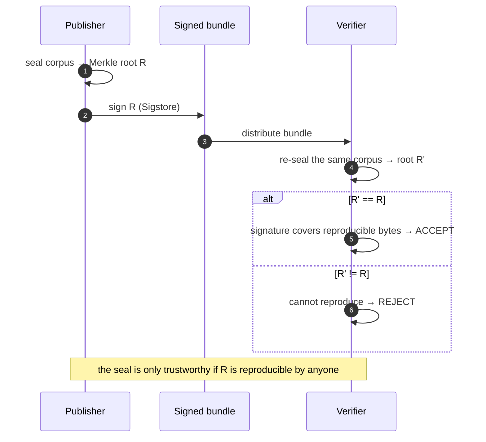
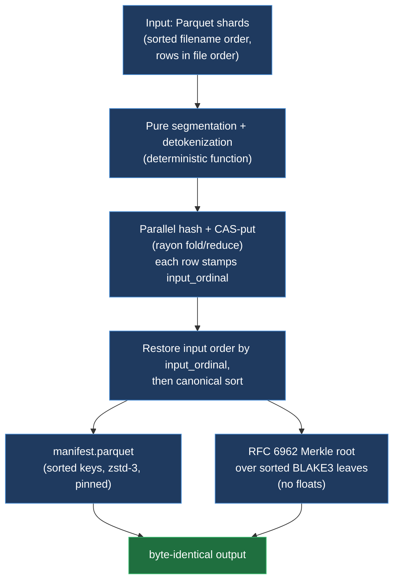
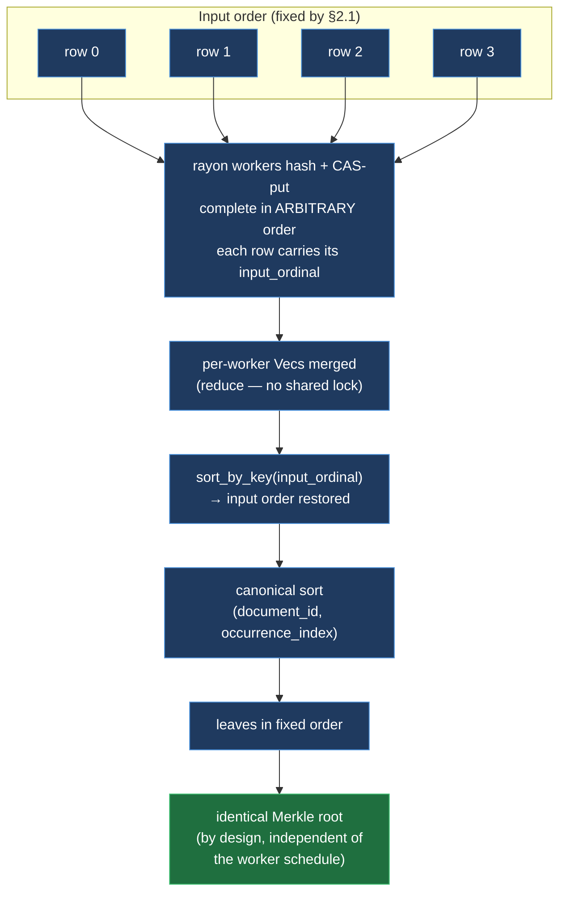
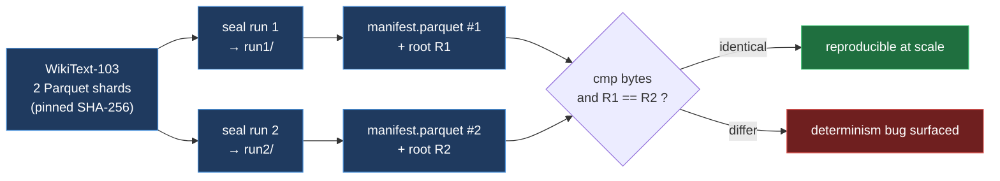

# Deterministic by Construction: How Attestrum Produces Byte-Identical Seals

Engineering documentation. Describes the concrete techniques that make Attestrum's
corpus seal **reproducible** — given the same input bytes, the build emits a
byte-identical `manifest.parquet` and an identical Merkle root across re-runs on the
same machine (demonstrated over two full-corpus runs; see §4). Intended for partners,
security auditors, and external verifiers evaluating
Attestrum's reproducibility claims, and for engineers who want to apply the same
disciplines elsewhere.

This is the **"how"** companion to
[`cross-target-determinism.md`](./cross-target-determinism.md), which catalogs
*which* emitted fields are byte-identical across **platforms** (Linux glibc/musl,
macOS, ARM) and documents the one field that is not. This document covers the
*mechanisms* — the design rules that produce byte-identity in the first place — and
reports a full-corpus, same-machine reproducibility experiment on WikiText-103.

Status: applies to the `attestrum-pipeline` seal path as of the Lookback Phase A
commits. The §4 full-corpus double-seal experiment was run on 2026-05-31.

---

## TL;DR

- A cryptographic provenance seal is only useful if it **reproduces**: a third party
  who re-runs the build on the same corpus must get the same Merkle root and the same
  signed bytes, or the signature proves nothing portable.
- Attestrum achieves this **by construction**. Seven disciplines —
  deterministic input ordering, pure transformations, parallel-but-order-stable
  accumulation, no wall-clock, no floating-point in the hash path, canonical
  serialization, and content-addressed storage — address the common sources of
  build-to-build drift.
- The claim is precise: **given identical input bytes and these disciplines, the
  `manifest.parquet` and Merkle root are byte-identical across re-runs on the same
  machine.** It is not a claim that any two unrelated inputs collide, nor that every
  downstream perceptual field is byte-stable (see the cross-target companion for the
  one exception), nor — on its own — a cross-platform claim (that is §3's matrix).
- Validated three ways: a fixture double-seal unit test, the 4-target cross-platform
  CI matrix, and — reported here — a **full double-seal of the entire WikiText-103
  corpus**, sealed twice and compared byte-for-byte. (That double-seal ran on the corpus
  *as first sealed* — 824,850 passages; the detokenizer was then corrected and the corpus
  re-sealed to the **current canonical 822,559 passages / root `de95bddc…`**, see §4.1.)

---

## 1. Why byte-identity is the whole game

Attestrum compiles a training corpus into a signed bundle whose load-bearing claim is
a single 32-byte **Merkle root** over the corpus. A verifier trusts that root only if
they can reproduce it:

1. Take the same input corpus.
2. Re-run the seal.
3. Get the same root and the same `manifest.parquet` bytes.
4. Confirm the signature covers those exact bytes.

If step 2 produced even a one-byte difference — a map that iterated in a different
order, a timestamp that leaked in, a float that rounded differently — the root would
change and the verifier would (correctly) reject the bundle. **Reproducibility is not
a nice-to-have; it is the property that makes the signature mean anything.**

So Attestrum treats any source of build-to-build non-determinism as a bug, and
designs it out structurally rather than patching it after the fact.

---

## 2. The seven disciplines

### 2.1 Deterministic input ordering

The seal reads Parquet shards in **sorted filename order** and rows **in file order**.
Directory-listing order is never trusted — the shard list is explicitly sorted before
reading. The same set of files therefore always presents the same sequence of rows.
(`crates/attestrum-pipeline/examples/wikitext/seal.rs::sorted_shards`.)

### 2.2 Pure, total transformations

Segmentation and moses-detokenization are **pure functions**: same string in, same
passages out, no hidden state, no I/O, no clock. This is unit-tested directly
(`segment_is_deterministic`). Because the transformation is pure, the only thing that
can vary the leaves is the input — which §2.1 fixes.

### 2.3 Parallel work, order-stable output

Hashing ~10⁶ passages serially would be slow, so the hash + content-store-put stage
runs in parallel (`rayon` `par_iter().fold(...).reduce(...)`). Parallelism is the
classic source of non-determinism — work-stealing completes items in arbitrary order.
Attestrum removes that risk with one move: **each row stamps its original input index
(`input_ordinal`) at construction time**, before any parallel reordering. After the
parallel stage the rows are re-sorted by `input_ordinal` to restore input order, then
sorted again into the canonical on-disk order. The work-stealing schedule cannot leak
into the output because the output order is recomputed from the stamped index, not
from completion order. (`crates/attestrum-pipeline/src/lib.rs::build_corpus`.)

This is why there is **no `Mutex<Vec>` accumulator** — a shared lock would serialize
the workers and add contention without improving determinism; the
fold/reduce + stamp + sort pattern is both faster and deterministic.

### 2.4 No wall-clock in sealed bytes

Nothing in the seal path reads the system clock. Where a timestamp is genuinely needed
elsewhere in Attestrum, it is injected from a caller-supplied `source_date_epoch`
(the Reproducible-Builds convention), never `SystemTime::now()`. The corpus
`manifest.parquet` produced by this pipeline carries **no clock-derived field at all**
(per-entry `fetched_at` is absent for the WikiText build), so there is no timestamp to
diverge.

### 2.5 No floating-point in the hash or Merkle path

Every byte that feeds the Merkle root is computed with integer-only math: BLAKE3 and
SHA-256 are integer hashes, and the RFC 6962 Merkle construction is pure byte
concatenation + hashing with no arithmetic on reals. Floating-point is the one place
where "the same operation" legitimately produces different bits on different
toolchains/libms — so it is kept entirely out of the load-bearing path. (The single
field that *does* use `f32`, and is therefore the one cross-platform exception, is
documented in the [cross-target companion](./cross-target-determinism.md) — it is not
part of the seal or the Merkle root.)

### 2.6 Canonical serialization

- The **manifest** is written by a Parquet writer pinned to a fixed configuration —
  `zstd` compression at a fixed level, no adaptive dictionary heuristics — so the same
  rows always compress to the same bytes. (`crates/attestrum-manifest::writer_properties`.)
- Any map serialized anywhere in the chain uses sorted keys / `BTreeMap` ordering, so
  key order is content-derived, never insertion- or hash-seed-derived.
- Leaves are extracted **in the canonical sorted order** (the same order written to the
  manifest), so the Merkle root is a function of the corpus viewed as a multiset, not of
  insertion or completion order.

### 2.7 Content-addressed storage

Each passage's bytes land in a content-addressed store keyed by its BLAKE3 digest.
Content addressing is inherently order-independent: the same bytes always map to the
same location, so the store's contents are a function of the corpus, not of the
insertion order or the parallel schedule.

---

## 3. How we test it

| Layer | What it proves | Where |
|---|---|---|
| **Fixture double-seal** unit test | The read→segment→build path is byte-stable on a small real-shaped Parquet, sealed twice. | `examples/wikitext/seal.rs` (`seal_is_deterministic_over_fixture_parquet`) |
| **4-target CI matrix** | The full chain (BLAKE3 → Merkle → DSSE → Sigstore Bundle) is byte-identical across Linux glibc/musl, macOS, ARM — on every push. | `.github/workflows/determinism.yml`; see [cross-target-determinism.md](./cross-target-determinism.md) |
| **Full-corpus double-seal** (this report) | The disciplines hold at production scale on a real ~10⁶-leaf corpus, same machine, two independent runs. | §4 |

The first two are continuous and small/synthetic. The third is the at-scale, real-data
check — the experiment this document was written to record.

---

## 4. Experiment: full WikiText-103 double-seal

> The double-seal below established the **determinism property** on the corpus as first
> sealed. The seal *content* was subsequently corrected (see §4.1), which changed the
> sealed bytes; the **current canonical root is in §4.1**. The result here stands as the
> same-machine byte-reproducibility proof, which is independent of the content fix.

**Goal.** Seal the entire WikiText-103 (raw) corpus twice, into two independent output
directories on the same machine, and confirm the two `manifest.parquet` files and the
two Merkle roots are byte-for-byte identical.

**Input.** `wikitext-103-raw-v1`, train split, 2 Parquet shards (~314 MB), pinned by
SHA-256 (see [`../lookback/corpus-source.md`](../lookback/corpus-source.md)). After
segmentation + the minimum-word floor, this *pre-fix* seal yielded **824,850 passages**
(one sealed leaf each). The detokenizer fix in §4.1 later dropped the ~2,291
mis-segmented stat-table glossary lines, giving the current canonical 822,559.

**Method.** Two runs of the seal generator (`examples/seal-wikitext.rs`, release
build) over the identical input directory, into separate output dirs (`run1`, `run2`).
Then: byte-compare the two `manifest.parquet` files (`cmp`), compare the two Merkle
roots, and record wall-clock, peak RSS, and on-disk size for each run.

**Results (2026-05-31).**

| Metric | run1 | run2 | match |
|---|---|---|---|
| Leaves sealed (manifest rows / Merkle leaves) | 824,850 | 824,850 | ✅ |
| Unique objects in content store (CAS) | 810,882 | 810,882 | ✅ |
| **Merkle root (BLAKE3, hex)** | `78cf503c3189479bd088d344419ddf759155724fd3fd5ca80d59f3a009d0e526` | `78cf503c3189479bd088d344419ddf759155724fd3fd5ca80d59f3a009d0e526` | ✅ |
| **`manifest.parquet` size** | 66,154,145 B | 66,154,145 B | ✅ |
| **`manifest.parquet` SHA-256** | `00f7e5c5c695e614f7ba5b83dbdb3799983d87a0d3717fd6f407417f9163e483` | `00f7e5c5c695e614f7ba5b83dbdb3799983d87a0d3717fd6f407417f9163e483` | ✅ |
| Sealed content bytes | 511,472,153 | 511,472,153 | ✅ |
| Wall-clock | 5,688.8 s (~94.8 min) | 5,442.7 s (~90.7 min) | — |
| Peak RSS | ~2.50 GB | ~2.43 GB | — |
| On-disk size (CAS + manifest) | 3.2 GB | 3.2 GB | — |

- **Merkle root identical across runs:** ✅ YES (`78cf503c…09d0e526`)
- **`manifest.parquet` byte-identical across runs:** ✅ YES (`cmp` clean; identical SHA-256)
- **Verdict: `DETERMINISTIC_OK`.**

**The decisive observation:** the two runs took *different* wall-clock times (run2 was
~4% faster — less machine contention) yet produced *byte-identical* output — same root,
same manifest down to the last byte. Execution timing and the parallel work-stealing
schedule varied; the sealed bytes did not. That is determinism in the sense that
matters for a signature: **on this machine, the sealed output was determined by the
input, not by how the machine got there.** (The across-machine case is tested
separately by the cross-platform matrix, §3.)

**Content-addressed deduplication, observed.** The corpus has 824,850 passages (leaves)
but only 810,882 *unique* ones — ~13,968 passages are byte-for-byte duplicates of others
(repeated boilerplate, identical sentences recurring across articles). Because the store
is content-addressed (§2.7), duplicates collapse to a single object, while the manifest
still records all 824,850 occurrences (each its own Merkle leaf, distinguished by an
occurrence index). The Merkle root therefore covers the full corpus as a multiset, and
both runs independently produced the *same* dedup count — itself another determinism
data point.

> Resource shape, confirmed: the build is fsync-bound — per run, ~1,090 s of system
> time (durable content-store writes) versus ~44 s of user CPU, with the ~94 min
> wall-clock dominated by waiting on those durable writes. Peak RSS (~2.5 GB) came in
> well under the ~5 GB pre-experiment estimate; the Parquet writer buffering its row
> group is the memory high-water mark.

### 4.1 Content-quality fix and re-seal (current canonical root)

The double-seal above proved the **determinism property** — that the pipeline emits
byte-identical output for the same input. That property is independent of *what* text is
sealed, so it carries forward unchanged through the content fix described here.

An adversarial review of the seal *content* (not its determinism) then found two defects
in the WikiText-specific preparation, both since fixed:

- **Detokenizer completeness.** Measured over the full corpus, **39.65%** of sealed
  passages carried a residual tokenization artifact a clean paste would not match —
  dominated by spaced straight quotes (33%), plus spaced slash, currency, and
  digit-colons. The detokenizer now handles these; the residual artifact rate fell to
  **0.10%**.
- **Backref attribution.** WikiText-103 linearizes some stat-table glossaries as
  single-`=` lines mid-article, which were mis-read as article titles, mis-attributing
  the following passages and producing **328** colliding `source_uri` slugs. After
  rejecting those lines and disambiguating slugs, collisions are **0**. (Leaf-level
  provenance was never affected — each leaf always carried its own `source_url`; this
  fixed the human-facing backref.)

Re-sealing the corrected corpus is the **current canonical seal**:

| Metric | Value |
|---|---|
| Merkle root (BLAKE3) | `de95bddc1c0d17123b8ab5960b3300f31a713b8804e32184ed03e606696726dc` |
| Leaves / unique CAS objects | 822,559 / 808,823 |
| `manifest.parquet` SHA-256 | `eafa3dd76ff9bcebfa6e115a1886fa761dd7c376256b053dd9e6ac9634e275a0` |
| `manifest.parquet` size | 66,038,259 B |
| Wall-clock / peak RSS / disk | ~94.3 min / ~2.07 GB / 3.1 GB |

Because the pipeline is unchanged, this artifact is reproducible by the same disciplines.
Independent **cross-platform** reproduction of this root (sealing on Linux and confirming
the identical `de95bddc…` — the property a Linux CI signer/verifier depends on) is the
next gate and will be recorded here once run.

---

## 5. What this proves — and its precise scope

**Proves:** for the same input bytes, on the same machine, the Attestrum seal pipeline
produced a byte-identical `manifest.parquet` and an identical Merkle root at production
scale, across the two runs — whose execution schedules differed (run2 was ~4% faster in
wall-clock).

**Scope and honest limits:**

- This is **same-input reproducibility** — the property a verifier relies on. It is
  distinct from cross-*platform* byte-identity (different OS/arch/libc), which the
  [cross-target companion](./cross-target-determinism.md) covers separately and which
  has one documented exception (an `f32`-based perceptual hash, not in the seal path).
- It is **not** a collision claim about unrelated inputs; that rests on BLAKE3's
  collision resistance, a separate property.
- The experiment exercises one real corpus on one machine. The cross-platform matrix
  is what extends the byte-identity claim across toolchains and operating systems; the
  two results are complementary, not redundant.

---

## 6. References

### Code
- `crates/attestrum-pipeline/src/lib.rs::build_corpus` — the fold/reduce + `input_ordinal` stamp + canonical sort that makes parallel hashing order-stable.
- `crates/attestrum-pipeline/examples/wikitext/seal.rs` — Parquet reader, passage→entry mapping, `seal()`, and the fixture double-seal determinism test.
- `crates/attestrum-pipeline/examples/wikitext/segment.rs` — pure segmentation + moses detokenization (`segment_is_deterministic`).
- `crates/attestrum-merkle/src/lib.rs::merkle_root` — RFC 6962 Merkle over sorted BLAKE3 leaves, integer-only.
- `crates/attestrum-manifest/src/io.rs::writer_properties` — the pinned Parquet writer configuration.

### Diagrams
- `docs/diagrams/lookback/wikitext-seal-pipeline.md` — the seal generator pipeline (source-of-truth: code).
- `docs/diagrams/sprint-3/rayon-pipeline.md` — the parallel hash + CAS-put stage.

### Companion docs
- `docs/research/cross-target-determinism.md` — cross-platform byte-identity guarantees and the one documented exception.
- `docs/lookback/corpus-source.md` — the WikiText-103 source + per-shard SHA-256.

### CI workflows
- `.github/workflows/determinism.yml` — the 4-target byte-identity matrix.
