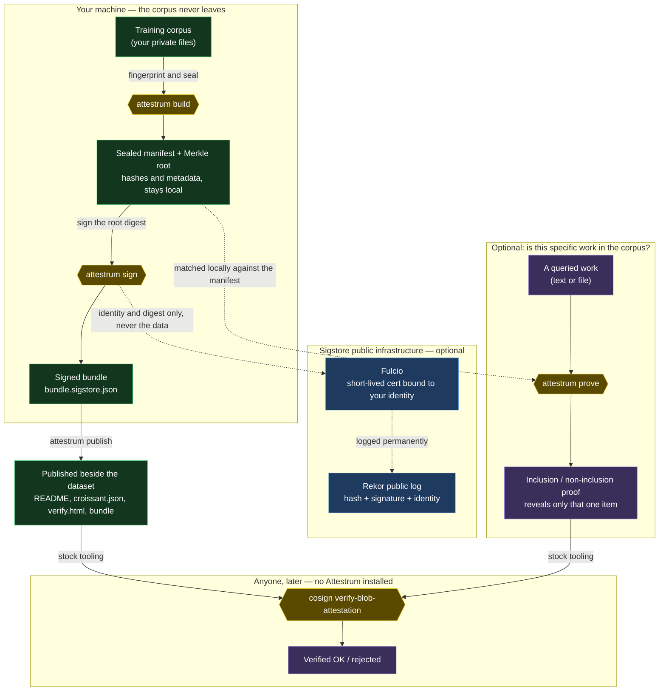
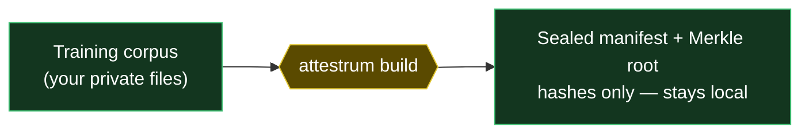
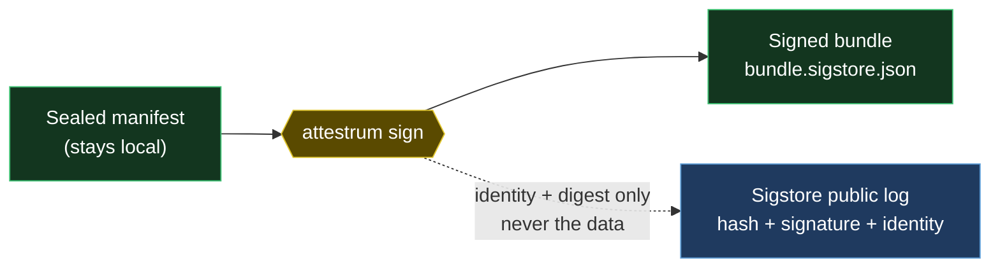
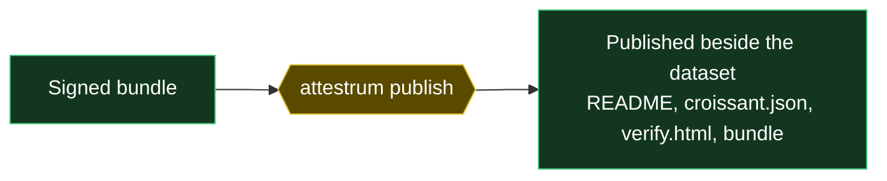
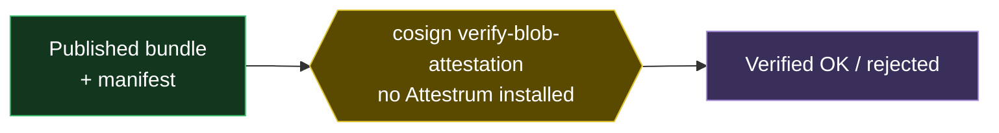
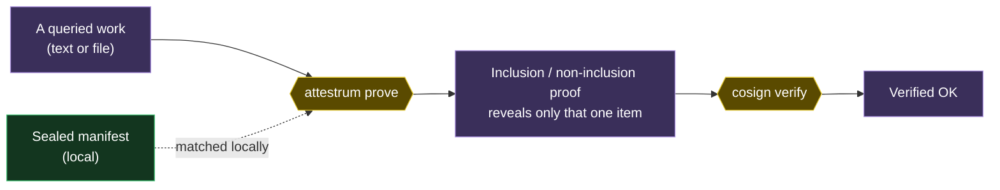

# How Attestrum Works, End to End

### A user walkthrough — from a folder of files to a proof anyone can check

**Status:** explanation / user guide. Walks through the actual commands a user runs and what each produces, with a diagram of the whole flow. Companion to `docs/research/provenance-without-disclosure.md`, which argues the privacy properties; this document shows the mechanics. The commands shown are the core seal → sign → publish → verify → prove path and reflect the current CLI; the CLI also ships read-only analysis subcommands (see the closing notes). The report names no organization and offers no legal advice.

---

## Abstract

This is the hands-on counterpart to the design report. It follows one corpus through the whole pipeline — sealing it, signing it, publishing the verification surface beside it, and (optionally) proving whether a specific work is in it — and shows the exact commands at each step. The throughline is a single boundary: **the corpus stays on your machine; only fingerprints, a signature, and an identity ever cross into the open.** A reader who finishes this should be able to run the flow themselves and explain to someone else what each artifact is and who can check it.

---

## 1. The three people in the story

- **The publisher** holds a corpus and wants to make verifiable claims about it. They run `build`, `sign`, and `publish`.
- **The verifier** — an auditor, a regulator, a downstream user — wants to check the publisher's claims. They run **stock `cosign`**, and never install Attestrum.
- **The rightsholder** wants to know whether one specific work is in the corpus. They receive a single membership proof, again checkable with stock tooling.

## 2. The whole flow at a glance

The diagram below shows every step and, crucially, the line the data never crosses. Green is *your machine* (the corpus and the sealed manifest stay there); yellow are the *commands* you run; blue is the *optional public infrastructure* that only ever sees a fingerprint and an identity; purple is what *anyone* can do afterward with no Attestrum installed.



## 3. Step 1 — `build`: seal the corpus

`build` walks the corpus, fingerprints every document, and seals the result into a manifest committed to by a single Merkle root hash.

```bash
attestrum build \
  --corpus corpus.toml \
  --workspace .attestrum \
  --source-date-epoch 1735689600
```

- `--corpus` points at a small spec file listing the corpus contents.
- `--workspace` is where the outputs land — the sealed `manifest.parquet` and the `merkle.root`.
- `--source-date-epoch` is a fixed timestamp (epoch seconds). It is required on purpose: Attestrum never reads the wall clock, so the same corpus sealed twice produces a byte-identical result. (`1735689600` is just an example.)

What you get: a **manifest** — a table of per-document hashes and metadata, *not* a copy of the documents — and a **Merkle root**, a single hash that commits to the whole ordered set. Both stay on your machine.

**In one picture:**



> **Where to run a large seal.** The seal is identical on every platform — byte-for-byte, guaranteed by the determinism property and verified across Linux and macOS. The only thing that changes is *speed*: sealing is dominated by durable disk writes, which are far cheaper on a Linux server than on a laptop. For a large corpus, run the production seal on **Linux — a cloud VM, a CI runner, or a Linux box** (our reference WikiText-103 seal of 822,559 passages took ~5 minutes there versus ~94 minutes on macOS). It is also where signing happens — Sigstore keyless signing uses your CI/cloud identity — so sealing and signing land in one place. macOS produces the *identical, correct* seal; it is simply slower, which suits development and smaller corpora.

## 4. Step 2 — `sign`: turn the sealed manifest into a bundle

`sign` wraps a statement about the sealed corpus in an in-toto attestation and signs it with Sigstore, producing the bundle — the portable "seal."

```bash
attestrum sign .attestrum/manifests/manifest.parquet \
  --workspace .attestrum \
  --source-date-epoch 1735689600
```

- The argument is the **sealed manifest** (the output of `build`) — that is what gets signed.
- The bundle lands at `.attestrum/bundles/manifest.sigstore.json`.
- Signing proves *who* sealed it. In the keyless flow this uses an **OIDC identity token**, supplied via `--oidc-token-file` or the `SIGSTORE_ID_TOKEN` environment variable. In a CI system such as GitHub Actions that token is issued automatically, so the *workflow* is the signing identity and no personal identity is involved.

This is the step that, by default, contacts the public infrastructure (Fulcio for a certificate, Rekor for the public log). Three things to know:

1. **The data is never sent.** What the subject of the signature commits to is the manifest's *digest* — a hash — plus summary fields like the Merkle root and a document count. The corpus bytes do not leave.
2. **The public log is permanent.** A Rekor entry (hash + signature + identity) is append-only and not designed to be deleted. In the keyless flow your identity is part of that public record.
3. **You can keep it private.** If even that metadata footprint is unwanted, the publisher can stay entirely local (see `--target static` below), disable the transparency-log upload, use a managed key instead of keyless, or run a private Sigstore instance. The data-stays-local property holds either way; these options only govern whether the *metadata* becomes public.

**In one picture:**



## 5. Step 3 — `publish`: put the verification surface beside the data

`publish` renders the human- and machine-readable artifacts that travel with the dataset.

```bash
attestrum publish \
  --dataset my-org/my-dataset \
  --manifest .attestrum/manifests/manifest.parquet \
  --bundle .attestrum/bundles/manifest.sigstore.json \
  --target static --out-dir ./out \
  --license CC-BY-4.0 --version 1.0.0 --cite-as "Doe, J. (2025). My Dataset."
```

- `--target static` writes the full artifact set to a local directory — `README.md`, `croissant.json`, `verify.html`, plus the bundle, manifest, and Merkle root under `attestrum/`. **No network, no account**; the directory is self-contained and can be hosted anywhere (or kept offline). There is also a Hugging Face Hub target.
- `--license`, `--version`, and `--cite-as` populate the standard dataset descriptor (`croissant.json`). License defaults to the honest token `"unknown"` when not supplied, rather than asserting one. These values are emitted only when real — never fabricated.

What you get: a folder a visitor can read, and a `croissant.json` that validates against the public `mlcroissant` validator.

**In one picture:**



## 6. Step 4 — `cosign verify`: anyone checks it, with no Attestrum

This is the payoff. The verifier needs only **stock `cosign`** — an independent, widely used open-source tool from the Sigstore project — not anything from us.

```bash
cosign verify-blob-attestation --new-bundle-format \
  --type https://attestrum.com/attestation/training-corpus/v0.3 \
  --bundle attestrum/bundle.sigstore.json \
  attestrum/manifest.parquet
```

`cosign` does all the cryptographic checking itself — signature, certificate, transparency-log entry — against Sigstore's public trust roots, and answers *Verified OK* or rejects it. Because verification uses a neutral third-party tool, **trusting the seal never requires trusting Attestrum** — and the proof remains checkable even if Attestrum the project no longer exists.

**In one picture:**



## 7. Optional — `prove`: answer "is this work in the corpus?"

A publisher who keeps the corpus private can still substantiate a specific claim. `prove` produces a membership proof for one queried work, checked locally against the manifest.

- An **inclusion** proof shows the queried work is present, disclosing only that item's hash, its position, and the Merkle path to the root — nothing about any other document.
- A **non-inclusion** proof shows the work is absent, by revealing the two neighboring entries that bracket where it would have sorted.

Both are signed attestations, verifiable with the same stock `cosign` as the corpus bundle. The recipient learns the answer for that one item (and the corpus's size), and no more. See `docs/research/provenance-without-disclosure.md` for exactly what is and isn't disclosed.

**In one picture:**



## 8. What crossed the line, and what didn't

At the end of the flow, here is the complete list of what left your machine:

- a **root hash** and per-item **fingerprints** (in the bundle, and — if you published — the manifest);
- a **signature** and a **certificate**;
- optionally, an **identity** and a **timestamp** in the public log (avoidable, as in §4).

And here is what did **not**: the corpus itself. That asymmetry is the whole point — the seal is checkable by anyone, while the data stays where it already was.

## 9. Notes and limits

- The proof establishes integrity of, and membership against, the *declared* manifest; it does not by itself prove the manifest is a complete record of what trained any particular model. The fuller treatment of what the cryptography does and does not establish is in `docs/research/provenance-without-disclosure.md` §8.
- Exact membership rests on content hashing; approximate / fuzzy matching is a weaker, discovery-grade signal and is labeled as such.
- Commands above show the core seal → sign → publish → verify → prove path. The CLI also ships read-only analysis subcommands not walked through here — `inspect` (manifest summary), `diff` (corpus-version delta), `decontaminate` (benchmark-contamination scan), `compose` (training-content summary), `dedup` (intra-corpus near-duplicate rate), and `remove` (two-manifest removal evidence) — each with its own note under `docs/research/`. Run any subcommand with `--help` for the full set of flags.

---

*Companion reports: `docs/research/provenance-without-disclosure.md` (the privacy argument), `docs/research/cross-target-determinism.md` (why output is byte-identical), and `docs/research/specification-first-agentic-engineering.md`.*
