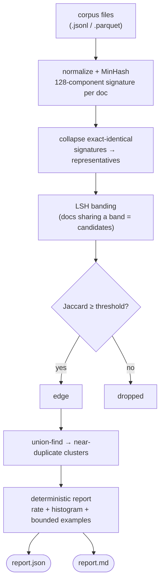
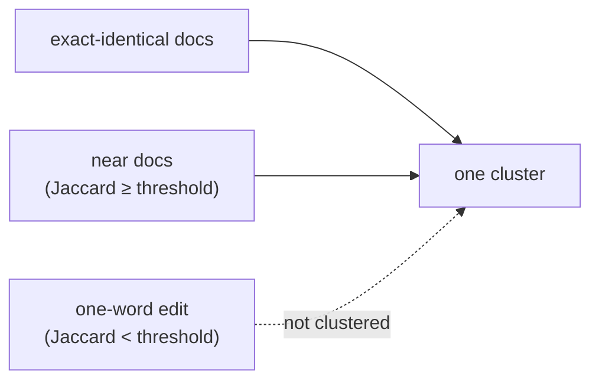

# Intra-Corpus Near-Duplicate Rate: A Byte-Reproducible Self-Similarity Report

Engineering documentation / feature explanation. Describes `attestrum dedup`, the read-only
subcommand that measures how much of a corpus is near-duplicated *against itself* and emits a
deterministic report — *what fraction of this training set is redundant, and which documents
cluster together?* Intended for engineers and data teams evaluating how Attestrum reasons
about corpus **quality and composition**, alongside its single-corpus seal pipeline.

Companion to [`how-attestrum-works-end-to-end.md`](./how-attestrum-works-end-to-end.md) (the
single-corpus seal → sign → publish pipeline whose fingerprint kernel this reuses),
[`deterministic-by-construction.md`](./deterministic-by-construction.md) (the byte-identity
disciplines the report's determinism promise rests on), and
[`benchmark-contamination-scanning.md`](./benchmark-contamination-scanning.md) (the sibling
read-only analysis subcommand that rides the same MinHash kernel, scanning *across* corpus and
benchmark rather than *within* one corpus).

Status: applies to the `attestrum-dedup` crate and the `attestrum dedup` subcommand as landed.
The worked example in §3 is genuine, unedited tool output.

---

## TL;DR

Near-duplication inside a training set is a known quality problem: deduplicating training data
[measurably improves language models](https://arxiv.org/abs/2107.06499) and
[reduces memorization](https://arxiv.org/abs/2202.06539) of repeated text. Before you can fix
it, you have to measure it — and measure it in a way someone else can reproduce. `attestrum
dedup --corpus <files>` computes the **intra-corpus near-duplicate rate**: the fraction of
documents that have at least one near-duplicate twin, plus a cluster-size histogram and a
bounded list of example clusters. It reuses the same 128-permutation MinHash kernel as the
rest of the CLI, generates candidates with LSH banding (not an O(n²) all-pairs scan), verifies
each candidate by exact Jaccard, and groups survivors with union-find — all deterministically,
so the same corpus yields byte-identical numbers on any machine.

## 1. What it is

`attestrum dedup --corpus <file...>` is a deterministic, read-only near-duplicate report over
one corpus. It signs nothing and mutates nothing — it reads the corpus text and reports how
self-similar it is.

A single run reports:

- **The near-duplicate rate** — the fraction of documents that fall into *some* near-duplicate
  cluster. This is a coverage figure (how much of the corpus is redundant), not a pair count
  that double-counts.
- **A cluster-size histogram** — how many clusters of size 2, size 3, and so on.
- **Bounded example clusters** — the largest clusters, by document id, capped at a fixed number
  with an explicit "N more omitted" note so the cap never reads as "that's all there is."
- **The parameters** — MinHash permutation count, LSH band geometry, and the Jaccard threshold,
  so the run is fully reproducible from the report alone.

Internally the pipeline is: normalize each document and compute its 128-component MinHash
signature (the same kernel `attestrum index` and `attestrum decontaminate` use); collapse
exact-identical signatures into representatives; split each signature into LSH bands so that
documents sharing a band become *candidate* pairs; verify each candidate by the exact Jaccard
estimate against the threshold; and union-find the survivors into clusters.



## 2. Why it is valuable

Near-duplicate rate is one of the cleanest single signals of training-data quality, and it is
well-supported in the literature. Lee et al. show that
[deduplicating training data makes language models better](https://arxiv.org/abs/2107.06499) —
fewer repeated sequences, less wasted compute, and lower test-set leakage — and Kandpal et al.
show that [duplication drives memorization](https://arxiv.org/abs/2202.06539), a privacy and
copyright concern. A reproducible near-duplicate rate turns "we deduped, trust us" into a
number anyone can recompute from the corpus.

This complements rather than replaces the heavy dedup pipelines. Large-scale curation
frameworks like [Dolma](https://github.com/allenai/dolma) and
[datatrove](https://github.com/huggingface/datatrove) *perform* deduplication as part of
building a corpus — that is their job, and `attestrum dedup` does not try to do it. What they
don't produce is a small, standalone, byte-reproducible **measurement** of how near-duplicated
a given corpus is, tied to that corpus and re-checkable without re-running the pipeline.
`attestrum dedup` is that instrument: it reports the rate, it doesn't rewrite the data.

Two caveats, stated up front. First, near-duplicate detection is **discovery-grade**, not
proof-grade: a near-match at a MinHash-Jaccard threshold is a high-confidence *signal* that two
documents are substantially similar, not a cryptographic claim that they are the same — exact
duplicates (identical content) are caught exactly, but the "near" band is a tunable heuristic.
Second, because per-document fingerprints are not persisted in the sealed manifest, dedup
recomputes signatures from the corpus bytes on each run; the trade-off and its deferred
alternative are discussed in §5.

## 3. How to use it

The command takes one or more corpus files:

```
attestrum dedup --corpus <file...> [--text-key <key>] [--near-threshold <0.0-1.0>] [--out <dir>]
```

- **`--corpus <path>`** — one or more `.jsonl` / `.json` / `.parquet` files (repeatable). The
  `id` field names each document; otherwise documents are named `<file-stem>/<row>`.
- **`--text-key <key>`** — the JSON field / Parquet column holding the text (default `text`).
- **`--near-threshold <f>`** — the MinHash Jaccard threshold for the near-duplicate verify step
  (default `0.80`). Higher is stricter.
- **`--out <dir>`** — directory for `report.json` + `report.md` (default: current directory).

The report carries **no wall-clock** — it is a pure function of the corpus and the threshold,
which keeps the output byte-identical across runs and machines.

### Worked example (genuine output)

Take a four-document corpus: `doc1` and `doc2` are byte-for-byte identical, `doc3` is the same
sentence with a single word changed (`jumps` → `leaps`), and `doc4` is unrelated.

```
$ attestrum dedup --corpus corpus.jsonl --out out
dedup: 4 document(s) → 2 near-duplicate(s) in 1 cluster(s) (50.00%)
  out/report.json
  out/report.md
```

The human-readable `report.md` (genuine, unedited):

```
# attestrum dedup — near-duplicate report (v0.1.0)

- corpus: corpus.jsonl
- detection: minhash(128) jaccard ≥ 0.8 via LSH 16×8 banding

**2 of 4 documents (50.00%) are near-duplicates**, in 1 cluster(s); largest cluster 2 docs.

## Cluster-size histogram

| cluster size (docs) | count |
|---:|---:|
| 2 | 1 |

## Example clusters (1 shown)

1. (2 docs) doc1, doc2
```

The result teaches the threshold. `doc1` and `doc2` are exact duplicates, so they cluster with
certainty — that is the single size-2 cluster, and the **50%** rate (2 of 4 documents). `doc3`,
which differs by exactly one word in a short sentence, falls *below* the 0.80 Jaccard threshold
and is therefore **not** reported as a near-duplicate of `doc1`/`doc2`. That is the right
behavior, not a miss: a one-word change in a twelve-word sentence is a real edit, and the
threshold is exactly the knob that decides how close is "near." Lower `--near-threshold` and
`doc3` would join the cluster; the report always states the threshold it used so the number is
never ambiguous.

The two clustering paths in one picture — exact duplicates and verified near-duplicates both
land in one cluster, while a below-threshold edit does not:



## 4. When to use it

`attestrum dedup` is built for the moments where redundancy inside a corpus is the question:

- **Before sealing a corpus** — measure how self-similar the data is, and decide whether a
  dedup pass is warranted.
- **To measure a dedup pass** — run dedup before and after, and watch the near-duplicate rate
  drop; the delta is your effectiveness number.
- **When evaluating a third-party corpus** — get an independent redundancy readout from the
  published data.
- **In CI**, to gate corpus quality — fail the build if the near-duplicate rate crosses a
  threshold you care about.

## 5. Why we made it — design philosophy

**One determinism ruler — it rides the shared MinHash kernel, it does not fork it.**
Normalization and the near-duplicate basis reuse the project's 128-permutation, BLAKE3-keyed
MinHash unchanged, so the similarity a `dedup` report measures is the *same* similarity
`attestrum index` and `attestrum decontaminate` reason about. There is no second, subtly
different notion of "near" anywhere in the tool.

**LSH banding keeps it honest about scale.** A naive self-similarity check is O(n²) pairwise.
`attestrum dedup` splits each signature into bands so only documents sharing a band are even
considered, then collapses exact-identical signatures *before* the candidate step — so a corpus
that is mostly verbatim copies (the worst case for an all-pairs join) reduces to one
representative per distinct signature first. The candidate set is bounded by band co-occurrence,
not by the square of the corpus size.

**The rate is a coverage figure, and the examples are bounded — no silent caps.** The headline
number is the fraction of documents that fall in *some* cluster, which doesn't double-count the
way a raw pair count would. Example clusters are capped at a fixed number, and when more exist
the report says exactly how many were omitted, so a truncated list never masquerades as the
whole picture.

**Discovery-grade, and labeled as such.** Exact duplicates are caught exactly; the "near" band
is a tunable heuristic, and the report always prints the threshold and MinHash geometry it used.
Near-duplication is reported as a high-confidence signal for human review, never dressed up as a
cryptographic proof.

**The report declares its own limit, in-band.** Per-document MinHash signatures are *not*
persisted in the sealed manifest, so dedup recomputes them from the corpus bytes each run. The
deferred alternative — persisting signatures in the manifest — would let dedup skip recomputation
and unlock a cross-version near-duplicate *delta*, but it is a change to the protected manifest
schema, so it is intentionally out of this read-only leaf.

**Determinism is the one absolute promise, and it is CI-enforced.** Same corpus + same threshold
→ byte-identical report on any machine. Candidate pairs are collected in a sorted set, clusters
are sorted by size then id, the rate rounds to six decimals, and JSON rendering rides the shared
canonical-key primitive. A committed golden plus a double-run byte-compare gate this in CI on
every push.

That is the whole intent: a small, single-purpose instrument that turns "how redundant is this
corpus?" into a reproducible number, bounds its own cost and its own output, and is honest about
the difference between an exact duplicate and a likely one.

---

### Sources

- [Lee et al. — Deduplicating Training Data Makes Language Models Better](https://arxiv.org/abs/2107.06499)
- [Kandpal et al. — Deduplicating Training Data Mitigates Privacy Risks in Language Models](https://arxiv.org/abs/2202.06539)
- [Broder — On the Resemblance and Containment of Documents (MinHash)](https://www.cs.princeton.edu/courses/archive/spring13/cos598C/broder97resemblance.pdf)
- [Dolma — an open corpus and toolkit](https://github.com/allenai/dolma)
- [datatrove — large-scale text processing](https://github.com/huggingface/datatrove)
