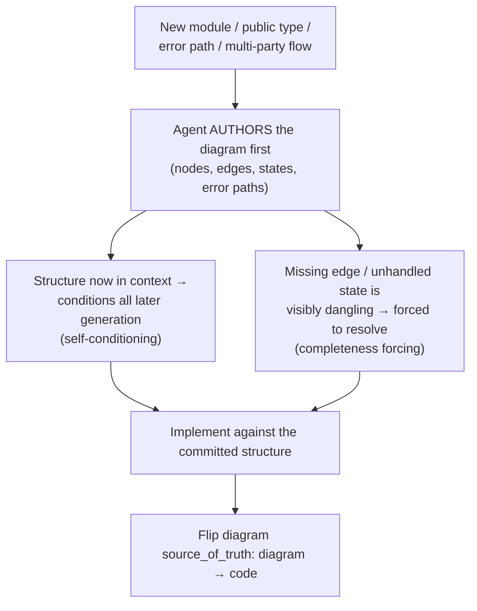
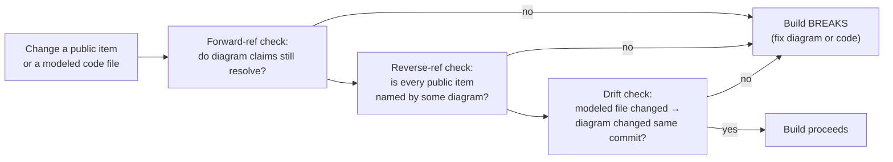
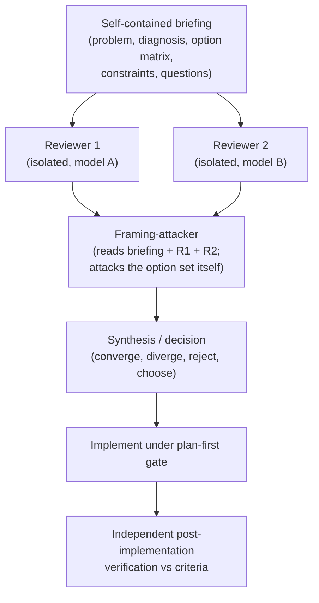

# Specification-First Agentic Software Engineering

### Diagrams as a generation-conditioning substrate, machine-checked design↔code coupling, and adversarial multi-agent review — a methodology report from the Attestrum project

**Status:** research / methodology. Derived from the practices encoded in this repository's `CLAUDE.md` (§2 diagram-first, §3 plan-first, §5 the diagram-linter gate, §7 build discipline) and from operating them on a deterministic Rust codebase. This document is descriptive and prescriptive: it explains *why* the practices work and *how* a reader can adopt them.

---

## Abstract

Large language models can now write and modify software faster than a human can review it. This inverts the classic bottleneck: code is cheap; *correctness assurance* is the scarce resource. We report a methodology, developed while building **Attestrum** — a deterministic Rust CLI that compiles AI-training corpora into cryptographically verifiable provenance bundles — for keeping an LLM-driven codebase correct at machine speed. The methodology has three pillars: (1) **diagram-first authoring**, in which the agent is required to emit a structural specification (a diagram) *before* writing code; (2) **machine-checked design↔code coupling**, a linter that fails the build when code and its documented design drift apart; and (3) **adversarial multi-agent review**, in which high-stakes decisions are routed through independent reviewers on diverse models plus a dedicated "framing-attacker." We argue pillar (1) works through two well-understood mechanisms — autoregressive *self-conditioning* and *completeness forcing* — rather than through any visual faculty of the model, and we give the conditions under which it pays off and the conditions under which it is overhead. We provide a step-by-step adoption guide. Worked examples reference the project's own diagrams.

---

## 1. Introduction: the inversion of the bottleneck

For most of software history, writing code was the expensive step and review was comparatively cheap — a reviewer could read far faster than an author could produce. Agentic coding tools invert this. A single operator directing several agents can land tens of thousands of reviewed, tested lines per day. When generation is nearly free, the limiting reagent becomes the assurance that what was generated is *correct*: that it implements the intended design, that it does not silently break an invariant, and that decisions which are expensive to reverse were made deliberately.

Three failure modes dominate at this speed:

1. **Plausible-but-wrong code.** The model produces code that compiles, passes shallow tests, and is subtly incorrect — especially on error paths and edge cases it was never forced to enumerate.
2. **Design drift.** Documentation, diagrams, and mental models describe a system that the code no longer matches. Drift is invisible until it causes a defect.
3. **Under-deliberated irreversible decisions.** A wire format, a public interface, or a schema is chosen quickly, approved quickly, and becomes load-bearing before anyone stress-tested the option set.

The methodology in this report targets each failure mode directly: diagram-first authoring attacks (1), the diagram-linter attacks (2), and adversarial review attacks (3). None of the three is novel in isolation; the contribution is the *combination*, the *enforcement* (these are build-breaking gates, not advisory conventions), and a precise account of the mechanism behind the first.

---

## 2. Background: why an LLM is conditioned by what it has just written

An autoregressive language model generates each token conditioned on every token already present in its context window. At inference time the model's weights are fixed; what changes from one generation to the next is the *context*, and the attention mechanism's job is to let that context shape the model's internal representations (its activations) for the next prediction. This is the substrate behind a now-standard result: **chain-of-thought prompting** — having the model produce intermediate reasoning before its answer — measurably improves answer quality, because the externalized reasoning becomes conditioning context for the answer (Wei et al., 2022).

The practical corollary, articulated by practitioners of high-throughput agentic development, is that *making the model write the structure of a solution before it writes the solution* improves the solution. As Gary Tan described the effect in a 2025 discussion of agentic building (Y Combinator, *The Light Cone*), requiring the agent to "make a diagram of all the data flows, all the inputs and outputs … the user flows … the error messages" before starting work caused it to "load all of the context in and then … do the work more completely." He summarized the felt effect as forcing context "into latent space." The phrase is informal, but it points at something concrete and correct: emitting the structure first forces that structure to be represented in the model's inference-time activations, where it conditions everything generated afterward. The model's *trained* representation does not change; its *active* representation for this task does.

This report makes that mechanism precise and builds an engineering discipline on top of it.

---

## 3. Pillar 1 — Diagram-first authoring

### 3.1 The rule

For any new module, public data structure, error path, or multi-party flow, a diagram must exist *before* production code is written. In this repository the rule is `CLAUDE.md` §2; the authored diagrams live under `docs/diagrams/` in [Mermaid](https://mermaid.js.org/) (chosen because it is plain text, diffable, and renders natively on most code-hosting platforms). A diagram authored before implementation declares itself the *contract* (`source_of_truth: diagram`); once code lands, it flips to a derived view of the code (`source_of_truth: code`). See, for example, the planning contract authored before the corpus-to-model binding feature was implemented: `docs/diagrams/binding/model-binding-and-chain-walk.md`.

### 3.2 The mechanism — two effects, neither of them vision

It is worth being exact about *why* this helps the agent, because the intuitive explanation ("a picture helps it understand") is wrong for a language model. The model does not perceive the rendered image; it processes the diagram's **source text**. The benefit comes from two distinct, real effects:

**(a) Self-conditioning.** The structure the agent emits — nodes, edges, states, transitions — becomes part of the context that subsequent code generation attends to. The architecture the model just committed to in the diagram now steers each downstream implementation decision. This is chain-of-thought specialized to software: the diagram is a dense, structured form of "think before you code."

**(b) Completeness forcing.** A graph or state machine *demands* that every node, edge, transition, and error path be named. Free-form prose permits hand-waving — a paragraph can gloss the case that is not yet figured out. A diagram cannot: an unhandled transition or a dangling edge is visibly missing, and the generator is pushed to resolve it during authoring rather than discovering it as a defect later. This is why practitioners report that diagram-first work comes out "more complete."

The corollary for *which* work benefits: diagram-first pays off most for **structurally shaped** problems — data flows, dependency graphs, state machines, multi-actor protocols, schema relationships. For linear or purely local logic, a diagram adds little over the type signatures and the code itself, and the practice becomes overhead. Adopt it where structure exists to be made explicit; skip it where it does not (see §8, Limitations).

*Figure 1. The diagram-first authoring loop. The value to the agent is in the act of authoring (the two right-hand effects), not in any rendered image.*

### 3.3 Choosing the right diagram type

Matching the diagram type to the problem shape is what makes completeness forcing bite. The conventions used here:

| Problem shape | Diagram type | Example in this repo |
|---|---|---|
| Pipelines, dependency graphs, decision trees | `flowchart` | `docs/diagrams/sprint-5/prove-pipeline.md` |
| Lifecycles, signing flows, state machines | `stateDiagram-v2` | `docs/diagrams/sprint-1/robots-txt-state.md` |
| Multi-actor / network flows | `sequenceDiagram` | `docs/diagrams/overview/sigstore-sign-verify.md` |
| Stable public APIs | `classDiagram` | `docs/diagrams/sprint-4/predicate-three-types.md` |
| On-disk schemas, key spaces | `erDiagram` | `docs/diagrams/sprint-3/manifest-schema.md` |

A `classDiagram` of a public API, for instance, forces every public field and method to be named before it exists — which is exactly the surface a future change is most likely to break silently.

### 3.4 The rendered image is for humans, not the model

Diagrams are additionally rendered to raster images for human review. This is a genuinely separate value stream: the human reviewer *does* perceive the picture and grasps a topology at a glance in a way the model does not. Keeping these two audiences distinct prevents a common misconception — that the agent benefits from the *picture*. It benefits from *authoring the source* (§3.2) and from the coupling described next; the rendered image is a convenience for the person.

---

## 4. Pillar 2 — Machine-checked design↔code coupling

A diagram that is merely *encouraged* drifts from the code within days. The second pillar makes the coupling a build-breaking invariant. This repository implements it as a custom linter (`tools/diagram-linter/`, invoked as `CLAUDE.md` §5 gate 4; see also `docs/diagrams/sprint-1/ci-diagram-linter.md`). The checks generalize to any project:

1. **Parse.** Every fenced diagram block parses cleanly under the renderer. A diagram that does not render is not a specification.
2. **Frontmatter present.** Every diagram declares `title`, what code it `models:`, its `source_of_truth`, and a `last_verified` commit stamp.
3. **Freshness.** The `last_verified` stamp must be recent (within a rolling window of commits). A diagram nobody has re-checked against the code in a long time is flagged for re-verification.
4. **Forward references resolve.** Every code identifier or path a diagram claims to model must actually exist in the tree (enforced for `source_of_truth: code` diagrams).
5. **Reverse references resolve.** Every public item in the code must be named by at least one diagram. This is the symmetric guarantee: you cannot add a public surface that no diagram documents.
6. **Drift.** When a code file that a diagram models is changed in a commit, that diagram must be updated in the *same* commit.

Checks 4–6 are the engine. Together they make "the docs are out of date" a category of error the build refuses to compile, rather than a thing discovered during an outage. Check 5 in particular is unusual and powerful: it inverts documentation from a thing you remember to write into a thing the build *requires* before it will accept new public surface.

*Figure 2. The design↔code coupling checks. Drift becomes a compile-time category of error.*

### 4.1 An empirical operational finding: the pre-commit / CI freshness gap

One non-obvious lesson is worth recording for anyone implementing check 3 (freshness against a rolling commit window). A pre-commit hook evaluates freshness against the **parent** commit — the state *before* the new commit exists. Continuous integration evaluates it against the **new** commit, which has consumed one slot in the rolling window. A diagram sitting exactly at the edge of the window therefore *passes the local hook and fails CI*, because the act of committing pushed it one position past the boundary. The mitigation is to run a freshness audit with a buffer (flag diagrams within a few commits of the edge, not only those already past it) and refresh them proactively *before* committing, rather than reacting to the CI failure. A naive single-diagram fix simply moves the cliff to the next diagram on the next commit; refreshing the whole near-edge cohort at once clears it.

This is a small, generalizable insight: **any gate whose verdict depends on commit-relative position must account for the fact that the local check and the CI check stand at different positions in history.**

---

## 5. Pillar 3 — Adversarial multi-agent review for high-stakes decisions

Plan-first gates (`CLAUDE.md` §3) and the six-gate pre-commit ritual (`CLAUDE.md` §7) are sufficient for routine work. A narrow class of decisions warrants more: those that change an externally-verifiable artifact, pin an upstream dependency posture, alter a protected interface, or select among options where *the option set itself might be wrong*. For these, single-agent reasoning is not a safe enough filter — not because the agent is weak, but because the agent that first frames a decision anchors every subsequent reviewer to that framing.

The method routes such a decision through a structured, multi-agent adversarial review before any code is written. The shape that proved most effective:

1. **A self-contained briefing** is written: the problem, the diagnosis, the option matrix, the constraints, and the specific questions for reviewers. It assumes the reviewer has *no shared context*.
2. **Two reviewers run in parallel, in isolation, on different models.** Each receives only the briefing and the governing rules — never the orchestrator's reasoning, and never each other's response. Model diversity matters: two instances of the same model share a training-data bias, so a second one doubles the cost without doubling the signal.
3. **A third reviewer is a dedicated "framing-attacker."** It reads the briefing *and* the first two responses, and its explicit job is to attack the framing rather than pick a side: *is the option matrix itself wrong? Is a single decision actually two decisions fused together? Did either prior reviewer get captured by the briefing's framing?*
4. **A synthesis** adjudicates and records the decision, what was rejected and why, where the reviewers converged, and where they diverged (divergence is often the most informative output).
5. **A post-implementation verification** — written by an agent that did *not* implement the change — checks the result against the decision's stated criteria.

*Figure 3. The adversarial review pipeline. The framing-attacker exists to defend against the failure mode the first two reviewers cannot, because they share the briefing's framing.*

### 5.1 Two failure modes this defends against

- **The false binary.** Reviewers 1 and 2 can split cleanly between options X and Y while both have silently accepted that X and Y are the only options. The framing-attacker's most valuable move is to show that the split is an artifact of fusing two independent decisions into one — and that a third path (do A as X, do B separately) dominates both. A binary disagreement is often evidence the option matrix is wrong, not that one side is right.
- **Approval mistaken for verification.** When a human approves a technically complex decision, the approval is *permission to proceed* — not a guarantee that the decision was checked and is correct. The reviewing burden must be carried by the process (the reviewers, the tests, the verification step), never assumed of the approver. A decision presented in a way that invites a rubber-stamp, and then treated as if the rubber-stamp were review, is the same failure as no review at all.

### 5.2 Cost discipline

This protocol is heavy: it spends multiple model invocations and produces several artifacts. It is explicitly *not* for routine work — refactors, bug fixes with a known cause, dependency bumps with no behavior change. Reserve it for decisions that are expensive to reverse or where the option set is genuinely contested. The cost of the protocol is hours; the cost of a wrong, hard-to-reverse decision is weeks.

---

## 6. The three pillars compose

The pillars reinforce each other. Diagram-first authoring produces the very artifact that the design↔code linter then polices, and the diagram authored as a *contract* before implementation is also the cleanest possible briefing input for adversarial review. A representative sequence, drawn from this project's own history (all artifacts public in this repository):

1. A change touching an externally-verifiable wire format was identified as high-stakes and routed through adversarial review **before** code. The review reframed an apparent binary choice into a strictly better composite.
2. A **diagram contract** was authored first (`docs/diagrams/binding/model-binding-and-chain-walk.md`, `source_of_truth: diagram`), declaring the data flow and the verification chain.
3. The riskiest, most-irreversible sub-change — a determinism correction to a hashed wire-format value — was landed as an **isolated commit**, with a migration note (`docs/migration/`) and proven byte-identical across a multi-target build matrix before anything was built on top of it.
4. Feature code followed, each commit passing the six gates, the diagram-linter co-checking design↔code coupling at every step.

No single pillar would have produced that ordering. Adversarial review chose the *shape*; diagram-first produced the *contract*; the linter held the *coupling*; the determinism gate proved the *correctness* of the irreversible step.

---

## 7. How to adopt this in your project

The methodology is not Rust-specific or Attestrum-specific. A minimal adoption:

### Step 1 — Establish a diagrams tree and a frontmatter convention
Create `docs/diagrams/<area>/<topic>.md`. Author diagrams in a plain-text, diffable, natively-rendered format (Mermaid is a good default). Require four frontmatter keys on every diagram: a title, the code it `models:`, a `source_of_truth` (`diagram` while it is a pre-implementation contract, `code` after), and a `last_verified` commit stamp.

### Step 2 — Write the diagram↔code linter
Implement the six checks of §4 as a small program and wire it as a build gate. The two highest-value checks are **reverse-reference** (every public item must be named by a diagram — this forces documentation of new surface) and **drift** (changing a modeled file requires updating its diagram in the same commit). Start with parse + frontmatter + drift; add the reference checks as the tree matures. Account for the pre-commit/CI freshness gap (§4.1) from day one.

### Step 3 — Make the gates real
Put the linter in a pre-commit hook *and* in CI. A practice that is merely encouraged is not practiced. Local-green is not CI-green: the CI run is the authoritative check, because it evaluates against the committed state and a clean environment.

### Step 4 — Adopt the diagram-first authoring rule
Require a diagram before code for any structurally-shaped change (modules, public types, error paths, multi-party flows). Match the diagram type to the problem shape (§3.3). Critically: have the *implementing agent author the diagram* — that is where the self-conditioning and completeness-forcing benefits accrue. Do not skip it for structural work; do not force it for linear logic.

### Step 5 — Add a plan-first gate
Before mutating code, require an approved plan. This is the routine-tier discipline that catches most problems cheaply and gives every change an explicit, reviewed intent.

### Step 6 — Reserve adversarial review for high-stakes decisions
Define, in advance, the trigger conditions (e.g., a change to an externally-verifiable artifact, a protected interface, an upstream-dependency posture, or a contested option set). When triggered, run the §5 pipeline: a self-contained briefing, two isolated reviewers on diverse models, a framing-attacker, a synthesis, and an independent post-implementation verification. Keep it off the routine path.

### Step 7 — Treat the rendered image as a human-review aid
Render diagrams to images for human review, and consider surfacing a changed diagram automatically to the reviewer. A useful convention for revisions: visually mark the *delta from the previous version* (e.g., new nodes in one color, revised nodes in another) and reset the marking each revision, so a reviewer sees at a glance what changed. This serves the human; it does not change how the agent reasons (§3.4).

---

## 8. Limitations and honest scope

This methodology is a discipline with costs, not a universal good. Recorded plainly:

- **Diagram-first is for structurally-shaped work.** For linear or local logic, a diagram is overhead and adds little over the code and its types. Forcing one everywhere is process tax.
- **The benefit is in authoring, not aesthetics.** A beautiful rendered diagram that the agent did not author confers the human-review benefit (§3.4) but not the generation-conditioning benefit (§3.2). The mechanism is "emit structure first," not "look at a picture."
- **"Latent space" is informal.** The conditioning effect is real and well-grounded in autoregressive generation and chain-of-thought, but the trained model is unchanged; only its inference-time activations are conditioned by the context it just produced. Adopt the mechanism, not the slogan.
- **The linter is only as good as its reference resolution.** Reverse-reference checks need a reliable notion of "public item" and "named by a diagram"; over-broad matching produces false passes, over-narrow matching produces false failures. Expect to tune it.
- **Adversarial review is expensive and easy to over-apply.** Its value is concentrated entirely in the high-stakes tail. On routine work it is ceremony.
- **Model diversity has limits.** Reviewer isolation via separate agent contexts approximates, but does not equal, fully independent sessions; and tooling may pin a model *tier* rather than a specific version, capping achievable diversity.

---

## 9. Conclusion

When code generation is nearly free, correctness assurance becomes the scarce resource, and the engineering problem shifts from *producing* code to *governing* its production. The three pillars reported here govern it at three layers: diagram-first authoring improves the generated artifact at the moment of generation, by forcing structure into the conditioning context; the design↔code linter keeps the documented design and the code provably in sync over time; and adversarial multi-agent review prevents the small number of expensive, hard-to-reverse decisions from being made under a single, possibly-captured framing. The combination — enforced as build-breaking gates rather than advisory norms — is what let a deterministic, cryptographically-verifiable Rust codebase be built and modified at machine speed without surrendering correctness.

The practices are deliberately simple to adopt incrementally (§7). The hardest part is cultural, not technical: accepting that, with generation cheap, the artifacts that *constrain* generation — diagrams, gates, reviews — are where the engineering now lives.

---

## References

- Wei, J., et al. (2022). *Chain-of-Thought Prompting Elicits Reasoning in Large Language Models.*
- Tan, G., et al. (2025). *The Light Cone* (Y Combinator), discussion of high-throughput agentic development ("token-maxing"); origin of the "forces context into latent space" framing for diagram-first authoring.
- Mermaid diagramming language: https://mermaid.js.org/
- This repository: `CLAUDE.md` §2 (diagram-first), §3 (plan-first), §5 (the diagram-linter gate), §7 (build discipline); `tools/diagram-linter/`; and the diagram corpus under `docs/diagrams/`.
- Background standards underpinning the project the methodology was developed on: RFC 6962 (Certificate Transparency / Merkle trees), the in-toto attestation framework, and the Sigstore bundle format.
