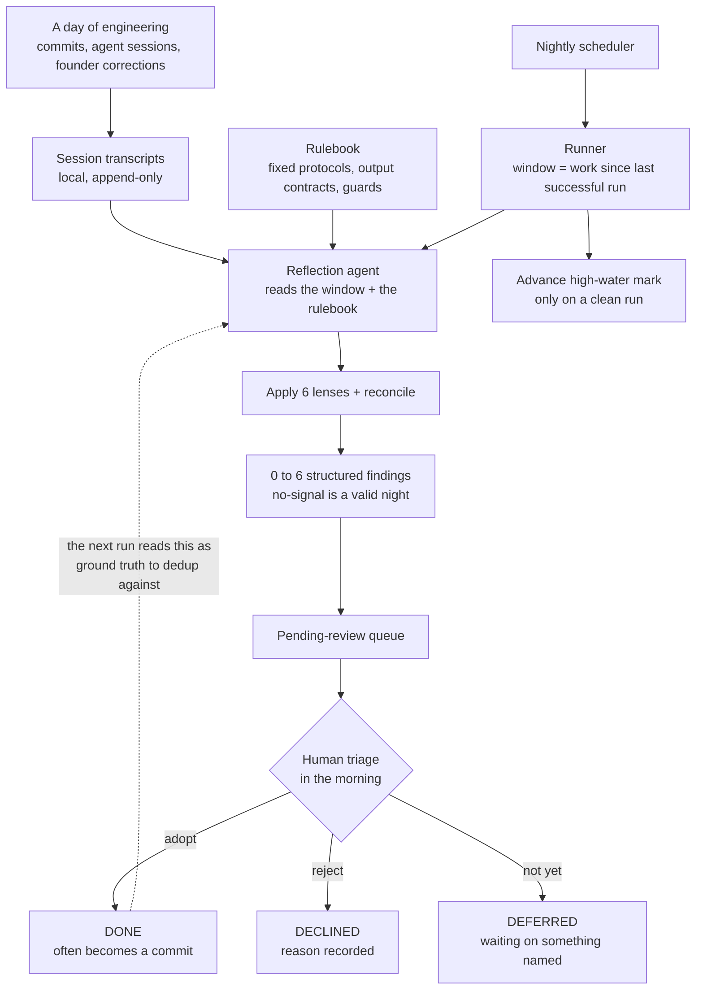
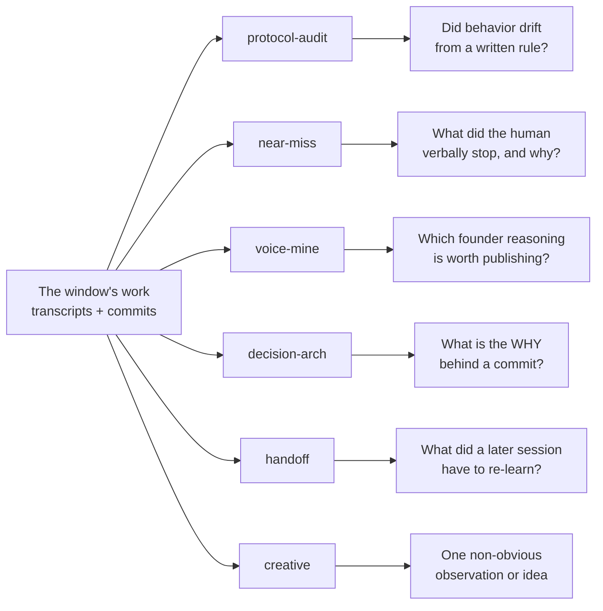
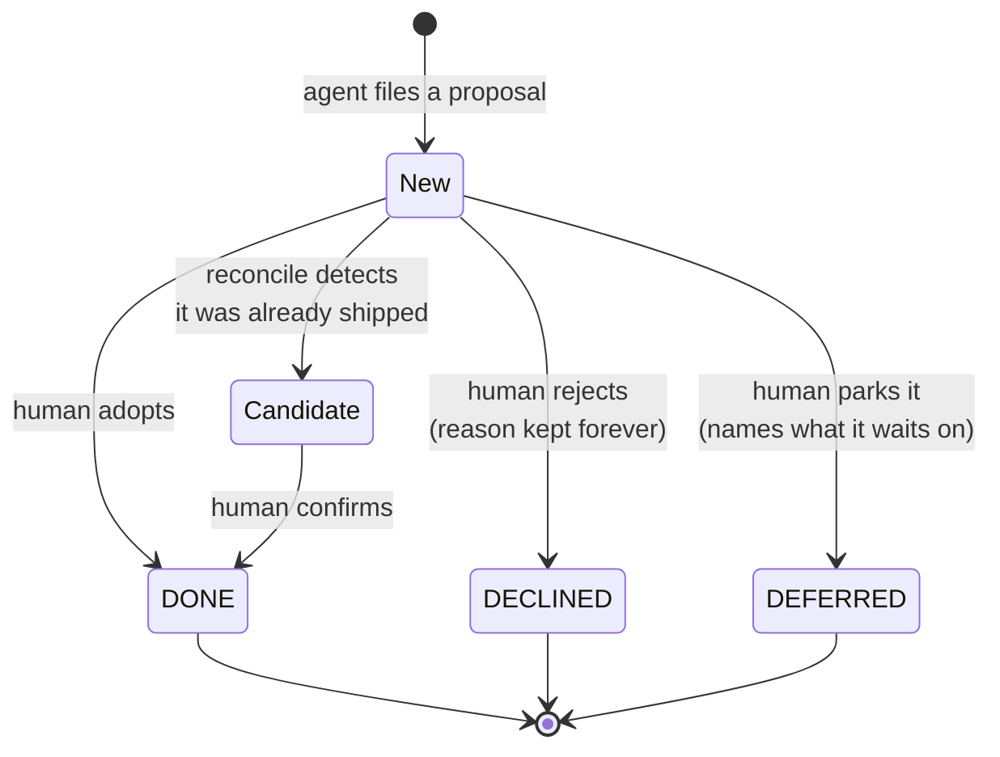
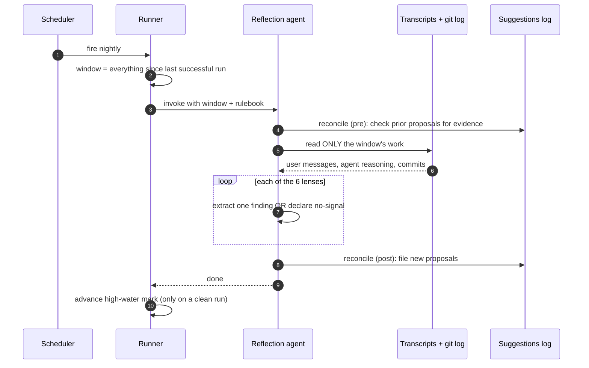

# The Dream Cycle

### A nightly autonomous agent that mines an engineering project for its own process lessons — and why the human stays in the loop. A practice report from the Attestrum project.

**Status:** research / explanation. Describes an engineering *practice* used to build Attestrum, not a product feature. It explains the method and the reasoning behind it; it deliberately contains none of the practice's actual outputs (those are local-only working notes), no personal data, and no internal paths. Companion to `specification-first-agentic-engineering.md` and `adversarial-review-high-stakes-decisions.md` in the "how we build Attestrum" series.

---

## Abstract

A solo or small team building software with AI coding agents generates an enormous amount of *process exhaust*: rules that were quietly violated, dangers the human caught verbally, decisions whose reasoning never made it into a commit message, facts a later session had to re-learn from scratch. Almost all of it evaporates by morning. The **dream cycle** is a scheduled, autonomous agent that runs once a night, reads only the day's own development transcripts, and applies six fixed "lenses" — plus a loop-closer that checks whether prior proposals have actually shipped — to extract that exhaust into a small number of structured, reviewable proposals. It does not change anything: it produces proposals, not actions, and a human triages each into *done*, *declined*, or *deferred*. This report describes the architecture, the six lenses, the loop-closing mechanism that keeps it honest, and the disciplines — chiefly *"no signal is a valid night"* and a hard separation between machine generation and human judgment — that let it run unattended without eroding trust. The contribution is not a tool; it is a repeatable shape for turning an agentic project's daily transcripts into a short queue of reviewable process improvements at near-zero marginal *compute* cost — the human review the queue feeds is the real cost, and the real bottleneck.

---

## 1. The problem: process knowledge decays overnight

When you build with AI coding agents, the highest-value signal is rarely the code — it is everything *around* the code. In a single day you might:

- let a standing rule slip without noticing,
- say "wait, stop — we don't do that" and explain *why*, in one sentence, then move on,
- decide something subtle and commit only the *what*, never the *why*,
- watch a fresh session burn ten minutes re-discovering a fact a prior session already knew.

Each of these is a process lesson worth keeping. Almost none survive contact with sleep. The next day's work overwrites the context window, and the insight is gone. Over weeks, the same rule slips repeatedly, the same fact is re-derived repeatedly, and the same decision gets re-litigated because nobody wrote down why it was settled.

The dream cycle exists to catch that exhaust on the night it is produced, while the transcript is still complete, and turn it into something a human can act on in the morning.

## 2. What it is

The dream cycle is a single autonomous agent run, scheduled once a night. It reads **only the project's own development session transcripts** for a bounded window of time, runs a fixed set of reflective protocols against them, and writes a handful of structured proposal files into a local-only working area. It is strictly **read-and-propose**: it never edits tracked code, never commits, never pushes, and runs no build. Its entire job is to surface candidates for a human to review.

Three design choices in that picture do most of the work, and each gets its own section below: the **bounded window** that never silently skips a day (§5), the **six lenses** that give the reflection structure instead of "summarize the day" mush (§3), and the **human-owned triage** that keeps the agent a proposer rather than an actor (§4).

## 3. The six lenses

Unstructured reflection produces unstructured slop. The dream cycle instead runs six protocols, each with a single fixed mission, a fixed output shape, and — critically — an explicit *no-signal* condition that tells it when to stay silent. Each lens looks at the same day's work and asks a different question.

- **protocol-audit** diffs the project's written rulebook against the day's *actual* behavior and flags any rule that was violated-and-not-caught, or any judgment doing load-bearing work that no rule yet captures. Output: a proposed rule change.
- **near-miss** scans for the moments a human intervened — "stop", "don't", "actually no, because…" — and captures the reasoning behind the catch. A verbal catch is a candidate for a permanent guardrail. Output: a proposed gate or rule.
- **voice-mine** pulls passages of authentic founder reasoning (pivot narratives, "why X over Y") out of the transcript — raw material for public writing that is already in the founder's own voice. Output: a content seed.
- **decision-arch** ("decision archaeology") pairs a commit to the conversation that produced it and reconstructs the *why* that the commit message omitted. Output: a durable decision record, so the choice is not re-litigated in six months.
- **handoff** measures the cost of cross-session re-discovery — what a fresh session had to relearn because nothing told it — and proposes the one-time note that would prevent the recurrence. Output: an onboarding note.
- **creative** is the free pass: surface exactly one surprising, non-obvious observation, pattern, or idea from a rolling multi-day window. Allowed to be speculative; forbidden to be generic.

A night produces **between zero and six files**. The protocols are lenses, not quotas.

## 4. Closing the loop: reconcile, then human triage

A reflection engine that only ever *adds* suggestions becomes landfill. The dream cycle closes its own loop with a seventh protocol — **reconcile** — that runs before and after the six lenses.

Before the lenses, reconcile re-reads every still-open proposal and runs a cheap, read-only detection check for each: did this proposal actually get implemented since it was filed? (A literal search of the rulebook, a commit-message keyword, a file-existence test.) If it finds evidence, it moves the item to a *candidate* state for the human to confirm. After the lenses, it files any new proposals they produced, with a stable ID and its own detection hint for next time.

What it never does is mark anything *resolved*. That transition belongs to the human.

The boundary is deliberate and load-bearing: **the agent owns the left side** (filing and auto-detecting), **the human owns the right side** (resolving). The agent generates; the human judges. Declined items keep their reasoning permanently, so the same idea is not re-proposed and re-argued every week. This is the same separation-of-powers principle that makes code review work — the author proposes, a different party decides — applied to process improvement.

## 5. The disciplines that make it trustworthy

An unattended nightly agent is only useful if you can trust it enough to *not* read everything it produces. Four disciplines earn that trust.

1. **No signal is a virtuous output.** Every lens has an explicit silence condition. A quiet, clean day correctly produces *nothing*. Filler degrades the corpus and trains the human to stop opening the files — so the system is built to prefer silence over a weak finding. The scarcest resource is the reviewer's trust that every file is worth opening.
2. **A bounded, gap-proof window.** The agent reads the work *since the last successful run*, not a fixed "last 24 hours." On a machine that sleeps and wakes, several scheduled runs can be missed and only one fires on wake; a fixed window would silently drop the missed days. The window's start advances **only after a clean run**, so a failed night never loses its coverage — it is simply re-read the next night.
3. **Dedup and adversarial self-check.** Before writing any finding, the agent must try to *refute* it: is this already an open proposal, already raised in the last several nights, or already codified in the rulebook or a commit message? A standing problem is observable every single night; the rule is to raise it once and then stay silent until it changes.
4. **Read-only by construction.** The agent cannot edit tracked files, cannot run git, cannot build. The blast radius of a hallucinated "improvement" is a proposal in a review queue, not a commit. The cost of being wrong is one ignored file.

## 6. What it deliberately does not do

The boundaries are as important as the capabilities:

- It does not act on anything. Every output is a proposal a human must adopt.
- It does not touch the resolved/decided record — that is human-owned.
- It does not mine anything outside the project. Its inputs are filtered to the project's own development transcripts; a passing cross-reference to other work that appears *inside* an in-scope transcript is treated as inert reference, not mined.
- It does not invent protocols at runtime. The six lenses are fixed; "be creative about the *findings*, never about the *process*" is the rule.
- Anything it proposes for a public file is marked for human sanitization first — the agent flags, the human scrubs. The working notes it writes into are local-only and never published; this report is the only thing about the practice that is public, and it carries the method, not the contents.

## 7. What it is designed to do

The intended value is not any single finding; it is the *compounding* of cheap, structured reflection. None of the following is yet backed by measured outcomes — they are the mechanisms the design is built to produce, not results it has been shown to deliver:

- **Process drift can be caught while it is small.** A rule that slips on Monday is flagged Tuesday morning, rather than after it has slipped twenty times.
- **Decisions can acquire memory.** The *why* behind a subtle choice is reconstructed the same week, so it need not be re-argued from zero six months later.
- **Onboarding cost can fall.** Facts a fresh session used to re-derive become one-time notes.
- **Near-misses can become guardrails.** A danger the human caught by voice once can become a written rule that catches it automatically thereafter.
- **The marginal *compute* cost is one scheduled run.** No standups, no retros, no discipline demanded of a tired human at midnight — the reflection happens overnight, and the human spends a few minutes triaging in the morning. The human minutes are real, and they are the binding constraint (§8).

For a small team, the aim is leverage on the one thing that usually has no owner — the project's own meta-process — by treating the transcript, normally write-once and read-never, as a standing input for improvement rather than disposable history.

## 8. Limitations and honest caveats

- **It is only as good as its triage.** If the human stops reviewing the queue, the value goes to zero; the system can surface proposals but cannot adopt them. The *no-signal* discipline exists precisely to keep the queue short enough to actually review.
- **A reflection agent inherits the model's blind spots.** It can miss a real lesson or over-weight a trivial one. The fixed lenses and the dedup gate bound this, but do not eliminate it — which is exactly why the output is proposals, not changes.
- **Its own findings are subject to the same review as anything else.** This very practice was refined by a finding *about the practice* — a reminder that the loop, including the loop-closer, is fallible and stays under human judgment.
- **It is a project-internal engineering practice, not a product.** Nothing here is part of what Attestrum emits or verifies; it is how the project is built, offered as a transferable pattern.

## 9. Conclusion

The dream cycle treats an agentic project's daily transcript not as disposable history but as a standing input. A scheduled, read-only agent applies six fixed lenses to the work *since it last succeeded*, prefers silence to slop, and hands a short queue of structured proposals to a human who alone decides what becomes real. The machine generates; the human judges; the loop closes itself by checking whether yesterday's proposals already shipped. The design aims at a continuous, low-cost way to tend the one layer most projects never tend — their own process — with a blast radius, when a finding is wrong, of a single ignored file. That asymmetry — cheap, *bounded* downside against open-ended upside, with a human gating every change — is the whole case for letting an agent dream.

---

## References / companions

- `docs/research/specification-first-agentic-engineering.md` — diagrams-before-code as the authoring discipline.
- `docs/research/adversarial-review-high-stakes-decisions.md` — the isolated multi-reviewer protocol for decisions the project cannot afford to get wrong.
- `docs/research/cross-target-determinism.md` — the byte-identical-build discipline these practices protect.
