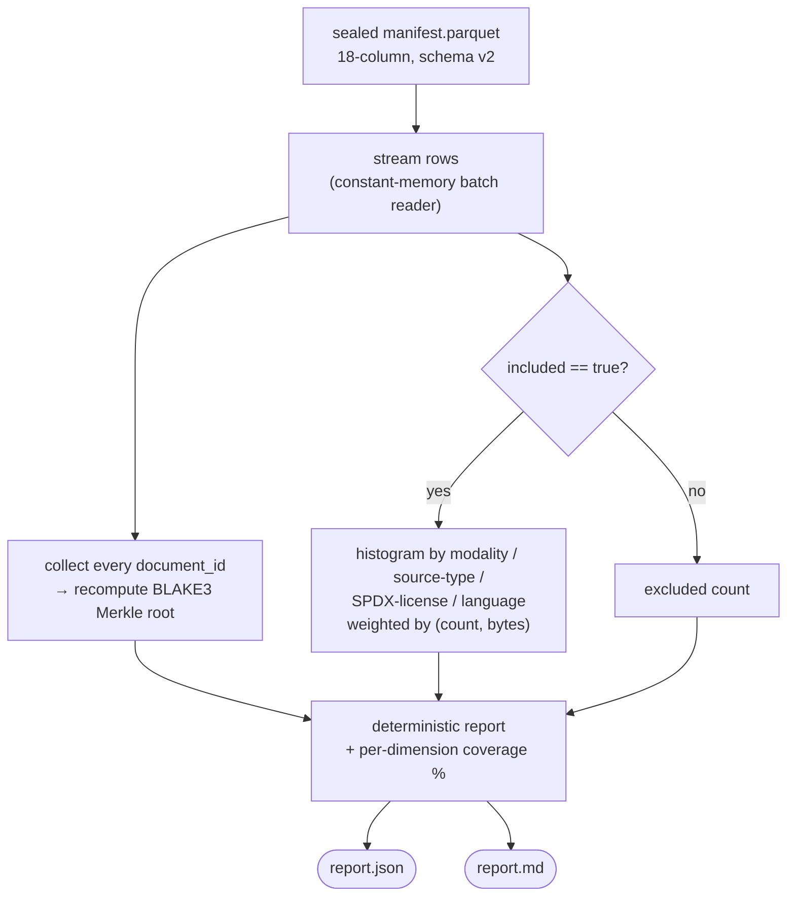
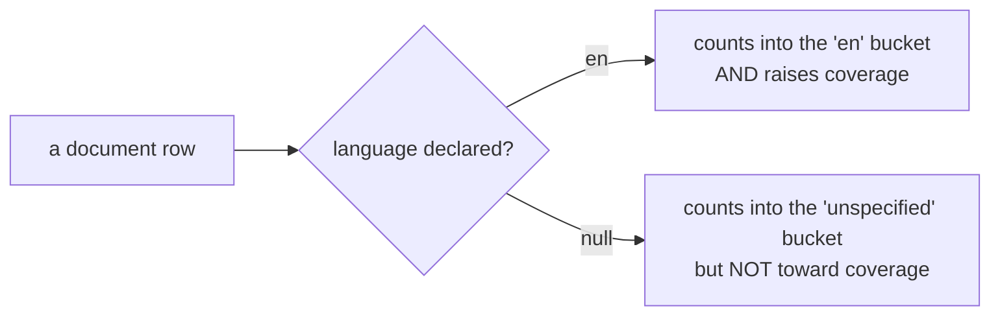

# Training-Content Summaries: A Byte-Reproducible Composition Report for a Sealed Corpus

Engineering documentation / feature explanation. Describes `attestrum compose`, the
read-only subcommand that summarizes what a sealed corpus is *made of* — its language,
source-type, SPDX-license, and modality mix — and emits a deterministic composition
report. *What is actually inside this training corpus, in numbers anyone can re-check
byte-for-byte?* Intended for engineers, auditors, and compliance leads evaluating how
Attestrum reasons about corpus **composition** — the regulatory surface the project is
positioned around.

Companion to [`how-attestrum-works-end-to-end.md`](./how-attestrum-works-end-to-end.md)
(the single-corpus seal → sign → publish pipeline whose manifest this reads),
[`deterministic-by-construction.md`](./deterministic-by-construction.md) (the byte-identity
disciplines the report's determinism promise rests on),
[`disclosure-mandates-and-verifiable-provenance.md`](./disclosure-mandates-and-verifiable-provenance.md)
(the EU AI Act Article 53 and California AB 2013 obligations this backs), and
[`corpus-version-diffing.md`](./corpus-version-diffing.md) (the sibling read-only analysis
subcommand for corpus *evolution* across versions).

Status: applies to the `attestrum-compose` crate and the `attestrum compose` subcommand as
landed. The worked example in §3 is genuine, unedited tool output.

---

## TL;DR

Regulators are starting to require a *summary of training content* — the EU AI Act's
Article 53(1)(d) and California's AB 2013 both oblige providers to publish the general
characteristics, sources, and composition of the data a model was trained on. The honest
way to produce that summary is to compute it from the sealed corpus itself, not to
hand-write it. `attestrum compose --manifest <manifest.parquet>` reads an already-sealed
corpus manifest and reports its **modality, source-type, SPDX-license, and language mix** —
each bucket weighted by both document count *and* bytes, each dimension carrying an explicit
**coverage %** so unknown metadata is visible rather than hidden — plus the corpus's BLAKE3
Merkle root as a cryptographic anchor that ties the summary to one specific sealed state. It
is a pure read over the manifest, touches no protected system, and produces byte-identical
output on any machine.

## 1. What it is

`attestrum compose --manifest <manifest.parquet>` is a deterministic, read-only summary of a
single sealed Attestrum corpus. It has no write path, signs nothing, and mutates nothing — it
streams one `manifest.parquet` and reports what the corpus is composed of.

A single run reports, over the documents actually **included** in the corpus:

- **Modality mix** — text / image / audio / video / pdf / other.
- **Source-type mix** — crawl / public-dataset / private-licensed / user / synthetic / other.
- **SPDX-license mix** — the license identifier carried by each document.
- **Language mix** — the BCP-47 language tag of each document.
- **Two weights per bucket** — a document count *and* a `size_bytes` sum, each as a
  percentage of the included totals. Byte-weighting answers *"how much of the training data,"*
  count-weighting answers *"how many documents."*
- **A coverage % per dimension** — modality is always present; source-type, license, and
  language are optional in the manifest, so each carries the share of documents (by count and
  by bytes) that actually declare a value. A `None` value lands in an explicit `unspecified`
  bucket and is excluded from coverage — never silently dropped.
- **A corpus anchor** — the BLAKE3 Merkle root over every document, byte-identical to the
  root the seal pipeline produced, plus included / excluded counts and total bytes.

Output comes in two surfaces: a byte-reproducible `report.json` (full detail, canonical key
ordering) and a human-readable `report.md` with one table per dimension. The walk is a
single streaming pass over the manifest's batch reader, so it never materializes the manifest
in full and scales to tens of millions of rows.



## 2. Why it is valuable

The compliance driver is concrete and near. The EU AI Act's Article 53(1)(d) obliges
general-purpose AI model providers to publish a [sufficiently detailed summary of training
content](https://www.wilmerhale.com/en/insights/blogs/wilmerhale-privacy-and-cybersecurity-law/european-commission-releases-mandatory-template-for-public-disclosure-of-ai-training-data),
and the Commission has published a mandatory template for it; California's [AB
2013](https://www.dlapiper.com/en-us/insights/publications/2024/10/california-enacts-ai-training-data-transparency-law)
adds a state-law disclosure obligation effective 2026. Both ask, in effect, *what is this
corpus made of?* — by source, by kind, by license. `attestrum compose` answers that question
**from the sealed corpus itself**, so the published summary is a computed fact tied to a
cryptographic root, not a hand-written assertion a reader has to trust.

This fills a gap the existing tooling leaves open. Data-curation frameworks like
[Dolma](https://github.com/allenai/dolma) and
[datatrove](https://github.com/huggingface/datatrove) **build** a corpus — they filter,
dedup, and mix sources, and statistics are a by-product of the pipeline run. But a pipeline's
own logs are not independently checkable, and they describe the *process*, not a frozen,
verifiable *artifact*. `attestrum compose` computes the composition of the sealed manifest
after the fact, so the same manifest yields the same summary for anyone — the corpus author,
an auditor, or a regulator — with no need to re-run or trust the original pipeline.

Two caveats, stated up front. First, `attestrum compose` **measures** composition; it does
not judge it. A mix that leans heavily on web crawl or on synthetic text is reported
neutrally — the interpretation is yours. Second, the summary is only as complete as the
manifest's metadata: if a corpus was sealed without language or license labels, compose
reports that honestly as low coverage rather than inventing values. The coverage % is the
feature that keeps the gap visible.

## 3. How to use it

The command takes one sealed manifest:

```
attestrum compose --manifest <manifest.parquet> [--out <dir>]
```

- **`--manifest <path>`** — the sealed `manifest.parquet` to summarize.
- **`--out <dir>`** — directory to write `report.json` + `report.md` into (default: the
  current directory).

The report carries **no wall-clock** — it is a pure function of the manifest, which is what
keeps the output byte-identical across runs and machines.

### Worked example (genuine output)

Take a small five-document corpus: four documents are **included** in training (a mix of
text and image, two crawled and one from a public dataset, with assorted licenses and
languages) and one is recorded but **excluded**. Running compose over its sealed manifest:

```
$ attestrum compose --manifest corpus/manifest.parquet --out out
compose: 5 document(s) (4 included · 1 excluded) → 2 modality / 3 language bucket(s)
  out/report.json
  out/report.md
```

The human-readable `report.md` (genuine, unedited):

```
# attestrum compose — training-content summary (v0.1.0)

- manifest: corpus/manifest.parquet
- corpus root (BLAKE3 Merkle): `3eb572819de9fac6c5216ce8989fa2bd3cfb8965188aa3281ac7ad175a0e3e19`
- documents: 5 (4 included · 1 excluded)
- included size: 750 bytes

## Modality (coverage 100.0% by count · 100.0% by bytes)

| bucket | docs | % docs | bytes | % bytes |
|---|---:|---:|---:|---:|
| text | 3 | 75.0% | 450 | 60.0% |
| image | 1 | 25.0% | 300 | 40.0% |

## Source type (coverage 75.0% by count · 80.0% by bytes)

| bucket | docs | % docs | bytes | % bytes |
|---|---:|---:|---:|---:|
| crawl | 2 | 50.0% | 300 | 40.0% |
| public_dataset | 1 | 25.0% | 300 | 40.0% |
| unspecified | 1 | 25.0% | 150 | 20.0% |

## License (SPDX) (coverage 50.0% by count · 53.3% by bytes)

| bucket | docs | % docs | bytes | % bytes |
|---|---:|---:|---:|---:|
| unspecified | 2 | 50.0% | 350 | 46.7% |
| CC-BY-4.0 | 1 | 25.0% | 100 | 13.3% |
| CC0-1.0 | 1 | 25.0% | 300 | 40.0% |

## Language (coverage 75.0% by count · 60.0% by bytes)

| bucket | docs | % docs | bytes | % bytes |
|---|---:|---:|---:|---:|
| en | 2 | 50.0% | 300 | 40.0% |
| fr | 1 | 25.0% | 150 | 20.0% |
| unspecified | 1 | 25.0% | 300 | 40.0% |
```

Read the tables with the coverage line in mind. The corpus is **100% text-and-image by
modality** (modality is always present), but only **50% of documents declare a license** —
the `unspecified` row and the `coverage 50.0% by count` header say the same thing two ways,
and neither hides it. The `excluded` document never appears in any composition bucket: the
summary describes the *training content*, and the byte totals (`750` included of a larger
sealed set) make the inclusion boundary explicit. The Merkle root names this exact corpus
state, so the whole summary is pinned to one verifiable artifact.

The honesty rule in one picture — an absent label is a bucket and a coverage hit, never a
silent drop:



## 4. When to use it

`attestrum compose` is built for the moments where someone needs to state, defensibly, what a
corpus contains:

- **When publishing an Article 53 / AB 2013 training-content summary** — generate the
  composition from the sealed corpus so the disclosure is a computed, re-checkable fact.
- **Before and after a curation pass** — run compose on each version to see how the mix moved
  (pair it with `attestrum diff` for the document-level delta).
- **When evaluating a third-party corpus** — get an independent composition readout from the
  published manifest, without trusting the publisher's own statistics.
- **In CI**, to assert a corpus's composition stays within bounds you care about — e.g. fail
  the build if synthetic-text share crosses a threshold, or if license coverage drops.

## 5. Why we made it — design philosophy

**Coverage is honesty made measurable.** Most composition tools quietly drop rows with
missing metadata, which makes a thinly-labeled corpus look cleaner than it is. `attestrum
compose` does the opposite: a missing source, license, or language is bucketed as
`unspecified` and *excluded from the coverage figure*, so every dimension reports the share of
the corpus it can actually speak to. A 50%-license-coverage corpus is reported as exactly
that — the gap is a number, not an omission.

**Two weights, because the regulator's question is about proportion of data, not count of
files.** A corpus can be 90% of documents but 10% of bytes in one language. Reporting both
count-share and byte-share keeps either framing from misleading: byte-weighting answers *"how
much of the training data,"* which is closer to what a training-content summary is really
asking.

**The summary is pinned to a cryptographic root.** Compose recomputes the BLAKE3 Merkle root
over every document in canonical order — byte-identical to the root the seal pipeline
produced — and prints it on the report. So the composition is not a free-floating description;
it is bound to one specific, verifiable corpus state that anyone can check.

**The report declares its own limits, in-band.** This version computes a composition summary;
it deliberately stops short of two things, and says so: there is **no signed `composition`
predicate yet** — compose is the reversible, unsigned leaf, not a frozen signed attestation —
and it does **not emit the Commission's exact Article 53 template** yet, only the underlying
composition the template is filled from. Both are deferred, schema-affecting work, kept out of
the leaf on purpose.

**Determinism is the one absolute promise, and it is CI-enforced.** Same manifest →
byte-identical report on any machine. Every histogram is a `BTreeMap`, percentages round to
six decimals, the manifest is walked in canonical order, and JSON rendering rides the same
shared canonical-key primitive as the rest of the CLI. No wall-clock, ever. A committed golden
plus a double-run byte-compare gate this in CI on every push.

That is the whole intent: a small, single-purpose instrument that turns a sealed corpus into a
defensible statement of what it contains, makes its own blind spots legible, and produces the
same bytes every time.

---

### Sources

- [WilmerHale — European Commission Releases Mandatory Template for Public Disclosure of AI Training Data](https://www.wilmerhale.com/en/insights/blogs/wilmerhale-privacy-and-cybersecurity-law/european-commission-releases-mandatory-template-for-public-disclosure-of-ai-training-data)
- [DLA Piper — California Enacts AI Training Data Transparency Law (AB 2013)](https://www.dlapiper.com/en-us/insights/publications/2024/10/california-enacts-ai-training-data-transparency-law)
- [Dolma — an open corpus and toolkit](https://github.com/allenai/dolma)
- [datatrove — large-scale text processing](https://github.com/huggingface/datatrove)
- [SPDX License List](https://spdx.org/licenses/)
